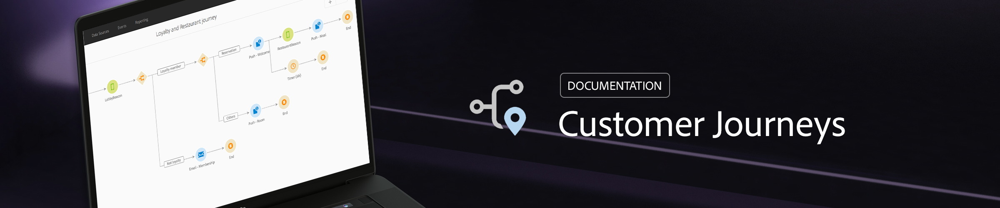

# Help Center {#journeys-documentation}

 

td valign="top">
    
    

    <a href="using/about/aboutprocess.md"><strong>Global user process</strong></a>
    

    <em> </em>
     
  </td>
  <td valign="top">
    
    

    <a href="using/building-journeys/journey.md"><strong></strong></a>
    

    <em>Combine your activities to build your multi-step cross-channel scenarios.</em>
     
  </td>
  <td valign="top">

## Get started

* **[Global user process](using/expression/expressionadvanced.md)** 
Discover the main steps to set up and use Journey Orchestration.

* **[Configuring your events](using/event/event.md#section_tbk_5qt_pgb)** 
Learn how to configure the events that your journeys will listen to.

* **[Configuring your data sources](using/datasource/ds.md)** 
Define the additional data that your journeys will use. 

* **[Configuring your actions](using/action/action.md)** 
Set up the connection to the system that will send messages.

* **[Building your journeys](using/building-journeys/journey.md)** 
Learn how to design and publish your journeys.

## Top pages

 <table>
<tr>
    <td valign="top">
        
    

    <a href="using/about/troubleshooting.md"><strong>Troubleshooting</strong></a>
    

     <em>Find out the various tools that you can use to troubleshoot your journeys.</em>
     
  </td>
  <td valign="top">
    
    

    <a href="using/usecase/uc2intro.md"><strong>Use case</strong></a>
    

    <em>Learn how to create an advanced journey step-by-step.</em>
     
  </td>
  <td valign="top">
    
    

    <a href="using/expression/expressionadvanced.md"><strong>Building advanced expression</strong></a>
    

    <em>Learn how to build complex expressions leveraging data from events and data sources. </em>
     
  </td>
</tr>
</table>

## Additional Resources

* [Unified Profile Service (UPS)](https://www.adobe.io/apis/cloudplatform/dataservices/profile-identity-segmentation/profile-identity-segmentation-services.html#!api-specification/markdown/narrative/technical_overview/unified_profile_architectural_overview/unified_profile_architectural_overview.md)
* [Experience Cloud XDM field definition](https://www.adobe.io/apis/cloudplatform/dataservices/xdm.html)
* [Namespace Service](https://www.adobe.io/apis/cloudplatform/dataservices/profile-identity-segmentation/profile-identity-segmentation-services.html#!api-specification/markdown/narrative/technical_overview/identity_namespace_overview/identity_namespace_overview.md)
* [Streaming Ingestion APIs](https://www.adobe.io/apis/cloudplatform/dataservices/data-ingestion/data-ingestion-services.html#!api-specification/markdown/narrative/technical_overview/streaming_ingest/getting_started_with_platform_streaming_ingestion.md)
* [Adobe Campaign Standard transactional messaging](https://docs.adobe.com/content/help/en/campaign-standard/using/communication-channels/transactional-messaging/about-transactional-messaging.html)
