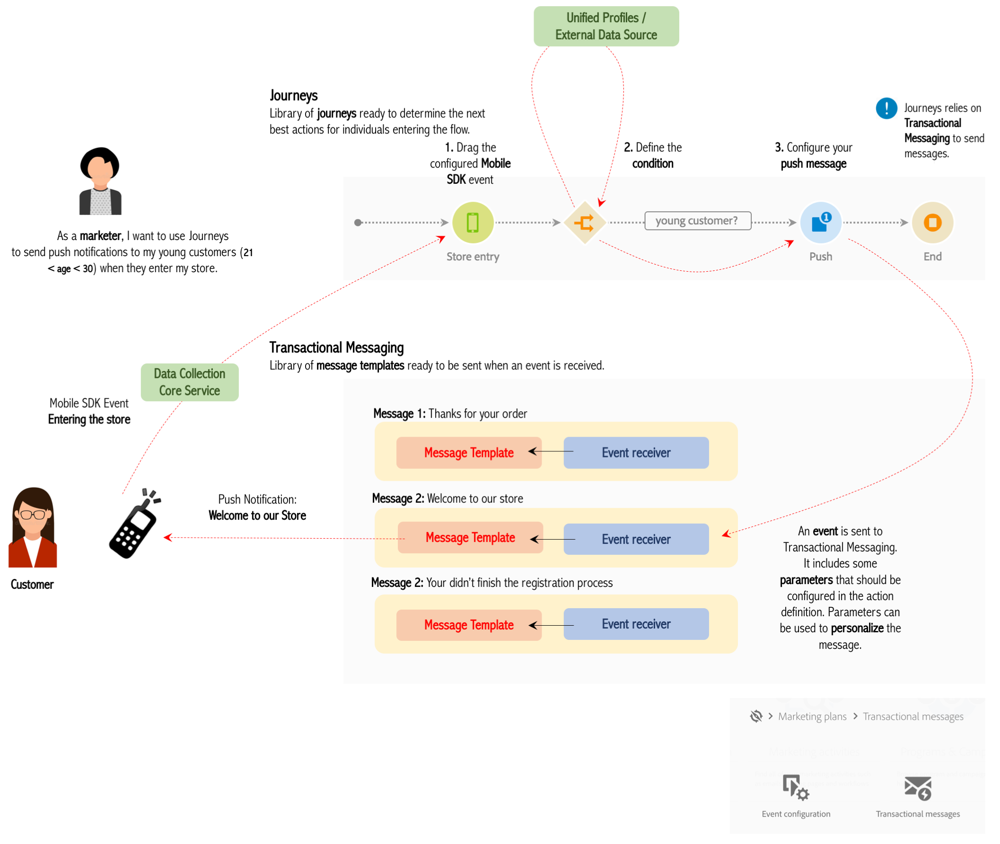

# User process

Here are the main steps to configure and use this feature:

1.  Configuring the event: this configuration is mandatory and performed by a **technical user**. You define the information expected and how to process it. See [Configuring an event](event.html#concept_gfj_fqt_52b).
2.  Configuring the data source: this step is performed by a **technical user**. It allows you to define a connection to a system to retrieve additional information that will be used in your journeys, for example in your conditions. This is not required if you only leverage data from the events in your journey. See [Configuring a data source](ds.html#concept_s1s_dqt_52b).
3.  Configuring a custom action: this step is performed by a **technical user**. If you're using a third-party system to send your messages, this is where you will configure its connection to Journeys. See [Configuring a custom action](custom.html#concept_sxy_bzs_dgb).
4.  Creating and defining the journey: this is performed by a **business user**. This is where you create, define and publish your scenarios. See [Building a journey](journey.html#concept_gq5_sqt_52b).
5.  Testing and publishing the journey: this is performed by a **business user**. This validates and activates the journey. See [Testing and publishing the journey](journeypublication.html#concept_mtc_lrt_52b)
6.  Analyzing the journey via the dedicated reporting tools. This is performed by a **business user**. See [Building your Journeys reports](reporting.html#concept_rfj_wpt_52b)

Here is a schema of an end-to-end scenario:

  