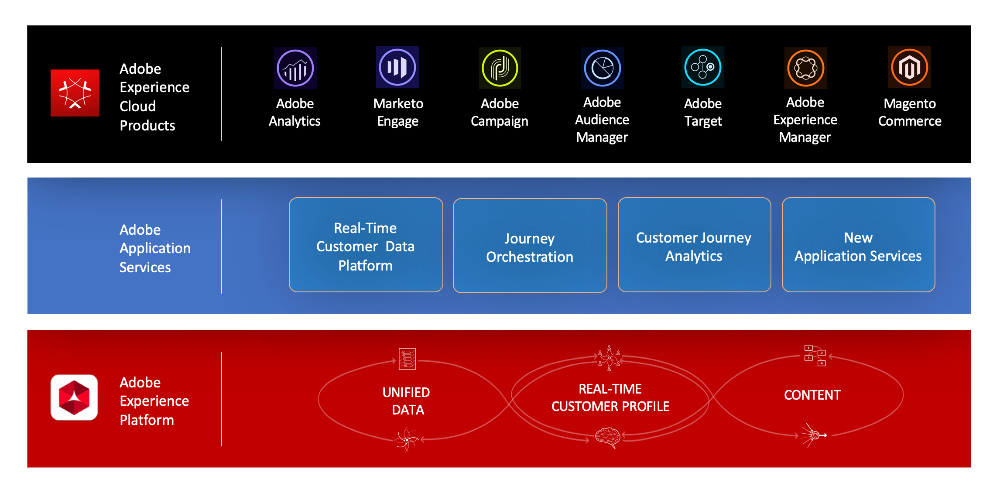

# About Journey Orchestration{#concept_nd3_mqt_52b}

Build real-time orchestration use cases leveraging contextual data stored in events or data sources.

Journey Orchestration is an application service integrated with the Experience Platform.

Journey Orchestration allows real-time orchestration powered by contextual data from events, information from the Adobe Experience Platform, or data from third-party API services. You can configure a custom action if you're using a third-party system to send your messages. If you have Adobe Campaign Standard, you will be able to send emails, push notifications and SMS using the Adobe Campaign Standard's [Transactional Messaging capabilities](https://docs.adobe.com/content/help/en/campaign-standard/using/communication-channels/transactional-messaging/about-transactional-messaging.html). 

In the event configuration tab, a **technical user** configures events expected in the journeys. The incoming events' data is normalized following the Adobe Experience Data Model (XDM). Events come from Streaming Ingestion APIs for authenticated and unauthenticated events (such as Adobe Mobile SDK events).

In the data source configuration tab, a **technical user** configures:

* The different fields exposed from the Adobe Experience Platform in the journey designer for condition building and personalization purposes.
* The additional custom data sources that you leverage in the journey designer. Custom data sources are connections between Journey Orchestration and third-party systems or services via API. You can connect a third-party system such as a loyalty system. Third-party services can be, for example, a weather API.

With the journey designer, a **business user** can easily drag and drop an entry event, add conditions and specify the action to perform.

You then create conditions based on:

* time
* data coming from the event payload
* information coming from data sources: Real-time Customer Profile data source or custom data sources

You can use the split condition to send people in the journey into different directions.

Using action activities, you can then send a message via a third-party system. If you have Adobe Campaign Standard, send real-time personalized SMS, push notifications or emails.

As Journey Orchestration is multistep, you can create advanced scenarios. For example, after a first event and action, you can drag other events. Then, you can add a second action, place a wait activity to wait for some time, add a split condition to push people to two different paths and then send different messages.

>[!NOTE]
>
>This documentation is frequently updated to reflect recent changes in the product. However, some screenshots can slightly differ from the product's interface. 
