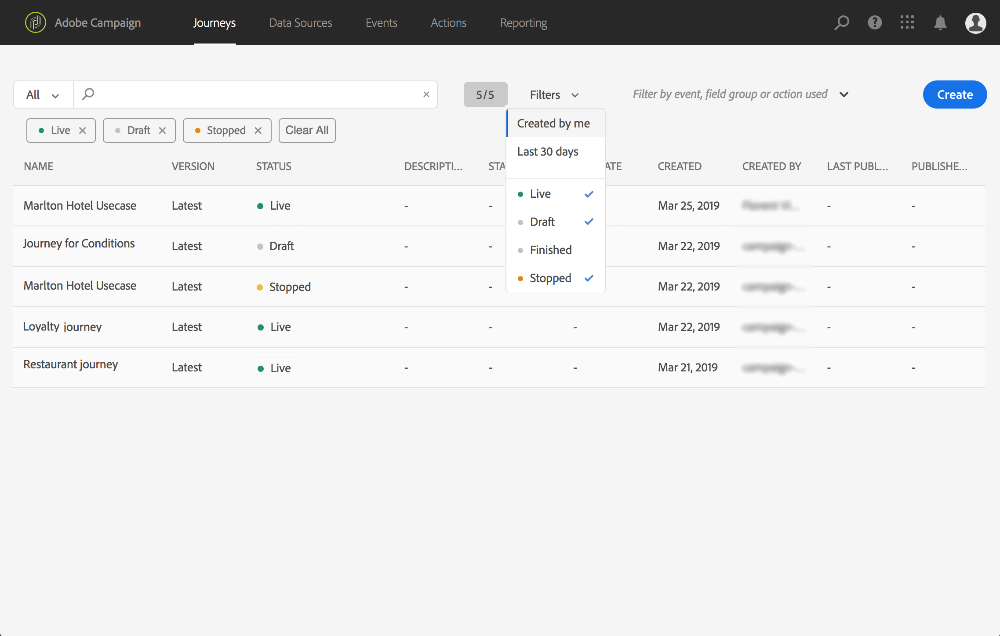

# The Journeys' interface{#concept_rcq_lqt_52b}

>[!NOTE]
>
>To get the best out of the Journey Orchestration feature, we recommend using Chrome as your Internet browser.

## Discovering the interface{#section_jsq_zr1_ffb}

To access the Journey orchestration' interface, click the **Journey Orchestration** shortcut in the Experience Cloud's solution switcher. It is displayed on the left, below "Experience Cloud".

  

The top bar allows you to navigate through the different functionalities of the feature: Journeys under **Home**, **Data Sources**, **Events**, **Actions**.

  

## Searching and filtering{#section_lgm_hpz_pgb}

In the **Home**, **Data Sources**, **Events** and **Actions** lists, a search bar allows you to search for an item. Use the left drop-down menu to search in names, descriptions or both. Use the **Filters** drop-down menu to filter the elements according to different criteria. You can choose to only display the elements of a certain type or status, the ones you created, or the ones modified in the last 30 days.

In the **Home** menu, the list of journeys is displayed. A drop-down menu allows you to only display the journeys that use a particular event, field group or action. See [The journey designer's interface](../building-journeys/journeyinterface.md#concept_m1g_5qt_52b).

>[!NOTE]
>
>Note that columns displayed can be personalized using the configuration button on the top right of the lists. Personalization is saved for each user.

  

In the event, data source and action configuration panes, the **Used in** field displays the number of journeys that use that particular event, field group or action. You can click the **View journeys** button to display the list of corresponding journeys.

  

In the different lists, you can perform basic actions on each element. For example, you can duplicate or delete an item.

  

## Using the different shortcuts{#section_ksq_zr1_ffb}

Here are the different shortcuts available in the Journey Orchestration's interface.

_When configuring an activity in a journey:_

The canvas is automatically saved. You can see on the top left of the canvas the saving status.

* Press **escape** to close the configuration pane and discard the changes made. This is the equivalent of the **Cancel** button.
* Press **enter** or click outside the pane to close the configuration pane. Changes are saved. This is the equivalent of the **OK** button.
* If you click **backspace**, you can then press **enter** to confirm the deletion.

_In pop-ups:_

* Press **escape** to close it (equivalent of the **Cancel** button).
* Press **enter** to save or coonfirm (equivalent of the **OK** or **Save** button).

_In the event, data source or action configuration pane:_

* Press **escape** to close the configuration pane without saving.
* Press **enter** to save modifications and close the configuration pane.
* Press **tab** to jump between the different fields to configure.

_When browsing through XDM fields:_

* Press and hold the **shift** key to perform multiple selection.
* Checking a "node" will select all the fields of the node.

_In all text areas:_

* Use the **Ctrl/Command + A** key combination to select the text. In the payload preview, it selects the payload.

_In a screen with a search bar:_

* Use the **Ctrl/Command + F** key combination to select the search bar.

_In the canvas of a journey:_

* Use the **Ctrl/Command + A** key combination to select all activities.
* When one or several activities are selected, press **delete/backspace** to delete them. Then you can press **enter** to confirm in the confirmation pop-up.
* Double-click on an activity from the left palette to add it at the first available position (from top to bottom).
