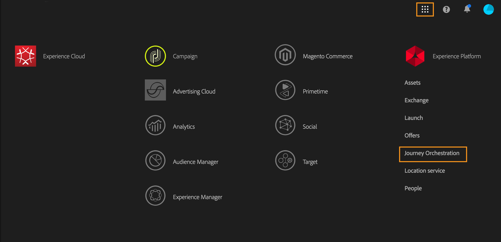
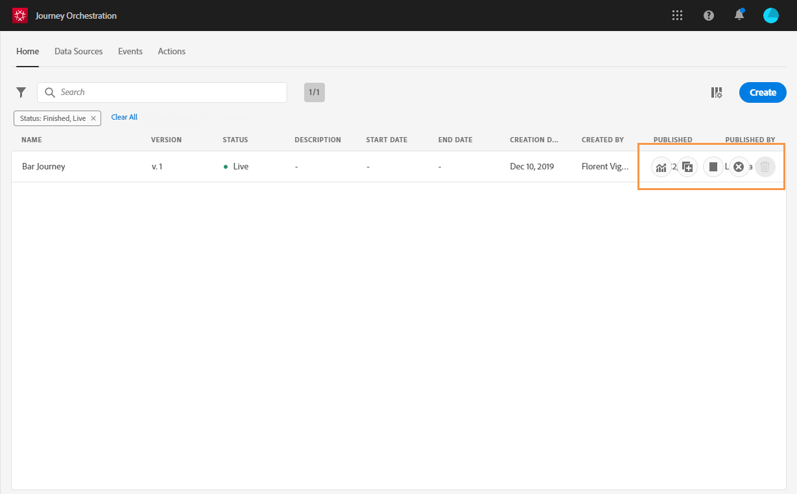

# The Journeys' interface{#concept_rcq_lqt_52b}

>[!NOTE]
>
>To get the best out of the Journey orchestration feature, we recommend using Chrome as your Internet browser.

## Discovering the interface{#section_jsq_zr1_ffb}

To access the Journey orchestration' interface, click the **Triggered Journeys** card from the home page of Campaign Standard or click the **Adobe Campaign** logo, in the top left corner, then select **Triggered Journeys**.

  

The top bar allows you to navigate through the different functionalities of the feature: **Journeys**, **Reports**, **Data Sources**, **Events**, **Actions**.

  

## Searching and filtering{#section_lgm_hpz_pgb}

In the **Journeys**, **Data Sources**, **Events** and **Actions** lists, a search bar allows you to search for an item. Use the left drop-down menu to search in names, descriptions or both. Use the **Filters** drop-down menu to filter the elements according to different criteria. You can choose to only display the elements of a certain type or status, the ones you created, or the ones modified in the last 30 days.

In the **Journeys** list, a drop-down menu allows you to only display the journeys that use a particular event, field group or action. See [The journey designer's interface](../building-journeys/journeyinterface.md#concept_m1g_5qt_52b).

  

In the event, data source and action configuration panes, the **Used in** field displays the number of journeys that use that particular event, field group or action. You can click the **View journeys** button to display the list of corresponding journeys.

  

In the different lists, you can perform basic actions on each element. For example, you can duplicate or delete an item.

  

## Using the different shortcuts{#section_ksq_zr1_ffb}

Here are the different shortcuts available in the Journeys' interface.

_When configuring an activity in a journey:_

* Click outside of the right pane or press **escape** to close the configuration pane without saving.
* Press **enter** to save modifications and close the configuration pane.
* If you click **Delete**, you can then press **enter** to confirm the deletion.

_In pop-ups:_

* Click outside of the pop-up to close it.

_In the event or data source configuration pane:_

* Press **escape** to close the configuration pane without saving.
* Press **enter** to save modifications and close the configuration pane.

_When browsing through XDM fields:_

* Press and hold the **shift** key to perform multiple selection.
* Checking a "node" will select all the fields of the node.

_In all text areas:_

* Use the **Ctrl/Command + A** key combination to select the text. In the payload preview, it selects the payload.

_In a screen with a search bar:_

* Use the **Ctrl/Command + F** key combination to select the search bar.

_In the canvas of a journey:_

* Use the **Ctrl/Command + S** key combination to save the journey.
* Use the **Ctrl/Command + A** key combination to select all activities.
* When several activities are selected, press **delete/backspace** to delete them.
* Double-click on an activity from the left palette to add it at the first available position (from top to bottom).
