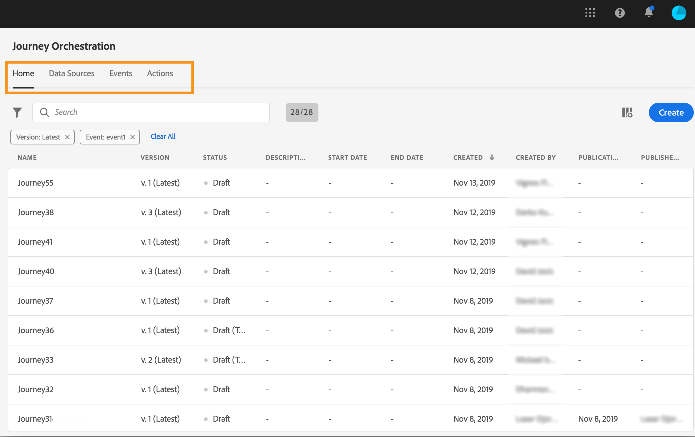

# User interface {#concept_rcq_lqt_52b}

>[!CONTEXTUALHELP]
>id="jo_home"
>title="About Journey list"
>abstract="The journey list allows you to view all your journeys at once, see their status and perform basic actions. You can duplicate, stop or delete your journeys. Depending on the journey, certain actions might not be available. For example, you can't stop or delete a stopped journey. You can also use the search bar to search for a journey."
>additional-url="https://images-tv.adobe.com/mpcv3/38af62cb-9390-4bc0-a576-d336849adb97_1574809570.1920x1080at3000_h264.mp4" text="Watch demo video"

>[!NOTE]
>
>To get the best out of Journey Orchestration, we recommend using Chrome as your Internet browser.
>
>This documentation is frequently updated to reflect recent changes in the product. However, some screenshots can slightly differ from the product's interface.

## Discovering the interface{#section_jsq_zr1_ffb}

To access the Journey Orchestration's interface, click the **[!UICONTROL App Selector]** icon, in the top right. Then click **[!UICONTROL Journey Orchestration]**, on the right side, below "Experience Platform".

  

You can also access Journey Orchestration from the Experience Cloud home page, in the **[!UICONTROL Quick access]** section.

  

The top menus allows you to navigate through the different functionalities of Journey Orchestration: **[!UICONTROL Home]**(the journeys),**[!UICONTROL Data Sources]**, **[!UICONTROL Events]**, **[!UICONTROL Actions]**.

  

## Searching and filtering{#section_lgm_hpz_pgb}

In the **[!UICONTROL Home]**,**[!UICONTROL Data Sources]**, **[!UICONTROL Events]** and **[!UICONTROL Actions]** lists, a search bar allows you to search for an item.

The **[!UICONTROL Filters]** can be accessed by clicking on the filter icon on the top left of the list. The filters menu allows you to filter the displayed elements according to different criteria. You can choose to only display the elements of a certain type or status, the ones you created, or the ones modified in the last 30 days.

In the **[!UICONTROL Data Sources]**, **[!UICONTROL Events]** and **[!UICONTROL Actions]** lists, use the **Creation filters** to filter on the creation date and user. You can choose, for example, to only display the events that you created in the past 30 days.

In the journey list (under **[!UICONTROL Home]**), in addition to the **[!UICONTROL Creation filters]**, you can also filter the displayed journeys according to their status and version (**[!UICONTROL Status and version filters]**). You can also choose to only display the journeys that use a particular event, field group or action (**[!UICONTROL Activity filters]** and **[!UICONTROL Data filters]**).The **[!UICONTROL Publication filters]** let you select a publication date or user. You can choose, for example, to only display the latest versions of live journeys that were published yesterday. See .

>[!NOTE]
>
>Note that columns displayed can be personalized using the configuration button on the top right of the lists. Personalization is saved for each user.

The **[!UICONTROL Last update]** and **[!UICONTROL Last update by]** columns allow you to display when has the last update of your journeys occured and which user operated it.

In the event, data source and action configuration panes, the **[!UICONTROL Used in]** field displays the number of journeys that use that particular event, field group or action. You can click the **[!UICONTROL View journeys]** button to display the list of corresponding journeys.

In the different lists, you can perform basic actions on each element. For example, you can duplicate or delete an item.

## XDM Field names display {#friendly-names-display}

XDM fields names are defined in schemas under field names and display names when defining [event payload](../event/defining-the-payload-fields.md), [field group payload](../datasource/field-groups.md) and selecting fields in the [expression editor](../expression/expressionadvanced.md).
When selecting a field, their technical name is displayed as well as a more user-friendly name of the field.

You can provide descriptors such as "xdm:alternateDisplayInfo" while setting up schemas to define friendly names that will replace display names. It also allows you to modify the "title" and "description" values of the schema fields.

If a friendly name is available, then the field will be displayed as "<friendly-name>(<name>)". If no friendly name is available, the display name will appear, for example "<friendly-name>(<name>)". If none of them are defined, only the technical name of the field will be displayed "<name>". 

You can configure friendly name descriptors via an API call. For more information, see the [Schema Registry developer guide](https://www.adobe.io/apis/experienceplatform/home/xdm/xdmservices.html#!api-specification/markdown/narrative/technical_overview/schema_registry/schema_registry_developer_guide.md).

>[!NOTE]
>
>Friendly names are not retrieved when you select fields from a union of schemas. 

## Using the different shortcuts{#section_ksq_zr1_ffb}

Here are the different shortcuts available in the Journey Orchestration's interface.

_In the list of journeys, actions, data sources or events:_

* Press **c** to create a new journey, action, data source or event.

_When configuring an activity in a journey:_

The canvas is automatically saved. You can see, on the top left of the canvas, the saving status.

* Press **escape** to close the configuration pane and discard the changes made. This is the equivalent of the **[!UICONTROL Cancel]** button.
* Press **[!UICONTROL Enter]** or click outside the pane to close the configuration pane. Changes are saved. This is the equivalent of the **[!UICONTROL Ok]** button.
* If you press **[!UICONTROL Delete]** or **backspace**, you can then press **[!UICONTROL Enter]** to confirm the deletion.

_In pop-ups:_

* Press **escape** to close it (equivalent of the **Cancel** button).
* Press **[!UICONTROL Enter]** to save or confirm (equivalent of the **[!UICONTROL Ok]** or **[!UICONTROL Save]** button).

_In the event, data source or action configuration pane:_

* Press **escape** to close the configuration pane without saving.
* Press **[!UICONTROL Enter]** to save modifications and close the configuration pane.
* Press **tab** to jump between the different fields to configure.

_In the simple expression editor_

* Double-click on a field, on the left, to add a query (equivalent to drag & drop).

_When browsing through XDM fields:_

* Checking a "node" will select all the fields of the node.

_In all text areas:_

* Use the **Ctrl/Command + A** key combination to select the text. In the payload preview, it selects the payload.

_In a screen with a search bar:_

* Use the **Ctrl/Command + F** key combination to select the search bar.

_In the canvas of a journey:_

* Use the **Ctrl/Command + A** key combination to select all activities.
* When one or several activities are selected, press **[!UICONTROL Delete]** or **backspace** to delete them. Then you can press **[!UICONTROL Enter]** to confirm in the confirmation pop-up.
* Double-click on an activity from the left palette to add it at the first available position (from top to bottom).
