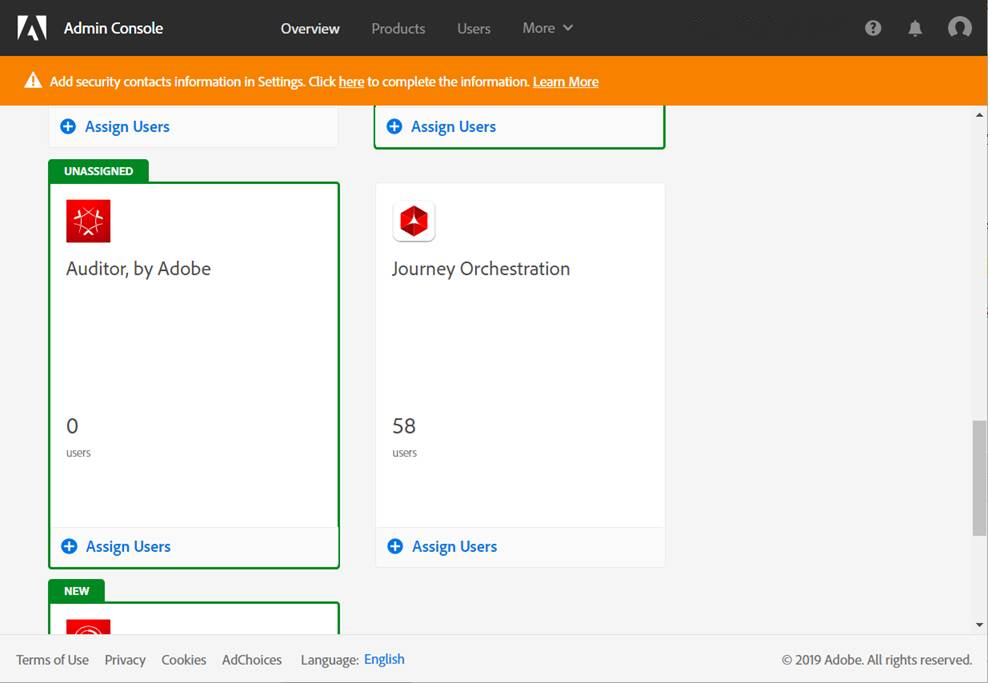
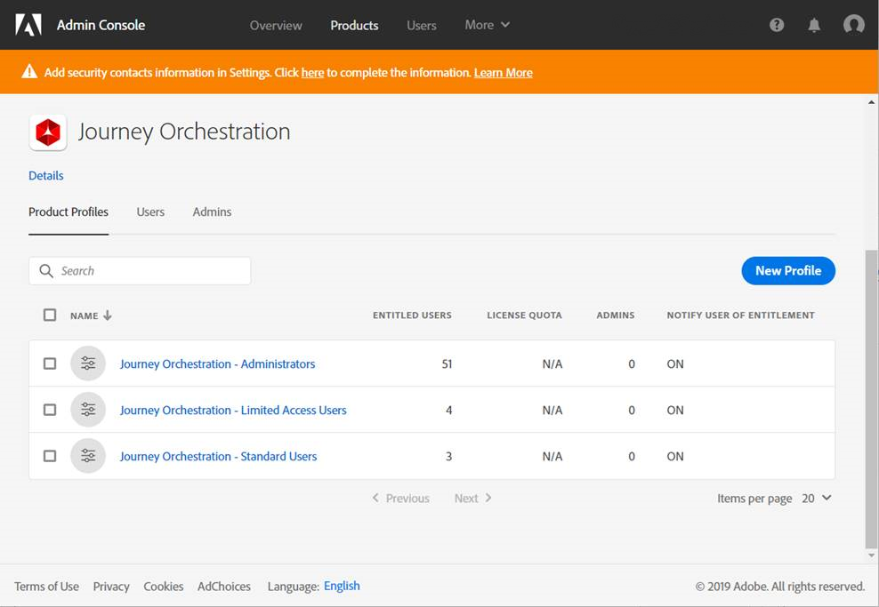
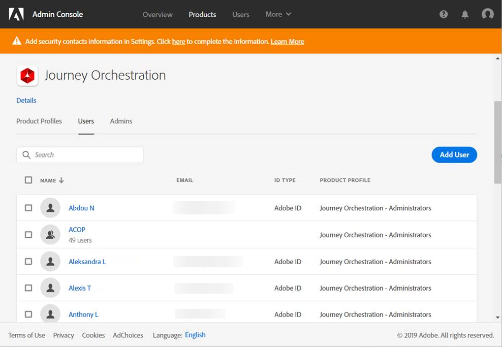
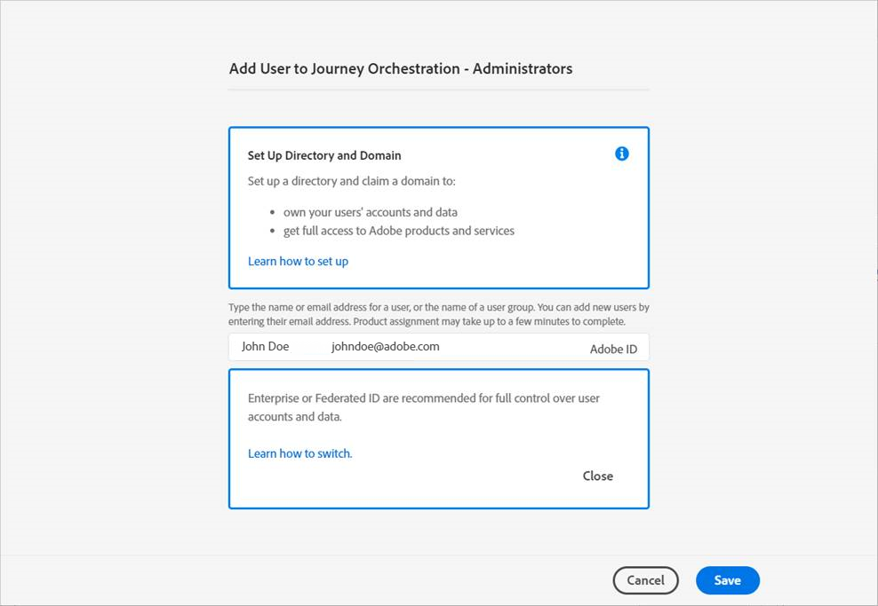

# Access management{#concept_rfj_wpt_52b}

## About access management {#about-access-management}

Security groups are assigned to a set of users that share the same roles and rights within your organization.

In the Admin console, you can assign one of the following out-of-the-box security groups to your users:

*   **[!UICONTROL Limited Access User]**: User with read only access to journeys, events and reports. This security group includes the following roles:
    *   Read journeys
    *   Read events and resources
    *   Read reports
*   **[!UICONTROL Administrators]**: User with access to the administration menus with the possibility to manage journeys, events and reports. This security group includes the following roles:
    *   Manage and execute journeys
    *   Manage events, resources, and keys
    *   Manage reports

    >[!NOTE]
    >
    >**[!UICONTROL Administrators]** is the only security group allowing creation, edition and publication of transactional messaging which allows message sending for Journey Orchestration.

*   **[!UICONTROL Standard User]**: User with basics access such as manage journeys. This security group includes the following roles:
    *   Manage and execute journeys
    *   Read events and resources
    *   Manage reports
    
You can find  the compatibility between roles and Journey Orchestration's different functionalities.

## Assigning a security group {#assigning-security-group}

Security groups are managed in the Admin console. For more on this, refer to the [Admin Console documentation](https://helpx.adobe.com/enterprise/managing/user-guide.html).

To assign a security group for a user to access Journey Orchestration:

1. In the Admin Console, select **[!UICONTROL Journey orchestration]**.

    

1. Select the security group to which your new user will be linked to.

    

1. Click **[!UICONTROL Add user]**.
   
   You can also add your new user to a user groups to fine tune the shared set of permissions. For more on this, refer to this [page](https://helpx.adobe.com/enterprise/using/user-groups.html).

    

1. Type in the email address of your new user then click **[!UICONTROL Save]**.

    

Your user should then receive an email redirecting to your Journey orchestration instance.