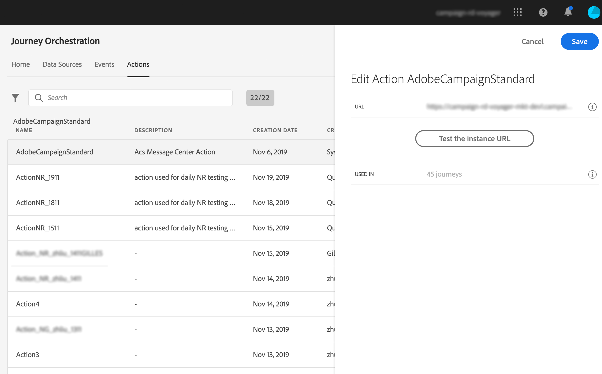
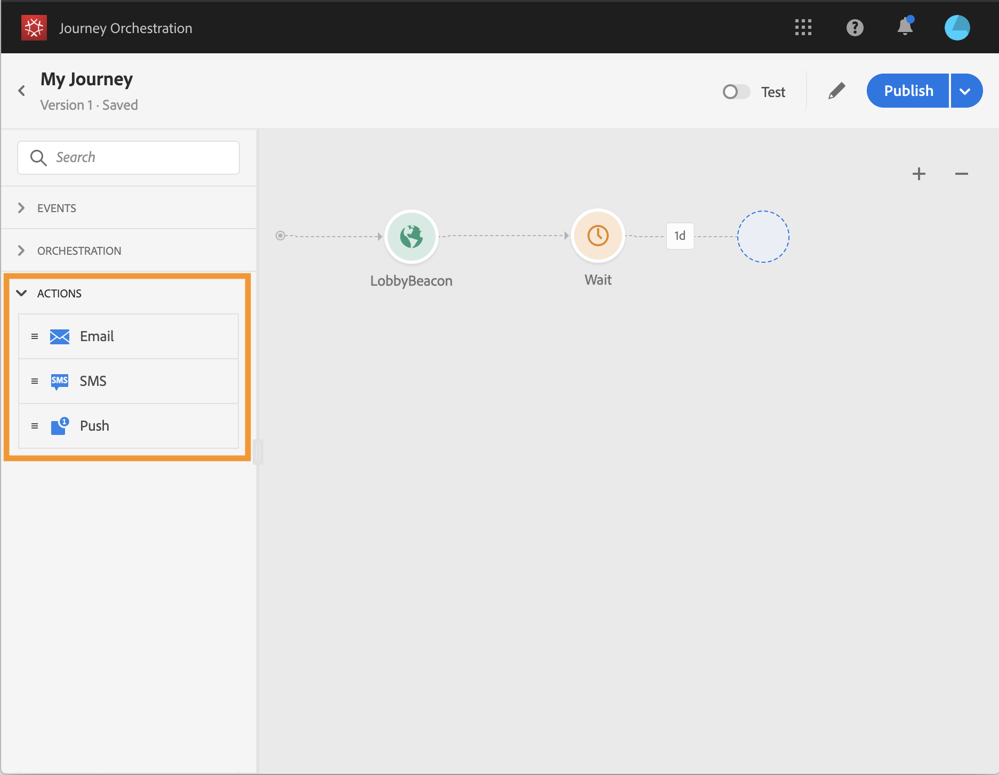

# Working with Adobe Campaign Standard {#using_adobe_campaign_standard}

You can send emails, push notifications and SMS using the Adobe Campaign Standard's Transactional Messaging capabilities. 

Journey Orchestration comes with an out-of-the-box action which allows the connection to Adobe Campaign Standard. Here are the steps to configure it:

1. From the **Actions** list, click the built-in **AdobeCampaignStandard** action. The action configuration pane opens on the right side of the screen.

1. Copy your Adobe Campaign Standard instance URL and paste it in the **URL** field. 

1. Click the **Test the instance URL** to test the validity of the instance.

When designing your journey, three actions will be available in the **Action** category: **Email**, **Push**, **SMS** (see [Action activities](../building-journeys/journeyactioncampaign.md)).

If you're using a third-party system to send messages, you need to add and configure a custom action. Refer to [Using a third-party system](../action/custom.md).
