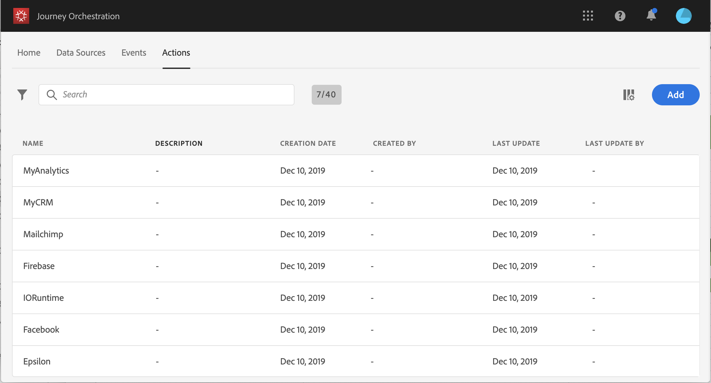
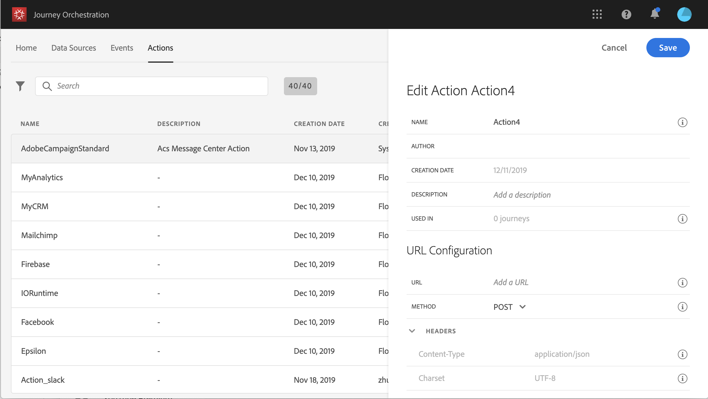

# About custom action configuration {#concept_sxy_bzs_dgb}

If you're using a third-party system to send messages or if you want Journey Orchestration to send API calls to a third-party system, this is where you configure its connection to Journey Orchestration. The custom action defined by technical users will then be available in the left palette of your journey, in the **Action** category (see [Action activities](../building-journeys/journeyaction.md#concept_hbj_hrt_52b)). Here are a few examples of systems that you can connect to with custom actions: Epsilon, Facebook, Adobe.io, Firebase, etc.
Limitations are listed here: [Custom action limitations](../custom-action/customlimitations.md#concept_lh2_df1_2gb).

Here are the main steps required to configure a custom action:

1. In the top bar, click **Actions**.

    The list of custom actions is displayed. See [The Journey Orchestration' interface](../about/aboutinterface.md#concept_rcq_lqt_52b) for more information on the interface.

    

1. Click **Add** to create a new action. The action configuration pane opens on the right side of the screen.

    

1. Enter a name for your action.

    >[!NOTE]
    >
    >Do not use spaces or special characters. Do not use more than 30 characters.

1. Add a description to your action. This step is optional.
1. The number of journeys that use this action is displayed in the **Used in** field. You can click the **View journeys** button to display the list of  journeys using this action.
1. Define the different **URL Configuration** parameters. See [URL configuration](../custom-action/customurl.md#concept_gbg_1f1_2gb).
1. Configure the **Authentication** section. See [Configuring the authentication](../custom-action/customauthentication.md#concept_is4_cf1_2gb).
1. Define the **Message parameters**. See [Defining the message parameters](../custom-action/customparameters.md#concept_wy4_bf1_2gb).
1. Click **Save**. 

    The custom action is now configured and ready to be used in your journeys. See [Action activities](../building-journeys/journeyaction.md#concept_hbj_hrt_52b).
