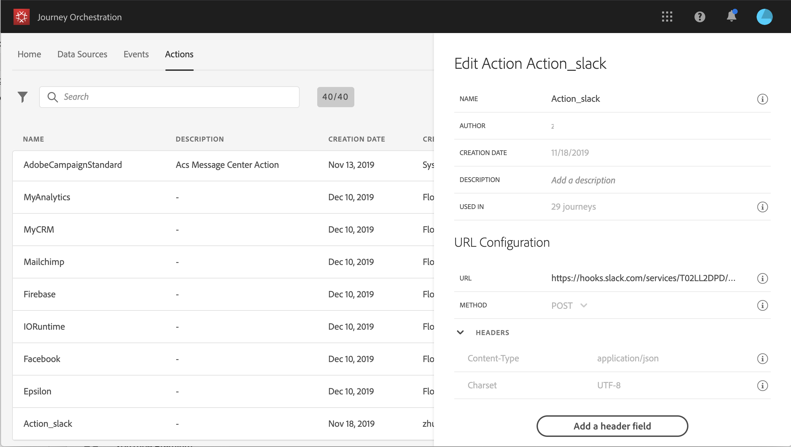

# URL configuration {#concept_gbg_1f1_2gb}

When configuring a custom action, you need to define the following **URL Configuration** parameters:

1. Add the **URL** of the external service.

    >[!NOTE]
    >
    >We strongly recommend using HTTPS for security reasons. We don't allow the use of Adobe addresses that are not public and the use of IP addresses.

1. Select the call **Method**: it can be either **POST** or **PUT**.
1. In the **Headers** section, click **Add a header field** to define a new key/value pair. They correspond to the HTTP headers of the request made to the external service. To delete key/value pairs, place your cursor on the **Headers** field and click on the **Delete** icon.

    **Content-Type** and **Charset** are set by default and cannot be deleted or overridden.

    >[!NOTE]
    >
    >Headers are validated according to the following [parsing rules](https://tools.ietf.org/html/rfc7230#section-3.2.4).
