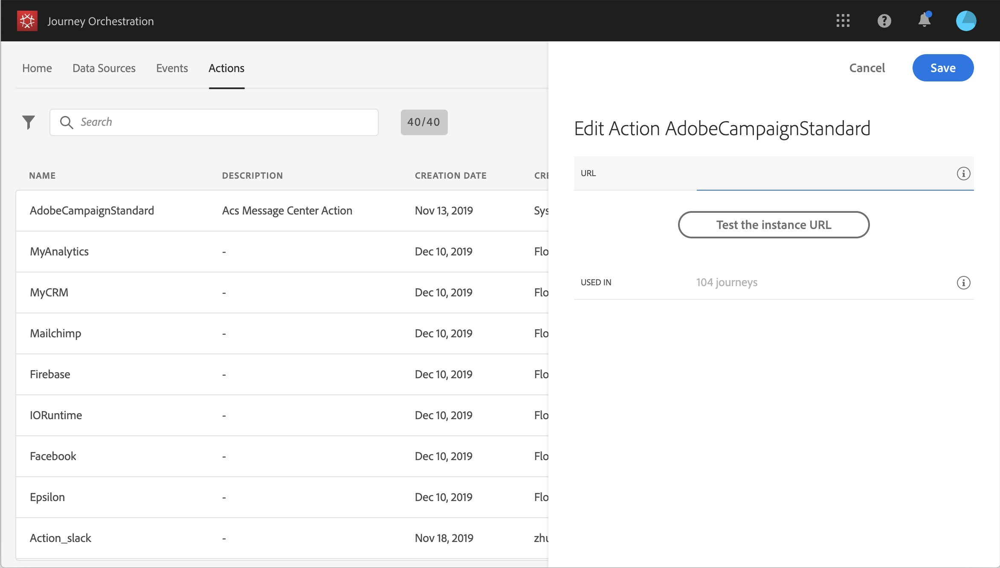

# Working with Adobe Campaign {#using_adobe_campaign_standard}

You can send emails, push notifications and SMS using the Adobe Campaign Standard's Transactional Messaging capabilities.

[!DNL Journey Orchestration] comes with an out-of-the-box action which allows the connection to Adobe Campaign Standard. 

The Campaign Standard transactional message and its associated event must be published in order to be used in Journey Orchestration. If the event is published but the message is not, it will not be visible in the Journey Orchestration interface. If the message is published but its associated event is not, it will be visible in the Journey Orchestration interface but it will not be usable.

>[!NOTE]
>
>To avoid overloading Adobe Campaign Standard Transactional Messaging, it is recommended to setup a **capping rule** for the Campaign Standard integration.
>
>Read more about transactional messaging SLAs in [Adobe Campaign Standard Product Description](https://helpx.adobe.com/legal/product-descriptions/campaign-standard.html).

Here are the steps to configure it:

1. From the **[!UICONTROL Actions]** list, click the built-in **[!UICONTROL AdobeCampaignStandard]** action. The action configuration pane opens on the right side of the screen.

    

1. Copy your Adobe Campaign Standard instance URL and paste it in the **[!UICONTROL URL]** field.

1. Click the **[!UICONTROL Test the instance URL]** to test the validity of the instance.

    >[!NOTE]
    >
    >This test verifies that:
    >
    >* The host is ".campaign.adobe.com" or ".campaign-sandbox.adobe.com",
    >* The URL starts with https,
    >* The ORG associated to this Adobe Campaign Standard's instance is the same as the Journey Orchestration's ORG.

When designing your journey, three actions will be available in the **[!UICONTROL Action]** category: **[!UICONTROL Email]**, **[!UICONTROL Push]**, **[!UICONTROL SMS]** (see [Using Adobe Campaign actions](../building-journeys/using-adobe-campaign-actions.md)). **Reactions event** will also allow you to react on message clicks, opens, etc. (see [Reactions events](../building-journeys/event-activities.md#section_dhx_gss_dgb)).

If you're using a third-party system to send messages, you need to add and configure a custom action. See [About custom action configuration](../action/about-custom-action-configuration.md).
