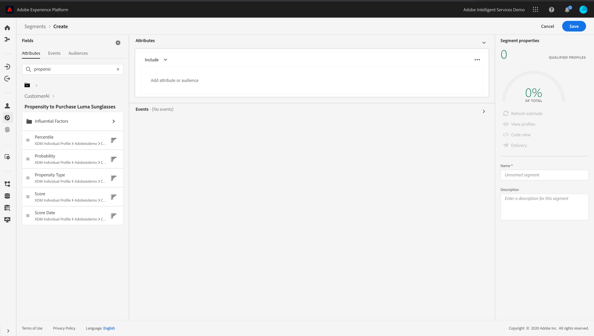

# Leveraging Customer AI {#customer-ai}

Customer AI is part of Intelligent Services. It helps predict what a customer is likely to do. See the [documentation](https://docs.adobe.com/content/help/en/experience-platform/intelligent-services/customer-ai/overview.html).  

Customer AI allows brands to create churn or conversion machine learning based scores that will be available as profile attributes in the Experience Platform profiles (Real-time Customer Profile).

As a result, they can be used as any other profile attributes in Journey Orchestration's conditions (to make the best decisions), actions or segment building. 

Note that Customer AI is a paid feature of the Experience Platform.

 