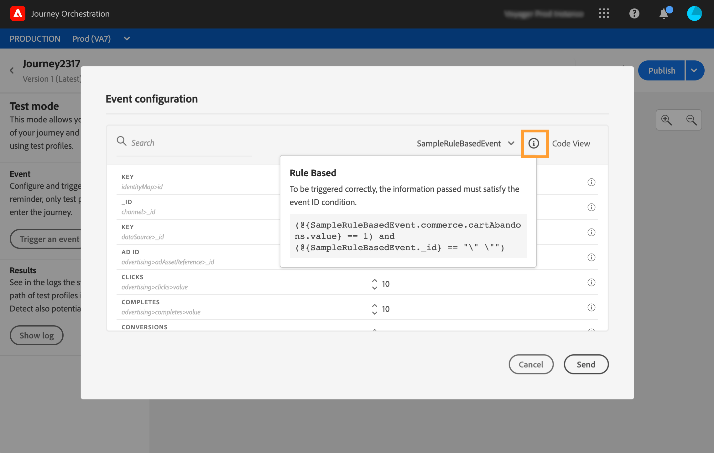

# Rule-based events{#simplified-events}

We have simplified the way you set up Experience events. We're introducing a new method that does not require the use of an eventID. When you set up your event in Journey Orchestration, you can now define a rule-based event.

This new type of event does not generate an eventID. Using the simple expression editor, you now simply define a rule which will be used by the system to identify the relevant events that will trigger your journeys. This rule can be based on any field available in the event payload, for example the profile's location or the number of items added to the profile's cart.

This new method is mostly transparent for users. The only change is a new field in the event definition screen.

## Leveraging Adobe Analytics data{#analytics-data}

>[!NOTE]
>
>This section only applies for customers who need to use Adobe Analytics data.

You can leverage all of the Adobe Analytics behavioral event data that you are already capturing and streaming into the Platform in order to trigger journeys and automate experiences for your customers.

For this to work, you need to activate, in Adobe Experience Platform, the report suite that you want to leverage:

1. In Adobe Experience Platform, select **[!UICONTROL Sources]** then **[!UICONTROL Add data]** in the Adobe Analytics section. The list of available Adobe Analytics report suites is displayed.

1. Pick the report suite you want to enable, click **[!UICONTROL Next]** and click **[!UICONTROL Finish]**. 

1. Share the source Data ID with your Alpha program point of contact. 

This enables the Analytics data connector for that report suite. Whenever the data comes in, it is transformed into an Experience event and sent into Adobe Experience Platform. 

For more information on the Adobe Analytics source connector, refer to the [documentation](https://docs.adobe.com/help/en/experience-platform/sources/connectors/adobe-applications/analytics.html) and [tutorial](.https://docs.adobe.com/content/help/en/experience-platform/sources/ui-tutorials/create/adobe-applications/analytics.html).

## Configuring a rule-based event{#configuring-rule-based}

1. From the left menu, click the **[!UICONTROL Admin]** icon, then click **[!UICONTROL Events]**. The list of events is displayed. 

   

1. Click **[!UICONTROL Add]** to create a new event. The event configuration pane opens on the right side of the screen.

   

1. Enter the name of your event. You can also add a description.

   

1. In the new **[!UICONTROL Event ID type]** field, select **[!UICONTROL Rule Based]**. 

   

   >[!NOTE]
   >
   >The **[!UICONTROL System Generated]** type is the existing method that requires an eventID. See [this section](../event/about-events.md).

1. Define the **[!UICONTROL Schema]** and payload **[!UICONTROL Fields]**. See [this section](../event/defining-the-payload-fields.md).

   

   >[!NOTE]
   >
   >When you select the **[!UICONTROL System Generated type]**, only schemas that have the eventID type mixin are available. When you select the **[!UICONTROL Rule Based]** type, all Experience Event schemas are available.

1. Click inside the **[!UICONTROL Event ID condition]** field. Using the simple expression editor, define the condition that will be used by the system to identify the events that will trigger your journey.

   

   In our example, we wrote a condition based on the profile's city. This means that whenever the system receives an event that matches this condition (**[!UICONTROL City]** field and **[!UICONTROL Paris]** value), it will pass it to Journey Orchestration.

1. Define the **[!UICONTROL Namespace]** and **[!UICONTROL Key]**. See [Selecting the namespace](../event/selecting-the-namespace.md) and [Defining the event key](../event/defining-the-event-key.md).

   

The other steps for event configuration and journey creation remain unchanged. 

The event is now configured and ready to be dropped into a journey like any other event. Every time an event that matches the rule is sent to the system, it is passed to Journey Orchestration to trigger your journeys.  

## Test mode for rule-based events{#configuring-rule-based}

The test mode is also available for journeys that use a rule-based event.

When triggering an event, the **Event configuration** screen allows you to define the event parameters to pass in the test. You can view the event ID condition by clicking the tooltip icon in the top right corner. A tooltip is also available next to each field that is part of the rule evaluation.

For more information on how to use the test mode, refer to 

