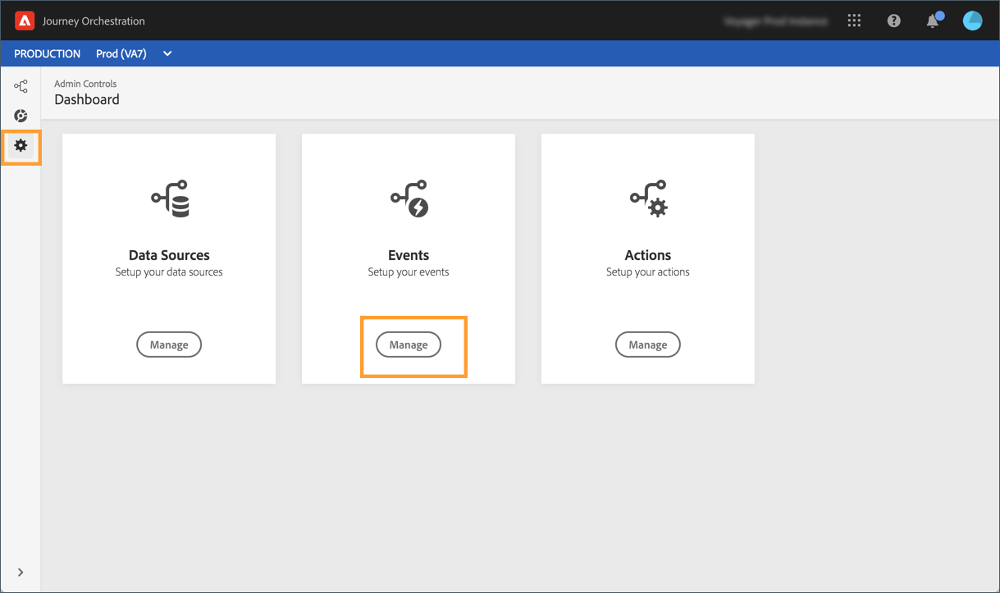

# Simplified events{simplified-events}

We have simplified the way you set up events. We're introducing a new method that does not require the use of an eventID. When you set up your event in Journey Orchestration, you can now define a rule-based event.

This new type of event does not generate an eventID. Using the simple expression editor, you now simply define a rule which will be used by the system identify the relevant events to trigger your journeys. This rule can be based on any field available in the event payload, for example the profile's location.

This new method is mostly transparent for users. The only change is a new field in the event definition screen.

1. From the left menu, click the **Admin** icon, then click **Events**. The list of events is displayed. 

 

1. Click **Add** to create a new event. The event configuration pane opens on the right side of the screen.

1. Enter the name of your event. You can also add a description.

1. In the **Event ID type** field, select **Rule Based**. 

 >[!NOTE]
 >
 >The **System Generated** type is the existing method that requires an eventID. See: [this section](../event/about-events.md).

1. Define the **Schema** and payload **Fields**. See [this section](../event/defining-the-payload-fields.md).

1. Using the simple expression editor, define the rule that will be used by the system to identify the events that will trigger your journey.

1. Define the **Namespace** and **Key**. See  and .

The other steps remain unchanged. See [this section](../event/about-events.md#).

The event is now configured and ready to be dropped into a journey. Every time an event that matches the rule is sent to the system, it is passed to Journey Orchestration to trigger your journeys.  

