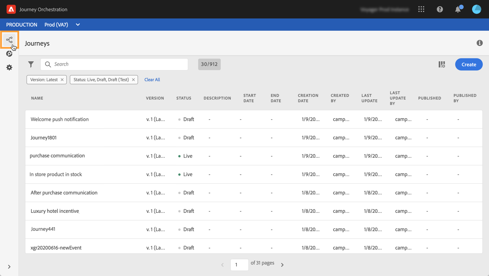

# Discovering the Alpha version interface {#discovering-alpha-interface}

## About the Alpha version interface {#about-alpha-interface}

Navigation within [!DNL Journey Orchestration] menus has been enhanced, in order to provide a consistant interface with Adobe Experience Platform. Changes include:

* Menus moved from the top to the left-hand side of the interface,
* Grouping of admin functionalities into a single dashboard.

Global concepts on how to use and navigate in the interface (searching and filtering, browsing through Data Platform fields, shortcuts) are presented in [this section](../about/user-interface.md).

## Accessing [!DNL Journey Orchestration] functionalities {#accessing-journey-orchestration-functionalities}

When you access [!DNL Journey Orchestration], the **[!UICONTROL Journeys]** menu is displayed, allowing you to access existing journeys or create new ones. See [Using the journey designer](../building-journeys/using-the-journey-designer.md).

The **[!UICONTROL Segments]** menu allows you to access and create Experience Platform segments. See [About Platform segments](../segment/about-segments.md).

The **[!UICONTROL Admin]** menu is available to all users with Administrator rights (see [Access management](../about/access-management.md)). It provides a dashboard which allows you to setup [data sources](../datasource/about-data-sources.md), [events](../event/about-events.md) and [actions](../action/action.md).

