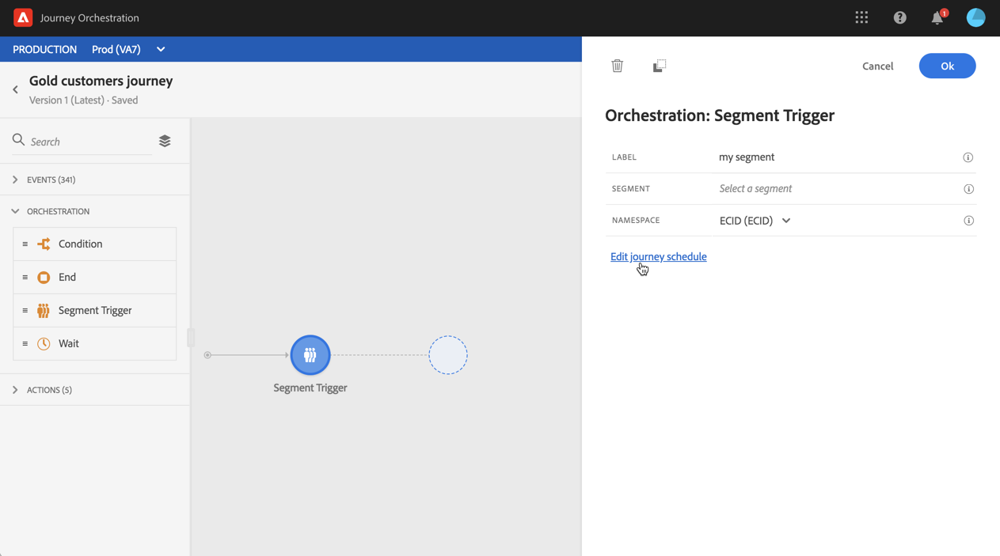
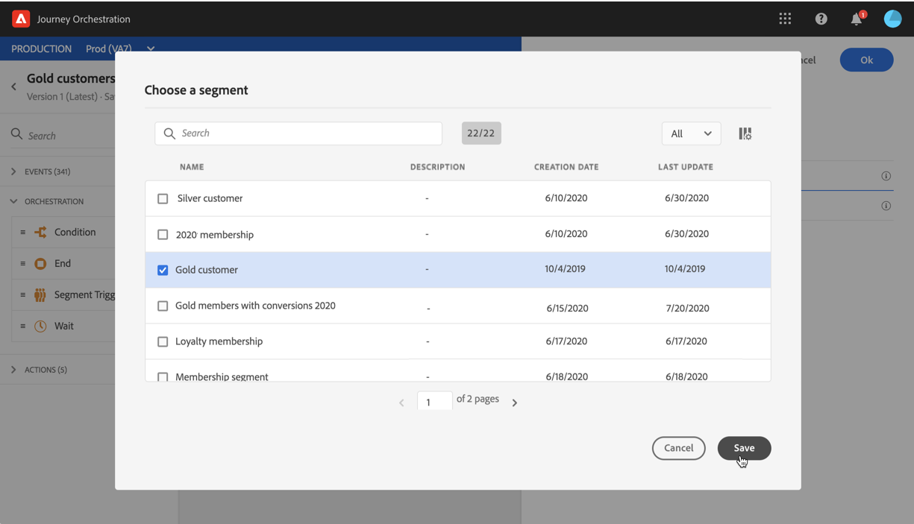

# Segment Trigger activity {#segment-trigger-activity}

## About the Segment Trigger activity {#about-segment-trigger-actvitiy}

>[!NOTE]
>
>If an Adobe Campaign Standard out-of-the-box action activity is present in the canvas at publication time or test mode activation time, the journey will be throttled at 13 entrances per second.  If no Adobe Campaign Standard out-of-the-box action activity is present in the canvas at publication time or test mode activation time, the journey will be throttled at 1000 events per second.

The Segment Trigger activity allows you to make all individuals belonging to an Adobe Experience Platform segment enter a journey. Entrance into a journey can be executed either once, or on a regular basis.

Let's say you have a Gold customer segment on Adobe Experience Platform. With the Segment Trigger activity, you can make all individuals belonging to the Gold customer segment enter a journey and make them flow into individualized journeys that will leverage all journey functionalities: conditions, timers, events, actions.

## Configuring the activity {#configuring-segment-trigger-activity}

>[!NOTE]
>
>Due to segment export latencies, it is not possible to trigger a segment-based journey in a shorter timeframe than 1 hour.

1. Unfold the **[!UICONTROL Orchestration]** category and drop a **[!UICONTROL Segment Trigger]** activity into your canvas.

    The activity must be positioned as the first step of a journey.

1. Configure the activity **[!UICONTROL Scheduler type]**.

    By default, the segment will enter the journey **[!UICONTROL As soon as possible]**, meaning 1 hour after the journey is published. If you want to make the segment enter the journey on a specific date/time or on a recurring basis, select the desired option from the list.

    In case of recurring journeys, you can also define the start and end of the journey.

    

1. In the **[!UICONTROL Segment]** field, choose the Adobe Experience Platform segment that will enter the journey, then click **[!UICONTROL Save]**.

    

1. In the **[!UICONTROL Namespace]** field, choose the namespace to use in order to identify the individuals. For more on namespaces, refer to [this section](../event/selecting-the-namespace.md).

    >[!NOTE]
    >
    >Individuals belonging to a segment that does not have the selected identity (namespace) among their different identities cannot enter the journey.

1. Click **[!UICONTROL Ok]** to confirm. You can then leverage available activities to build your journey.

1. Once the journey is ready, you can potentially test it (see [Testing the journey](../building-journeys/testing-the-journey.md)).

    When the test mode is activated on a journey starting with a **[!UICONTROL Segment Trigger]** activity, 100 test profiles will be randomly selected among the profiles qualified for the selected segment. The test logs will allow you to see the path of individuals in the journey and potential encountered errors (see [Viewing the logs](../building-journeys/testing-the-journey.md#viewing_logs)).

    >[!NOTE]
    >
    >Note that you will not be able to see the 100 persons following the journey using the visual flow feature existing in unitary journeys.

1. You can then publish your journey (see [Publishing the journey](../building-journeys/publishing-the-journey.md)). Individuals belonging to the segment will enter the journey on the date/time specified in the Segment Trigger activity scheduler.

    >[!IMPORTANT]
    >
    >Keep in mind that Adobe Experience Platform segments are calculated either once a day (**batch** segments) or in real-time (**streamed** segments).
    >
    >If the selected segment is streamed, the individuals belonging to this segment will be potentially enter the journey in real-time. If the segment is batch, people newly qualified for this segment will potentially enter the journey when the segment calculation is executed on the Adobe Experience Platform.
