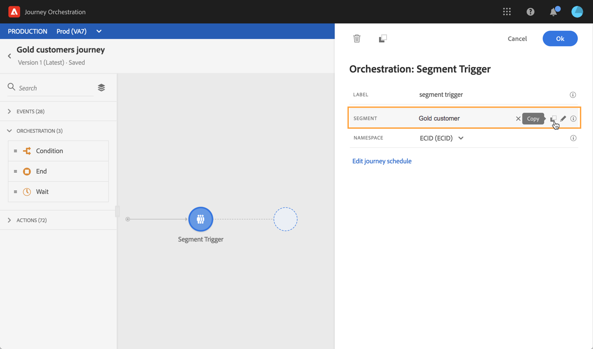
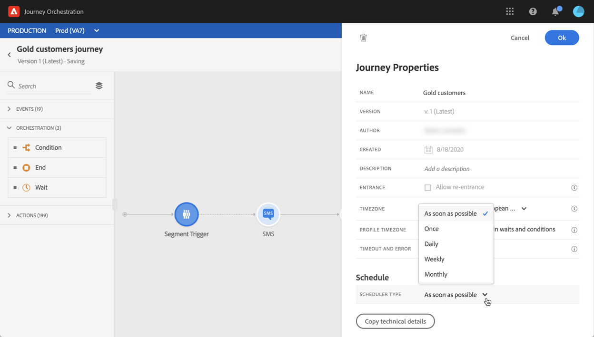
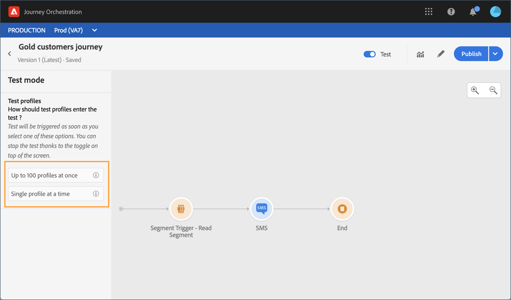

# Read Segment activity {#segment-trigger-activity}

## About the Read Segment activity {#about-segment-trigger-actvitiy}

>[!NOTE]
>
>If an Adobe Campaign Standard out-of-the-box action activity is present in the canvas at publication time or test mode activation time, the journey will be throttled at 13 entrances per second. Otherwise, the journey will be throttled at 1000 events per second.

The Read Segment activity allows you to make all individuals belonging to an Adobe Experience Platform segment enter a journey. Entrance into a journey can be executed either once, or on a regular basis.

Let's say you have a Gold customer segment on Adobe Experience Platform. With the Read Segment activity, you can make all individuals belonging to the Gold customer segment enter a journey and make them flow into individualized journeys that will leverage all journey functionalities: conditions, timers, events, actions.

## Configuring the activity {#configuring-segment-trigger-activity}

>[!NOTE]
>
>Due to segment export latencies, it is not possible to trigger a segment-based journey in a shorter timeframe than 1 hour.

1. Unfold the **[!UICONTROL Orchestration]** category and drop a **[!UICONTROL Read Segment]** activity into your canvas.

    The activity must be positioned as the first step of a journey.

1. Add a **[!UICONTROL Label]** to the activity (optional).

1. In the **[!UICONTROL Segment]** field, choose the Adobe Experience Platform segment that will enter the journey, then click **[!UICONTROL Save]**.

   >[!NOTE]
   >
   >Note that you can customize the columns displayed in the list and sort them.

    

   Once the segment is added, the **[!UICONTROL Copy]** button allows you to copy its name and ID:

   `{"name":"Gold customers,”id":"8597c5dc-70e3-4b05-8fb9-7e938f5c07a3"}`

   

1. In the **[!UICONTROL Namespace]** field, choose the namespace to use in order to identify the individuals. For more on namespaces, refer to [this section](../event/selecting-the-namespace.md).

    >[!NOTE]
    >
    >Individuals belonging to a segment that does not have the selected identity (namespace) among their different identities cannot enter the journey.

1. The **[!UICONTROL Read Segment]** activity allows you to specify the time at which the segment will enter the journey. To do this, click the **[!UICONTROL Edit journey schedule]** link to access the journey's properties, then configure the **[!UICONTROL Scheduler type]** field.

    

    By default, segments enter the journey **[!UICONTROL As soon as possible]**, meaning 1 hour after the journey is published. If you want to make the segment enter the journey on a specific date/time or on a recurring basis, select the desired value from the list.

    >[!NOTE]
    >
    >Note that the **[!UICONTROL Schedule]** section is only available when a **[!UICONTROL Read Segment]** activity has been dropped in the canvas.

    

## Testing and publishing the journey {#testing-publishing}

The **[!UICONTROL Read Segment]** activity allows you to test the journey either on a unitary profile, or on 100 randomly test profiles selected among the profiles qualified for the segment.

To do this, activate the test mode, then select the desired option from the left pane.

You can then configure the test mode as usual. Detailed steps on how to test a journey are presented in [this section](../building-journeys/testing-the-journey.md).

Note that testing the journey using up to profiles at once does not allow you to track the progress of the individuals in the journey using the visual flow.

Once the tests are successfull, you can publish your journey (see [Publishing the journey](../building-journeys/publishing-the-journey.md)). Individuals belonging to the segment will enter the journey on the date/time specified in the journey's properties **[!UICONTROL Scheduler]** section.

>[!IMPORTANT]
>
>Keep in mind that Adobe Experience Platform segments are calculated either once a day (**batch** segments) or in real-time (**streamed** segments).
>
>If the selected segment is streamed, the individuals belonging to this segment will be potentially enter the journey in real-time. If the segment is batch, people newly qualified for this segment will potentially enter the journey when the segment calculation is executed on the Adobe Experience Platform.
