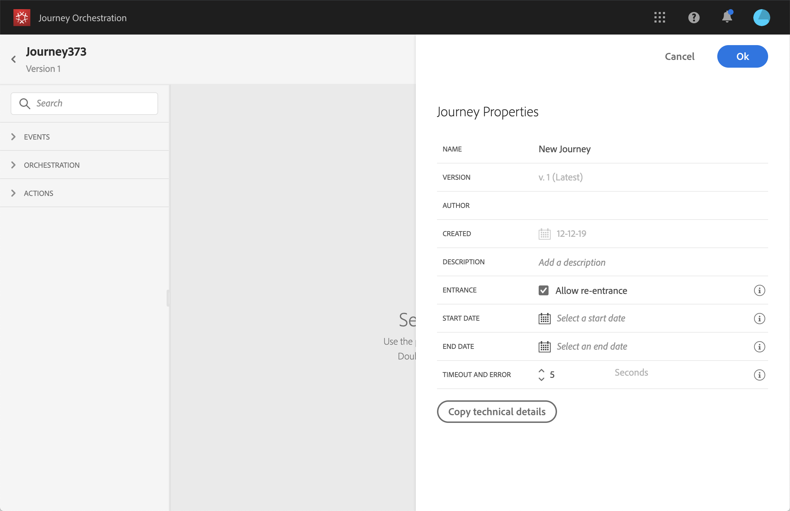

# Changing properties {#concept_prq_wqt_52b}

Click on the pencil icon, in the top right to access the journey's properties.

You can change the name of the journey, add a description, allow re-entrance, choose start and end dates and define a **[!UICONTROL Timeout and error]** duration if you are admin. 

 

## Entrance{#entrance}

By default, new journeys allow re-entrance. You can uncheck the option for “one shot” journeys, for example if you want to offer a one-time gift when a person enters a shop. In that case, you don't want the customer to be able to re-enter the journey and receive the offer again.

When a journey "ends", it will have the status **[!UICONTROL Closed (no entrance)]**. The journey will stop letting new individuals enter the journey. Persons already in the journey will finish the journey normally.

## Timeout and error in journey activitites {#timeout_and_error}

When editing an action or condition activity, you can define an alternative path in case of error or timeout. If the processing of the activity interrogating a third-party system exceeds the timeout duration defined in the journey's properties (**[!UICONTROL Timeout and  error]** field), the second path will be chosen to perform a potential fallback action. 

Authorized values are between 1 and 30 seconds.

We recommend that you define a very short **[!UICONTROL Timeout and error]** value if your journey is time sensitive (example: reacting to the real-time location of a person) because you cannot delay your action for more than a few seconds. If your journey is less time sensitive, you can use a longer value to give more time to the system called to send a valid response.

[!DNL Journey Orchestration] also uses a global timeout. See the [next section](#global_timeout).

## Global journey timeout {#global_timeout}

In addition to the [timeout](#timeout_and_error) used in journey activitites, there is also a global journey timeout which is not displayed in the interface and cannot be changed. This timeout will stop the progress of individuals in the journey 30 days after they enter. This means that an individual's journey cannot last longer than 30 days. After the 30 day timeout period, the individual's data is deleted. Individuals still flowing in the journey at the end of the timeout period will be stopped and they will be taken into account as errors in reporting.

>[!NOTE]
>
>[!DNL Journey Orchestration] does not directly react to privacy opt-out, access or delete requests. However, the global timeout ensures that individuals never stay more than 30 days in any journey.

Due to the 30-day journey timeout, when journey re-entrance is not allowed, we cannot make sure the re-entrance blocking will work more than 30 days. Indeed, as we remove all information about persons who entered the journey 30 days after they enter, we cannot know the person entered previously, more than 30 days ago.

## Timezone and profile timezone {#timezone}

Timezone are defined at journey level.

You can enter a fixed time zone or use Adobe Experience Platform profiles to define the journey time zone.

For more information on timezone management, see .
