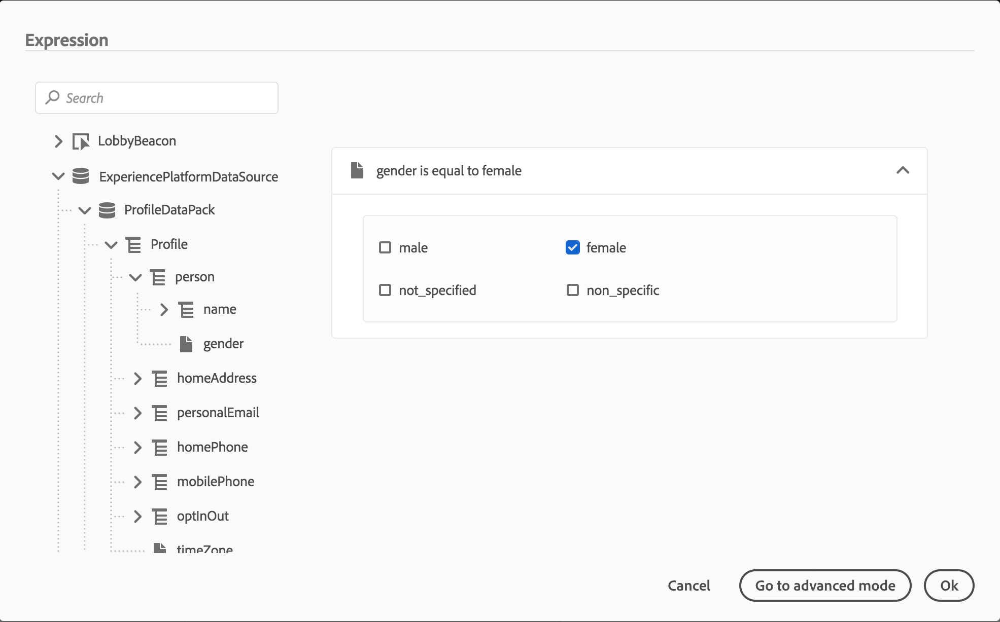
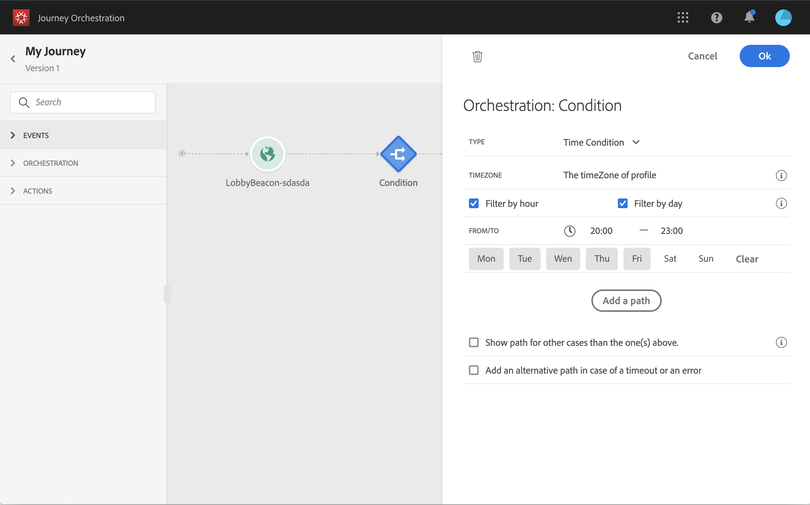
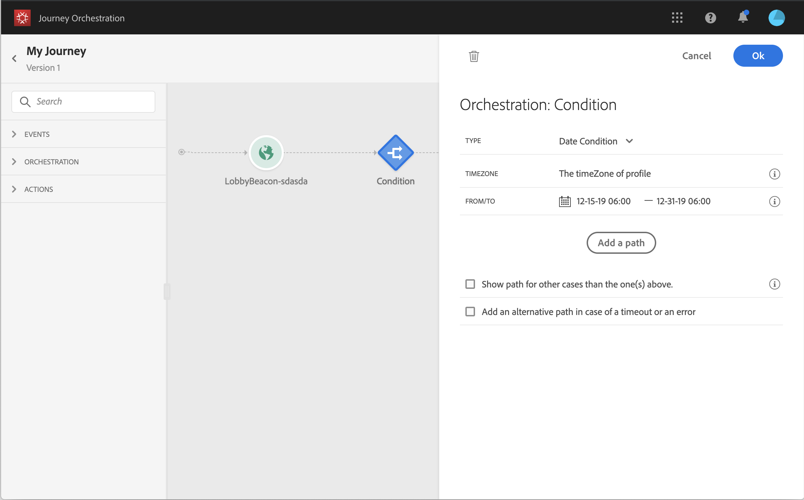

# Condition activity{#section_e2n_pft_dgb}

Four types of conditions are available:

* [Data Source condition](#data_source_condition) 
* [Time condition](#time_condition) 
* [Percentage split](#percentage_split) 
* [Date condition](#date_condition) 

## About the Condition activity {#about_condition}

Click **Add a path** if you want to define several conditions. For each condition, a new path is added in the canvas after the activity.

Note that the design of journeys has functional impacts. When several paths are defined after a condition, only the first eligible path will be executed. It means that you can vary the prioritization of paths by placing them above or below one another. For example, if the first path's condition is "The person is a VIP" and the second path's condition is "The person is a male". If a person meeting both conditions (a male who is a VIP) passes this step, the first path will be chosen even if he's also eligible to the second one, because the first path is "above". To change this priority, move your activities in another vertical order.

You can create another path for audiences that are not eligible to the defined conditions by checking **Show path for other cases than the one(s) above**. Note that this option is not available in split conditions. See [Percentage split](#percentage_split).

The simple mode allows you to perform simple queries based on a combination of fields. All the available fields are displayed on the left side of the screen. Drag and drop fields into the main zone. To combine the different elements, interlock them into one another to create different groups and/or group levels. You can then select a logical operator to combine elements on the same level:

* AND: an intersection of two criteria. Only the elements matching all criteria are taken into account. 
* OR: a union of two criteria. Elements matching at least one of the two criteria are taken into account.

>[!NOTE]
>
>You cannot perform queries on time series (for example a list of purchases, past clicks on messages) with the simple editor. For this you’ll need to use the advanced editor. See .

## Data Source condition {#data_source_condition}

This allows you to define a condition based on fields from the data sources or the events previously positioned in the journey. To learn how to use the expression editor, see . Using the advanced expression editor, you can setup more advanced conditions manipulating collections or using data sources requiring the passing of parameters. See 

## Time condition{#time_condition}

This allows you to perform different actions according to the hour of the day and/or the day of the week. For example, you can decide to send SMS messages during daytime and emails at night during weekdays. You can define a specific time zone for this condition. See .

## Percentage split {#percentage_split}

This option allows you to randomly split the audience to define a different action for each group. Define the number of splits and the repartition for each path. The split calculation is statistical as the system cannot anticipate how many people will flow in this activity of the journey. As a result, the split has a very low error margin. This function is based on a Java random mechanism (see this [page](https://docs.oracle.com/javase/7/docs/api/java/util/Random.html)). 

>[!NOTE]
>
>Note that there is no button to add a path in the percentage split condition. The number of paths will depend on the number of splits. In split conditions, you cannot add a path for other cases as it cannot happen. People will always go into one of the split paths.

## Date condition {#date_condition}

This allows you to define a different flow based on the date. For example, if the person enters the step during the "sales" period, you'll send him a specific message. The rest of the year, you'll send another message. When you define a date condition, you must specify a time zone. See .

