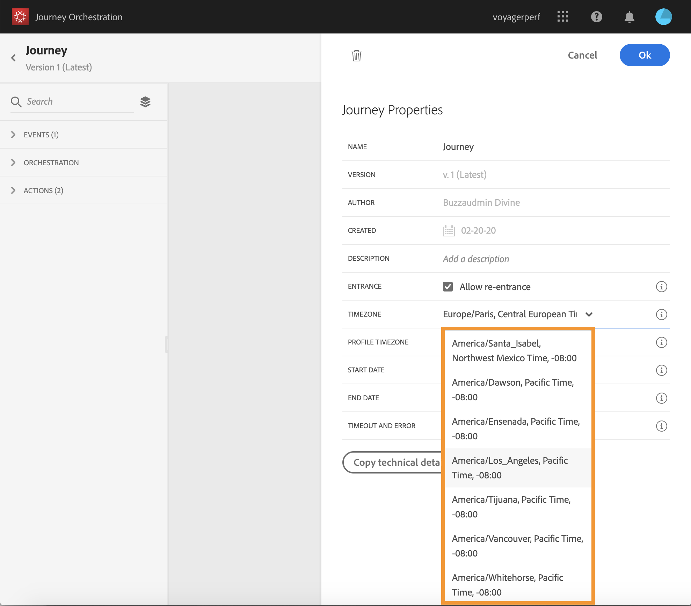

# Building a journey {#concept_gq5_sqt_52b}

This step is performed by the **business user**. This is where you create your journeys. Combine the different event, orchestration and action activities to build your multi-step cross-channel scenarios.

The journey interface allows you to easily drag and drop activities from the palette into the canvas. You can also double-click on an activity to add it in the canvas at the next step available. Each activity has a specific role and place in the process. The activities are sequenced. When an activity is finished, the flow continues and processes the next activity, and so on.

Only one namespace is allowed per journey. When you drop the first event, events with different namespaces will be grayed out. If the first event doesn't have a namespace, then all events with a namespace will be grayed out. See [Selecting the namespace](../event/eventnamespace.md#concept_ckb_3qt_52b). Also, Experience Platform field groups are grayed out if the journey has events without a namespace. And finally, if you use several events in the same journey, they need to use the same namespace.

## Ending a journey {#section_asc_51g_nhb}

Here are the main steps to create and publish a journey.

1. In the top bar, click **Home**. 

    The list of journeys is displayed. See [The journey designer's interface](../building-journeys/journeyinterface.md#concept_m1g_5qt_52b) for more information on the interface.

    

1. Click **Create** to create a new journey.

    

1. Edit the journey's properties in the configuration pane displayed on the right side. See [The journey's properties](../building-journeys/journeyproperty.md#concept_prq_wqt_52b).

    

1. Start by drag and dropping an event activity from the palette into the canvas. You can also double-click on an activity to add it to the canvas.

    

1. Drag and drop your other activities and configure them. See [Events activities](../building-journeys/journeyevent.md#concept_rws_1rt_52b), [Orchestration activities](../building-journeys/journeyorchestration.md#concept_ksq_2rt_52b) and [Action activities](../building-journeys/journeyaction.md#concept_hbj_hrt_52b).

    

1. Your journey is automatically saved. Test your journey and publish it. See [Testing and publishing the journey](../building-journeys/journeypublication.md#concept_mtc_lrt_52b).

    

## Ending a journey{#ending_a_journey}

There are three ways to end a journey:

* The person arrives at an **End** activity.
* The person arrives at the last activity of a path.
* The person arrives at a condition activity (or a wait activity with a condition) and does not match any of the conditions.

The person can then re-enter the journey if re-entrance is allowed. See [The journey's properties](../building-journeys/journeyproperty.md#concept_prq_wqt_52b).

## Timezone management {#timezone_management}

Timezone definition is available in the following activities:

* time conditions, see [Condition](../building-journeys/journeyorchestration.md#section_e2n_pft_dgb)
* date conditions, see [Condition](../building-journeys/journeyorchestration.md#section_e2n_pft_dgb)
* custom wait, see [Wait](../building-journeys/journeyorchestration.md#section_rlm_nft_dgb)
* fixed date wait, see [Wait](../building-journeys/journeyorchestration.md#section_rlm_nft_dgb)

If the entry event of the journey has a namespace, meaning that the journey can reach the Unified Profile Service of the Data Platform, the timezone is pre-defined with the one specified in the profile of the individual flowing in the journey. If the individual's profile does not contain a timezone, the instance's timezone is used. You can contact your administrator to know the instance timezone.

The timezone can also be fixed. Clear the pre-defined timezone and pick one from the drop-down list. If you use a fixed timezone, it will be the same for all individuals entering the journey. 

Finally, the timezone can be dynamic for each person entering the step. In this case, you will use the expression editor to select where you want the system to get this information (it can be from an event or a data source). See [Building advanced conditions](../expression/expressionadvanced.md#concept_uyj_trt_52b)The custom timezone must follow this [format](https://docs.oracle.com/javase/8/docs/api/java/time/ZoneId.html#of-java.lang.String-). If the timezone you want to leverage is a string, you can use the function ‘toTimeZone’ to convert it to the right format. See [Wait](../functions/functiontotimezone.md#toTimeZone)

The start and end dates of a journey cannot be linked to a specific timezone. They are automatically associated to the instance's timezone.

