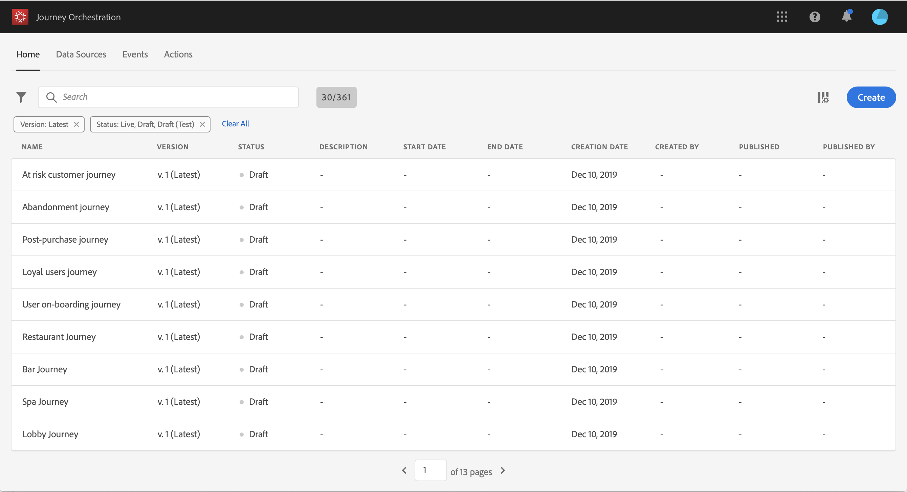

# Creating a journey {#concept_gq5_sqt_52b}

This step is performed by the **business user**. This is where you create your journeys. Combine the different event, orchestration and action activities to build your multi-step cross-channel scenarios.

The journey interface allows you to easily drag and drop activities from the palette into the canvas. You can also double-click on an activity to add it in the canvas at the next step available. Each activity has a specific role and place in the process. The activities are sequenced. When an activity is finished, the flow continues and processes the next activity, and so on.

Only one namespace is allowed per journey. When you drop the first event, events with different namespaces will be grayed out. If the first event doesn't have a namespace, then all events with a namespace will be grayed out. See . Also, Experience Platform field groups are grayed out if the journey has events without a namespace. And finally, if you use several events in the same journey, they need to use the same namespace.

## Quick start {#creating_journey}

Here are the main steps to create and publish a journey.

1. In the top menu, click the **Home** tab. 

    The list of journeys is displayed. See  for more information on the interface.

    

1. Click **Create** to create a new journey.

    

1. Edit the journey's properties in the configuration pane displayed on the right side. See .

    

1. Start by drag and dropping an event activity from the palette into the canvas. You can also double-click on an activity to add it to the canvas.

    

1. Drag and drop your other activities and configure them. See ,  and .

    

1. Your journey is automatically saved. Test your journey and publish it. See  and .

    

## Ending a journey{#ending_a_journey}

There are two ways to end a journey:

* The person arrives at the last activity of a path. This last activity can be an end activity or another activity. There is no obligation to end a path with an end activity. See .
* The person arrives at a condition activity (or a wait activity with a condition) and does not match any of the conditions.

The person can then re-enter the journey if re-entrance is allowed. See .

