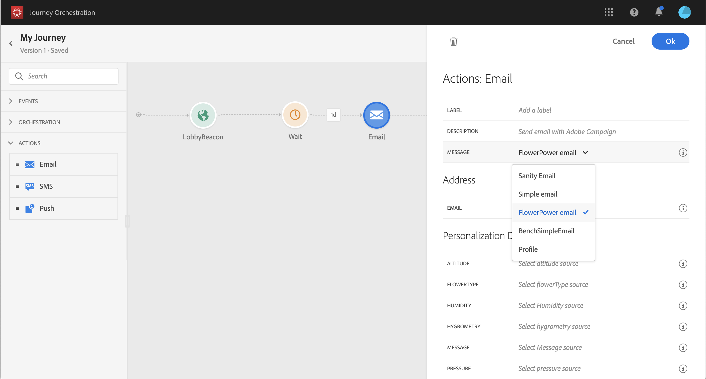
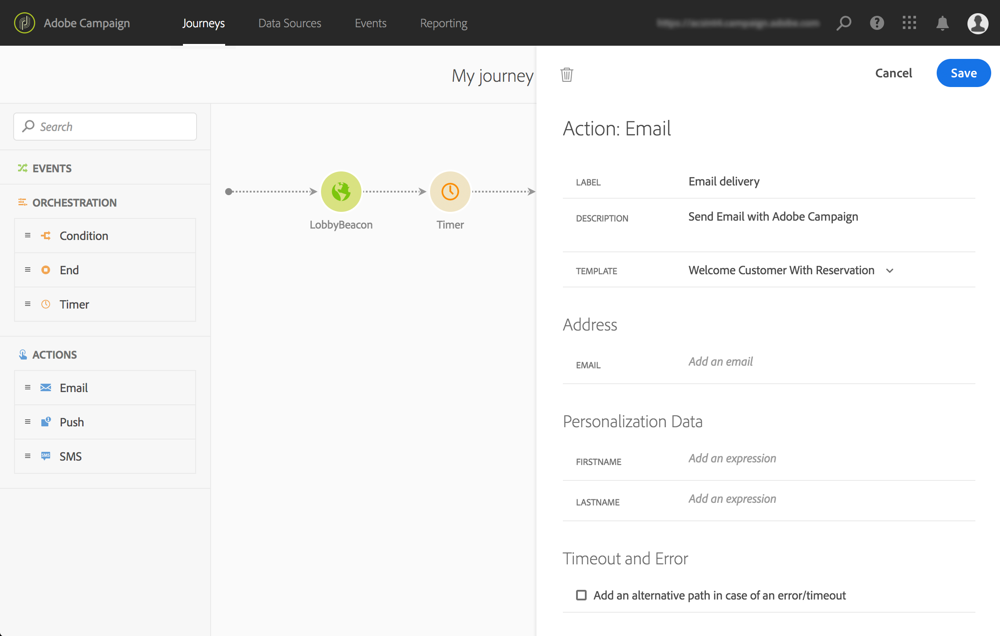
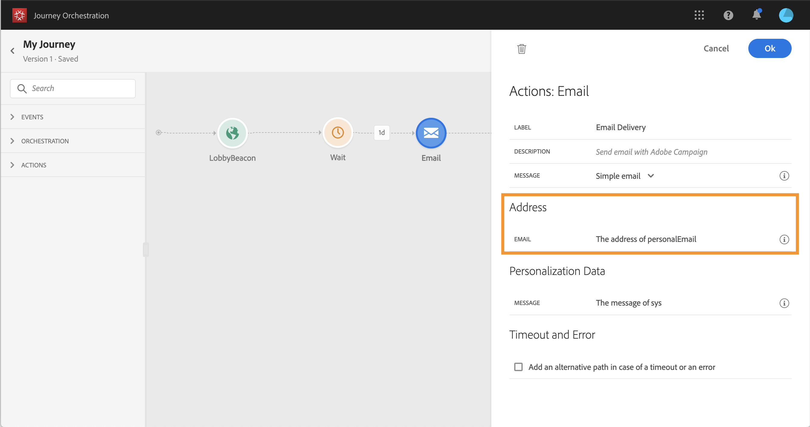
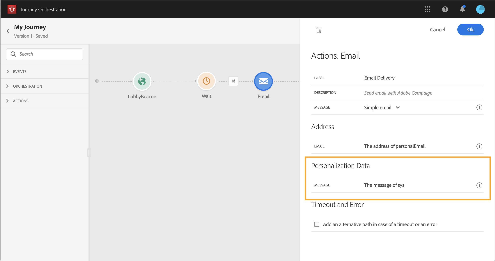
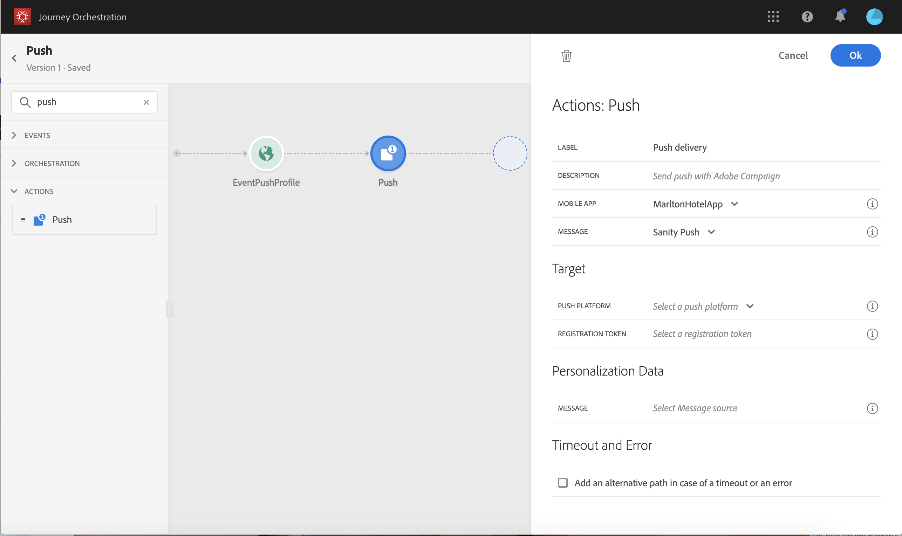

# Action activities {#concept_hbj_hrt_52b}

From the palette, on the left-hand side of the screen, unfold the **Actions** category.

These activities represent the different available communication channels. You can combine them to create a cross-channel scenario. The following out-of-the-box action activities are available: **Email**, **Push** and **SMS**. If you've configured custom actions, they will also appear here (see [custom actions](custom.md)).

When you drop an action activity in the canvas, you can define a **Label**. This allows you to add a suffix to the action name that will appear under your activity in the canvas. This is useful if you use the same action several times in your journey. You can also add an optional **Description**.


For each of these channels, you select an Adobe Campaign Standard Transactional Messaging **template**. Indeed, Journeys is not a message sending solution. We rely on Transactional Messaging to execute message sending. It means that if you want to use a certain message template in your journeys, you must publish it in Adobe Campaign Standard. Refer to this [page](https://docs.adobe.com/content/help/en/campaign-standard/using/communication-channels/transactional-messaging/about-transactional-messaging.html) to learn how to use this feature.



You can use an event or profile transactional messaging template.

>[!NOTE]
>
>When we send real-time transactional messages (rtEvent) or when we route messages with a third-party system thanks to a custom action, a specific setup is required for fatigue, blacklist, profile deletion or unsubscription management. For example, if an attribute "blacklist" or "unsubscribe" is stored in the Platform or in a third-party system, a condition will have to be added before the message sending to check this condition.

When you select a template, all the fields expected in the message payload are displayed in the activity configurator. You need to map each of these fields with the field you want to use, either from the event or from the data source.



## Email and SMS {#section_asc_51g_nhb}

For **Email** and **SMS**, the parameters are identical.

>[!NOTE]
>
>For email, if you're using a profiles transactional template, the unsubscription mechanism is handled out-of-the-box by Campaign Standard. You simply add an **Unsubscription link** content block in the template ([learn more](https://docs.adobe.com/content/help/en/campaign-standard/using/communication-channels/transactional-messaging/about-transactional-messaging.html)). If you're using an event-based template (rtEvent), you need to add, in the message, a link passing the person's email in the URL parameter and pointing to an unsubscription landing page. You need to create this landing page and make sure the person's decision to unsubscribe is transmitted to Adobe.

First, you need to choose a transactional messaging template. See [Actions](journeyaction.md#concept_hbj_hrt_52b).

Two categories are available: **Address** and **Personalization Data**.

**Address**

>[!NOTE]
>
>This category is only visible if you select an event template. For profile templates, the **Address** fields are automatically retrieved by the system using the reconciliation performed by Adobe Campaign Standard.
    
These are the fields the system requires to know where to send the message. For an email template, it's the email address. For an SMS, it's the mobile phone number.



**Personalization data**

These are the fields used in your Adobe Campaign Standard template to personalize your message, apply conditional formatting, or pick a specific message variant. 



## Push {#section_im3_hvf_nhb}

Prior to using the push activity, your mobile app needs to be configured along with Campaign Standard to send push notifications. Use this [article](https://helpx.adobe.com/campaign/kb/integrate-mobile-sdk.html) to take the necessary implementation steps for mobile.

First, you need to choose a mobile app from the drop-down list and a transactional messaging template. See [Actions](journeyaction.md#concept_hbj_hrt_52b).



Two categories are available: **Target** and **Personalization Data**.

* **Target**

>[!NOTE]
>
>This category is only visible if you select an event template. For profile templates, the **Target** fields are automatically retrieved by the system using the reconciliation performed by Adobe Campaign Standard.
    
In this section, you define the **Push Platform** (iOS or Android) and **Registration Token**. The registration token needs to be defined in the payload of the nearest event. It is pre-filled as follows:

    ```

        @{eventName.'_experience'.campaign.message.profileSnapshot.pushNotificationTokens.first().token}
    ```
* **Personalization Data**

    These are the fields used in your Adobe Campaign Standard template to personalize your message, apply conditional formatting, or pick a specific message variant. 

## Custom actions {#section_f2c_hbg_nhb}

If you're using a custom action, you will see, in read-only, the **URL Configuration** and **Authentication** parameters defined in the action configuration screen (see [custom actions](custom.md)).

In the **Action parameters** section, you'll see the message parameters defined with _"toBeMapped": true_. For these parameters, you can define an expression based on the journey's information.
