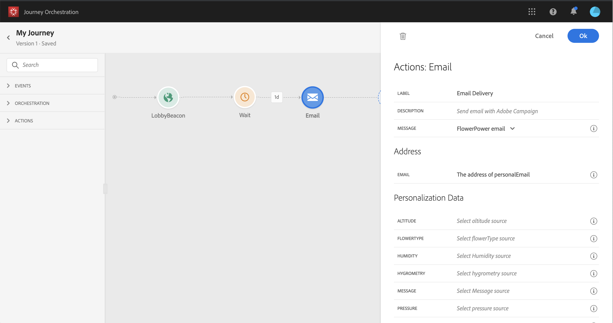

# Action activities {#concept_hbj_hrt_52b}

From the palette, on the left-hand side of the screen, below **Events** and **Orchestration**, you will find the **Actions** category.


These activities represent the different available communication channels. You can combine them to create a cross-channel scenario. The following out-of-the-box action activities are available: **Email**, **Push** and **SMS**. If you've configured custom actions, they will also appear here (see [custom actions](../custom-action/custom.md)).

When you drop an action activity in the canvas, you can define a **Label**. This allows you to add a suffix to the action name that will appear under your activity in the canvas. This is useful if you use the same action several times in your journey and want to identify them more easily. Reports will also be easier to read. You can also add an optional **Description**.


For each of these channels, you select an Adobe Campaign Standard Transactional Messaging **template**. Indeed, Journey orchestration is not a message sending solution. For the built-in email, SMS and push channels, we rely on Transactional Messaging to execute message sending. It means that if you want to use a certain message template in your journeys, you must publish it in Adobe Campaign Standard. Refer to this [page](https://docs.adobe.com/content/help/en/campaign-standard/using/communication-channels/transactional-messaging/about-transactional-messaging.html) to learn how to use this feature.


You can use an event (also known as real-time) or profile transactional messaging template.

>[!NOTE]
>
>When we send real-time transactional messages (rtEvent) or when we route messages with a third-party system thanks to a custom action, a specific setup is required for fatigue, blacklist or unsubscription management. For example, if an attribute "blacklist" or "unsubscribe" is stored in the Platform or in a third-party system, a condition will have to be added before the message sending to check this condition.

When you select a template, all the fields expected in the message payload are displayed in the activity configuration pane under **Address** and **Personalization data**. You need to map each of these fields with the field you want to use, either from the event or from the data source. You can also use the advanced expression editor to pass a value manually, perform data manipulation on retrieved information (for example convert a string to uppercase) or use functions such as "if, then, else". See [Building advanced conditions](../expression/expressionadvanced.md#concept_uyj_trt_52b).



## Email and SMS {#section_asc_51g_nhb}

For **Email** and **SMS**, the parameters are identical.

>[!NOTE]
>
>For email, if you're using a profiles transactional template, the unsubscription mechanism is handled out-of-the-box by Campaign Standard. You simply add an **Unsubscription link** content block in the template ([learn more](https://docs.adobe.com/content/help/en/campaign-standard/using/communication-channels/transactional-messaging/about-transactional-messaging.html)). If you're using an event-based template (rtEvent), you need to add, in the message, a link passing the person's email in the URL parameter and pointing to an unsubscription landing page. You need to create this landing page and make sure the person's decision to unsubscribe is transmitted to Adobe.

First, you need to choose a transactional messaging template. See [Actions](../building-journeys/journeyaction.md#concept_hbj_hrt_52b).

Two categories are available: **Address** and **Personalization Data**.

You can easily define where to retrieve the **Address** or the **Personalization Data** using the interface. You can browse through events and available data source’s fields. You can also use the advanced expression editor for more advanced use cases such as using a data source that requires the passing of parameters or performing manipulations. See [Building advanced conditions](../expression/expressionadvanced.md#concept_uyj_trt_52b). 

**Address**

>[!NOTE]
>
>This category is only visible if you select an "event" transactional message. For "profile" messages, the **Address** field is automatically retrieved from Adobe Campaign Standard by the system.

These are the fields the system requires to know where to send the message. For an email template, it's the email address. For an SMS, it's the mobile phone number.


**Personalization data**

>[!NOTE]
>
>You cannot pass a collection in personalization data. If the transactional email or SMS expects collections, it will not work. Also note that the personalization data has an expected format (example: string, decimal, etc.). You must be careful to respect these expected formats. 

These are the fields expected by the Adobe Campaign Standard message. These fields can be used to personalize the message, apply conditional formatting, or pick a specific message variant. 


## Push {#section_im3_hvf_nhb}

Prior to using the push activity, your mobile app needs to be configured along with Campaign Standard to send push notifications. Use this [article](https://helpx.adobe.com/campaign/kb/integrate-mobile-sdk.html) to take the necessary implementation steps for mobile.

First, you need to choose a mobile app from the drop-down list and a transactional message. See [Actions](../building-journeys/journeyaction.md#concept_hbj_hrt_52b).


Two categories are available: **Target** and **Personalization Data**.

**Target**

>[!NOTE]
>
>This category is only visible if you select an event message. For profile messages, the **Target** fields are automatically retrieved by the system using the reconciliation performed by Adobe Campaign Standard.

In this section, you need to define the **Push platform**. The drop-down list allows you to select **Apple Push Notification Server** (iOS) or **Firebase Cloud Messaging** (Android). You can alternatively select a specific field from an event or a data source, or define an advanced expression.

You also need to define the **Registration Token**. The expression depends on how the token is defined in the event payload or in other Journey Orchestration information. It can be a simple field or a more complex expression in case the token is defined in a collection for instance:

```
@{Event_push._experience.campaign.message.profileSnapshot.pushNotificationTokens.first().token}
```

**Personalization Data**

>[!NOTE]
>
>You cannot pass a collection in personalization data. If the transactional push expects collections, it will not work. Also note that the personalization data has an expected format (example: string, decimal, etc.). You must be careful to respect these expected formats.

These are the fields expected by the transactional template used in your Adobe Campaign Standard message. These fields can be used to personalize your message, apply conditional formatting, or pick a specific message variant. 

## Custom actions {#section_f2c_hbg_nhb}

If you're using a custom action, you will see, in read-only, the **URL Configuration** and **Authentication** parameters defined in the action configuration screen (see [custom actions](../custom-action/custom.md)).

>[!NOTE]
>
>You cannot pass a collection in custom action parameters. If the custom action expects collections, it will not work. Also note that the parameters have an expected format (example: string, decimal, etc.). You must be careful to respect these expected formats. 

In the **Action parameters** section, you'll see the message parameters defined as _"Variable"_. For these parameters, you can define where to get this information (example: events, data sources), pass values manually or use the advanced expression editor for advanced use cases. Advanced uses cases can be data manipulation and other function usage. See [Building advanced conditions](../expression/expressionadvanced.md#concept_uyj_trt_52b)
