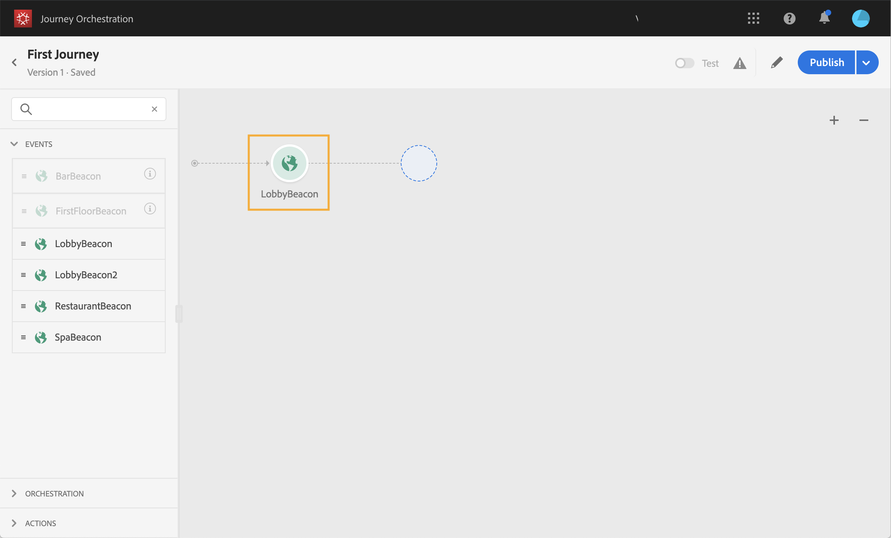
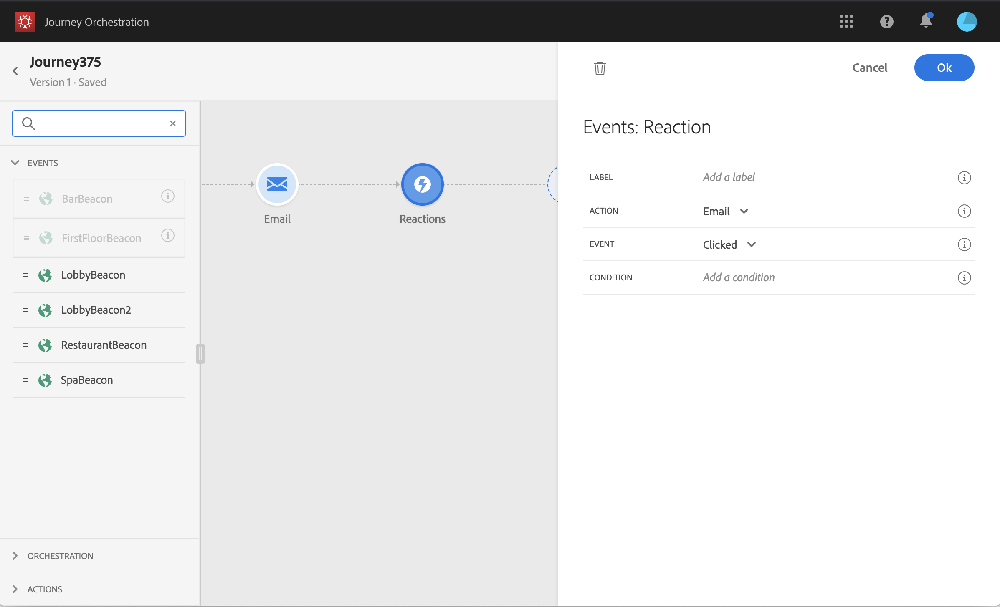
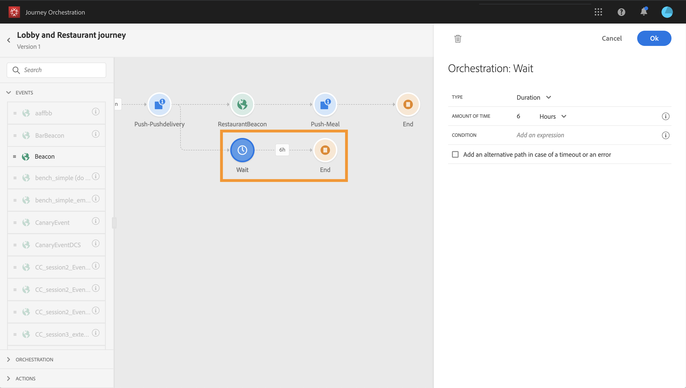

# Events activities {#concept_rws_1rt_52b}

The events configured by the technical user (see [Configuring an event](../event/event.md#concept_gfj_fqt_52b)) are all displayed in the first category of the palette, on the left side of the screen.

 

Always start your journey by drag and dropping an event activity. You can also double-click on it.

 

When you click on the event activity in the canvas, the activity configuration pane is displayed. By default, when you use the same event several times, an incremented number is added to the event name in the canvas. In addition, you can use the **Label** field to add a suffix to the event name that will appear under your activity in the canvas. This is useful to identify your events in the canvas, especially if you use the same event several times. It will also make debugging easier in case of errors and it will make reports easier to read.

 

## General events {#section_ofg_jss_dgb}

For this type of event, you can only add a label and a description. The rest of the configuration cannot be edited. It was performed by the technical user. See [Configuring an event](../event/event.md#concept_gfj_fqt_52b). 

## Reaction events {#section_dhx_gss_dgb}

Among the different event activities available in the palette, you will find the built-in **Reactions** event. This activity allows you to react to tracking data related to a message sent with email, SMS or push activities within the same journey. This information comes from transactional messaging in Adobe Campaign Standard. We capture this information in real-time at the moment it is shared with the Data Platform. For push notifications, you can react to clicked, sent or failed messages. For SMS messages, you can react to sent or failed messages. For emails, you can react to clicked, sent, opened or failed messages.

You can also use this mechanism to perform an action when there is no reaction to your messages. To do this, create a second path parallel to the reaction activity and add a wait activity. If there is no reaction during the period defined in the wait activity, the second path will be chosen. You can choose to send, for example, a follow-up message. 

Note that you can only use a reaction activity in the canvas if there is an email, push or SMS activity before.

See [Action activities](../building-journeys/journeyaction.md#concept_hbj_hrt_52b).

 

Here are the different steps to configure the reaction events:

1. Add a **label** to the reaction. This step is optional.
1. From the drop-down list, select the action activity you want to react to. You can select any action activity positioned in the previous steps of the path.
1. Depending on the action you selected (an email, SMS or a push notification), choose what you want to react to. 
1. You can define a condition as an optional step. For example, after an email action, you can decide to create two paths, one with a reaction event to track clicks only for VIP customers and one with a reaction event to track clicks performed by women.

>[!NOTE]
>
>Reaction events cannot track email, SMS or push actions that take place in a different journey. 
>
>Reaction events track clicks on links of the type "tracked" (see this [page](https://docs.adobe.com/content/help/en/campaign-standard/using/designing-content/links.html#about-tracked-urls)). Unsubscription and mirror page links are not taken into account.

>[!CAUTION]
>
>Email clients such as Gmail allow image blocking. Emails opens are tracked using a 0-pixel image included in the email. If images are blocked, email opens will not be taken into account.

## Advanced usage: events with a wait in parallel{#section_vxv_h25_pgb}

**How can you listen to an event only during a certain time?**

An event activity positioned in the journey listens to events indefinitely. To listen to an event only during a certain time, you must add a wait activity parallel to the event path. The journey will then listen to the event during the time specified in the wait activity. If an event is received during that period, the person will flow in the event path. If not, the customer will flow into the wait path.

For example, you sent a welcome first push to a customer and you want to send a meal discount push only if the customer enters the restaurant within the next 6 hours. To do this, you will create a second path (parallel to the restaurant event one) with a 6-hour wait activity. If the restaurant event is received less than 6 hours after the welcome push, the meal discount push activity is sent. If no restaurant event is received within the next 6 hours, the person flows through the wait path.

 
