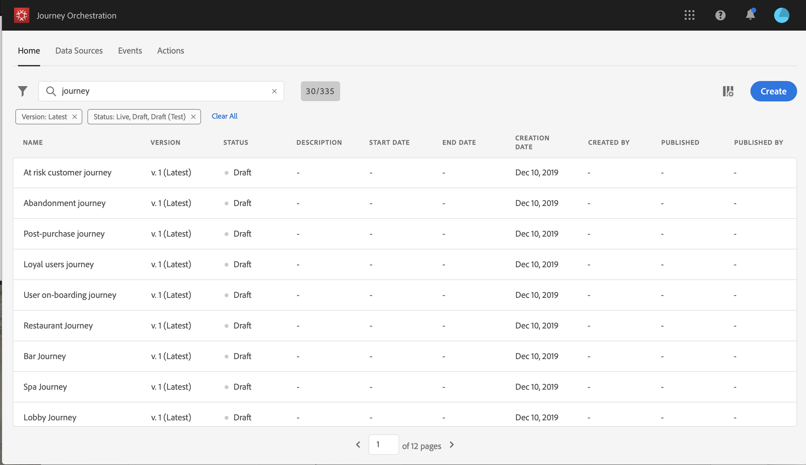
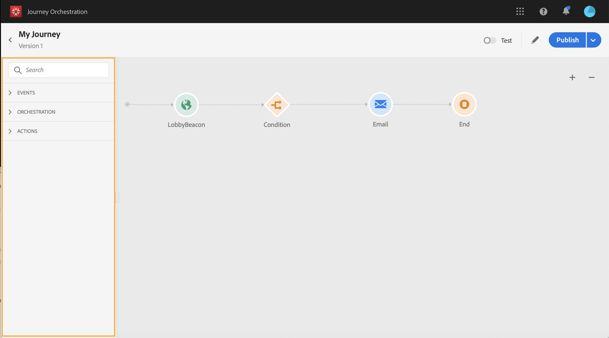

# The journey designer's interface {#concept_m1g_5qt_52b}

The **journey list** allows you to view all your journeys at once, see their status and perform basic actions. You can duplicate, stop or delete your journeys. Depending on the journey, certain actions might not be available. For example, you can't stop or delete a stopped journey. You can also use the search bar to search for a journey. The **Filters** drop-down menu allows you to filter the displayed journeys according to different criteria (status, the ones you created, the ones modified in the last 30 days). You can also choose to only display the journeys that use a particular event, field group or action.
All the versions of your journeys appear in the list with the version number. See [Journey versions](journeyversions.md#concept_ldc_k55_zgb).

 

The **journey designer** is made up of the following zones: the palette, the canvas and the activity configurator.
The **palette** is on the left-hand side of the screen. All available activities are sorted into several categories: **Events**, **Orchestration** and **Actions**. You can expand/collapse the different categories by clicking on their name. To use an activity in your journey, drag and drop it from the palette into your canvas. You have to configure each activity added from the palette before publishing the journey.

 

The **canvas** is the central zone in the journey designer. It is in this zone that you can drop your activities and configure them. Click on an activity in the canvas to configure it. This opens the activity configurator on the right-hand side. You can zoom in and out by using the "+" and "-" buttons on the top right.

 

The **activity configurator** appears when you click on an activity in the palette. Fill in the required fields. Click on the **Delete** icon to delete the activity. Click on **Cancel** to cancel the modifications or **Ok** to confirm. 

In the canvas, your action and event activities are represented by an icon with the name of the event or action displayed underneath. In the activity configurator, you can use the **Label** field to add a suffix to the activity name. These labels will help you contextualize the use of events and actions, especially when you use the same event or action several times in your journey. You will also be able to see the labels you added in the Journeys reporting.

 

Depending on the journey's status, you can perform different actions on your journey using the buttons available in the top right corner: **Publish**, **Duplicate**, **Delete**, **Reporting**, **Journey properties**. These buttons appear when no activity is selected.

 

Several activities (**Condition**, **Email**, **Push**, **SMS**) allow you to define a fallback action in case of an error or timeout. In the activity configurator, check the box: **Add an alternative path in case of a timeout or an error**. A second path is added after the activity. The timeout duration is defined in the journey's properties (see [The journey's properties](journeyproperty.md#concept_prq_wqt_52b)). For example, if an email takes too long to be sent or is in error, you can decide to send an SMS.

 

Various activities (event, action, timer) allow you to add several paths after them. To do this, place your cursor on the activity and click on the "+" symbol. Only events and timers can be set in parallel. If several events are set in parallel, the chosen path will be the one of the first event happening. If you want to listen to an event only during a certain time, you will place an event and a timer in parallel. See [Advanced usage](journeyevent.md#concept_rws_1rt_52b/section_vxv_h25_pgb).
To delete the path, place your cursor on it and click the **Delete arrow** icon.

 
