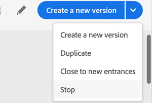

# Terminating a journey

The **Stop** and **Finish** options allow you to terminate journeys. Finishing a journey involves that the customers who already started in the journey are able to experience it to the end. Stopping a journey involves that journeys already started by users are immediately terminated.

## Finishing a journey

You can finish a journey manually to ensure that customers who already entered the journey can finish their path but new users are not able to enter the journey.

A finished journey version cannot be restarted. You can create a new version from the journey or duplicate it.

>[!WARNING]
>
>When a version of a journey is manually finished, any new entrance on events for new customer is forbidden.

You can stop a journey by clicking **Finish** while hovering over a journey in the list of journeys.

You can also:

1. In Home, click on the journey you want to finish.
1. On the top-right, click on the down arrow.

  

1. Click **Finish**. A dialog box appears.
1. Click **Finish** to confirm.

>[!NOTE]
>
>To perform a manual finish on a journey, it must be in live status.

## Stopping a journey

You can stop a journey when an emergency occured and all processing needs to be ended immediately on a journey.

A stopped journey version cannot be restarted or manually deleted.

>[!NOTE]
>
>To perform a manual stop on a journey, it must be in live status.

You can stop a journey by clicking **Stop** while hovering over a journey in the list of journeys.

You can also:

1. Click on the journey you want to stop.
1. On the top-right, click on the down arrow.

  

1. Click **Stop**. A dialog box appears.
1. Click **Stop** to confirm.

>[!WARNING]
>
>When a version of a journey is manually stopped, any new entrance on events for new users is forbidden and the journey ends for all customers for which the journey has started.
