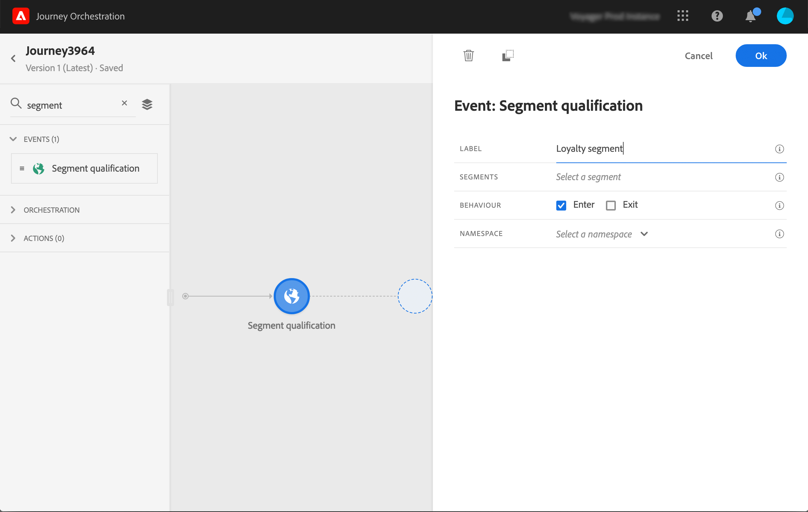

# Segment qualification events {#segment-qualification}

## About segment qualification events{#about-segment-qualification}

This activity allows your journey to listen to the entrances and exits of profiles in Adobe Experience Platform segments in order to make individuals enter or move forward in a journey. For more information on segment creation, refer to this [section](../segment/about-segments.md).

Let's say you have a "silver customer" segment. With this activity, you can make all new silver customers enter a journey and send them a series of personalized messages.

This type of event can be positioned as the first step or later in the journey.

If the segment is streamed with the High Frequency Audiences option of Adobe Experience Platform, entrance and exits are listened to in real time. If the segment is not streamed, entrances and exits are taken into account at segment calculation time.

1. Unfold the **[!UICONTROL Events]** category and drop a **[!UICONTROL Segment qualification]** activity into your canvas.

   

1. Add a **[!UICONTROL Label]** to the activity. This step is optional.

1. Click in the **[!UICONTROL Segment]** field and select the segments you want to leverage. 

   

1. In the **[!UICONTROL Behavior]** field, choose is you want to listen to segment entrances, exits or both.

1. Select a namespace. This is only needed if the event is positionned as the first step of the journey.

   

The payload contains the following context information, which you can use in conditions and actions:

* the behavior (entrance, exit)
* the timestamp of qualification
* the segment id

When using the expression editor in a condition or action that follows a **[!UICONTROL Segment qualification]** activity, you have access to the **[!UICONTROL SegmentQualification]** node. You can choose between the **[!UICONTROL Last qualification time]** and the **[!UICONTROL status]** (enter or exit).

See [Condition activity](../building-journeys/condition-activity.md#about_condition).

## Best practices on segments {#best-practices-segments}

The **[!UICONTROL Segment Qualification]** activity enables the immediate entrance in journeys of individuals getting qualified or disqualified from an Adobe Experience Platform segment.

The reception speed of this information is high. Measurements made show a speed of 10 000 events received per seconds. As a result, you should make sure you understand how peaks of entrance might happen, how to avoid them and how to make your journey ready for them.

### Batch segments{#batch-speed-segment-qualification}

When using segment qualification for a batch segment, note that a peak of entrance will happen at the time of the daily calculation. The size of the peak will depend on the number of individuals entering (or exiting) the segment daily.

Moreover, if the batch segment is newly created and immediately used in a journey, the first batch of calculation might make a very large number of individuals enter the journey.

### Streamed segments{#streamed-speed-segment-qualification}

When using segment qualification for streamed segments, there is less risk of getting large peaks of entrances/exits due to the continuous evaluation of the segment. Still, if the segment definition leads to making a large volume of customers qualify at the same time, there might be a peak too. 

### How to avoid overloads{#overloads-speed-segment-qualification}

Here are a few best practices that will help to avoid overloading systems leveraged in journeys (data sources, custom actions, Adobe Campaign Standard actions).

Do not use, in a **[!UICONTROL Segment Qualification]** activity, a batch segment immediately after its creation. It will avoid the first calculation peak. Note that there will be a yellow warning in the journey canvas if you're about to use a segment that has never been calculated.

Put in place a capping rule for data sources and actions used in journeys to avoid overloading them (refer to this [section](../api/capping.md)). Note that the capping rule has no retry. If you need to retry, you must use an alternative path in the journey by checking the box **[!UICONTROL Add an alternative path in case of a timeout or an error]** in conditions or actions.

Before using the segment in a production journey, always evaluate first the volume of individuals qualifying for this segment every day. To do so, you can check the **[!UICONTROL Segments]** section in the Adobe Experience Platform and look at the graph on the right side.

