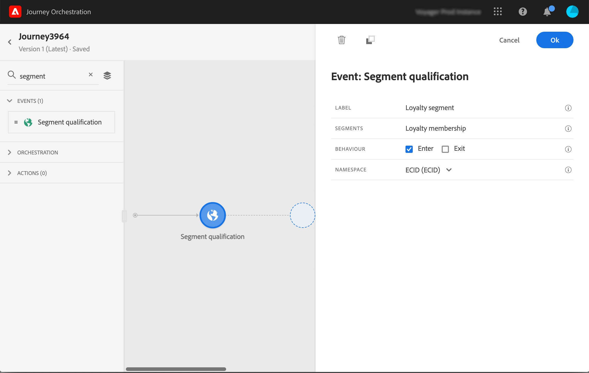

# Segment qualification events {#segment-qualification}

## About segment qualification events{#about-segment-qualification}

This activity allows your journey to listen to the entrances and exits of profiles in Platform segments in order to make individuals enter or move forward in a journey. For more information on segment creation, refer to this [section](../segment/about-segments.md).

Let's say you have a "silver customer" segment. With this activity, you can make all new silver customers enter a journey and send them a series of personalized messages.

This type of event can be positioned as the first step or later in the journey.

If the segment is streamed with the High Frequency Audiences option of Platform, entrance and exits are listened to in real time. If the segment is not streamed, entrances and exits are taken into account at segment calculation time.

1. Unfold the **Events** category and drop a **Segment qualification** activity into your canvas.

   

1. Add a **Label** to the activity. This step is optional.

1. Click in the **Segment** field and select the segments you want to leverage. 

   

1. In the **Behavior** field, choose is you want to listen to segment entrances, exits or both.

1. Select a namespace. This is only needed if the event is positionned as the first step of the journey.

   

The payload contains the following context information, which you can use in conditions and actions:

* the behavior (entrance, exit)
* the timestamp of qualification
* the segment id

When using the expression editor in a condition or action that follows a **Segment qualification** activity, you have access to the **SegmentQualification** node. You can choose between the **Last qualification time** and the **status** (enter or exit).

See [Condition activity](../building-journeys/condition-activity.md#about_condition).

## Speed of segment entrance or exit{#speed-segment-qualification}

The **Segment Qualification** activity enables the immediate entrance in journeys of individuals getting qualified or disqualified from a Platform segment.

The speed of reception of this information is high. Measurement made shows a speed of 10 000 events received per seconds. As a result, you should make sure to understand how peak of entrance might happen, how to avoid them and how to make your journey ready for them.

### Case of batch segment{#batch-speed-segment-qualification}

When using segment qualification activity for a batch segment, note that a peak of entrance will happen at the time of daily calculation. The size of the peak will depend on the number of people entering (or exiting) of the segment daily.

Moreover, if the batch segment is newly created and immediately used in a journey, the first batch of calculation might make a very big number of people enter the journey.

### Case of streamed segments{#streamed-speed-segment-qualification}

When using segment qualification for streamed segments, there is less risk to get a big peaks of entrancse/exits due to the continuous evaluation of the segment. Still, if the segment definition leads to making a large volume of customers qualifying at the same time, there might be a peak too. 

### How to avoid overloads{#overloads-speed-segment-qualification}

To avoid overloading systems leveraged in journeys (data sources, custom actions, Adobe Campaign Standard actions), a couple of best practices could help:

Do not use in a Segment Qualification activity a batch segment immediately after creation. it will avoid the first calculation peak. Note that there will be a yellow warning in the canvas UI if you're about to use a segment that has never been calculated (see screenshot below)

Put in place a capping rule for data sources and actions used in journeys to avoid overloading them (link to capping documentation). Note that the capping rule has no retry. If you want to retry, you must use an alternative path in the journey checking the box "Add an alternative path in case of a timeout or an error" in conditions or actions.
Try to understand the volume of people qualifying for this segment every day before using it in a production journey. To do so, you can check the Segments section in Platform and check this graph on the right (screenshot below).
