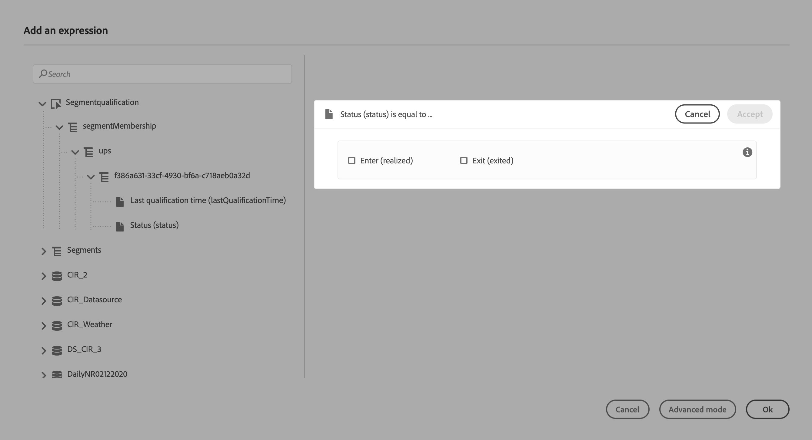

# Segment qualification events {#segment-qualification}

This activity allows your journey to listen to the entrances and exits of profiles in Platform segments in order to make individuals enter or move forward in a journey. For more information on segment creation, refer to this [section](../segment/about-segments.md).

Let's say you have a "silver customer" segment. With this activity, you can make all new silver customers enter a journey and send them a series of personalized messages.

This type of event can be positioned as the first step or later in the journey.

If the segment is streamed with the High Frequency Audiences option of Platform, entrance and exits are listened to in real time. If the segment is not streamed, entrances and exits are taken into account at segment calculation time.

1. Unfold the **Events** category and drop a **Segment qualification** activity into your canvas.

   

1. Add a **Label** to the activity. This step is optional.

1. Click in the **Segment** field and select the segments you want to leverage. 

   

1. In the **Behavior** field, choose is you want to listen to segment entrances, exits or both.

1. Select a namespace. This is only needed if the event is positionned as the first step of the journey.

   

The payload contains the following context information, which you can use in conditions and actions:

* the behavior (entrance, exit)
* the timestamp of qualification
* the segment id

When using the expression editor in a condition or action that follows a **Segment qualification** activity, you have access to the **SegmentQualification** node. You can choose between the **Last qualification time** and the **status** (enter or exit).

See [Condition activity](../building-journeys/condition-activity.md#about_condition).

