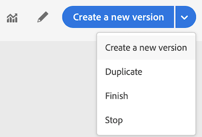

# Terminating a journey

The **Stop** and **Finish** options allow you to terminate **live** journeys. Finishing a journey involves **that the arrival of new customers in the journey is blocked** and that the customers who already entered in the journey are able to experience it to the end. This is the most recommended way to put an end to a journey as it offers the best experience for customers. Stopping a journey involves that people who already entered a journey are all stopped in their progress. The journey is basically switched off.

>[!NOTE]
>
>Note that you cannot resume a finished or stopped journey.

## Finishing a journey

You can finish a journey manually to ensure that customers who already entered the journey can finish their path but new users are not able to enter the journey.

A finished journey version cannot be restarted or deleted. You can create a new version of it or duplicate it.

You can stop a journey by clicking **Finish** while hovering over a journey in the list of journeys.

You can also:

1. In **Home**, click on the journey you want to finish.
1. On the top-right, click on the down arrow.

    

1. Click **Finish**. A dialog box appears.
1. Click **Finish** to confirm.

## Stopping a journey

You can stop a journey when an emergency occurred and all processing needs to be ended immediately on a journey.

A stopped journey version cannot be restarted or manually deleted.

You can stop a journey when an emergency occurred (for example if a marketer realizes that the journey targets the wrong audience or a custom action supposed to deliver messages is not working correctly…) by clicking **Stop** while hovering over a journey in the list of journeys.

You can also:

1. In **Home**, click on the journey you want to stop.
1. On the top-right, click on the down arrow.

  

1. Click **Stop**. A dialog box appears.
1. Click **Stop** to confirm.
