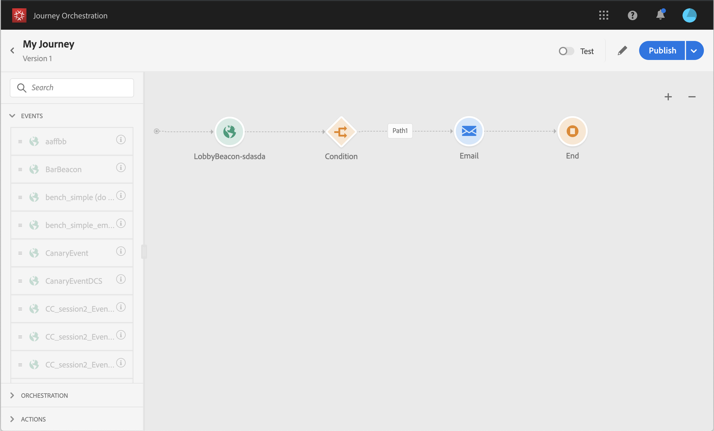
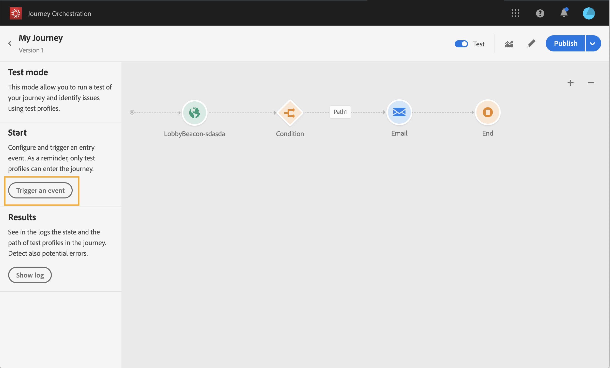
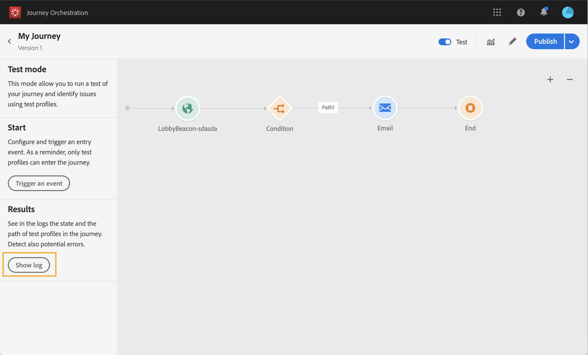
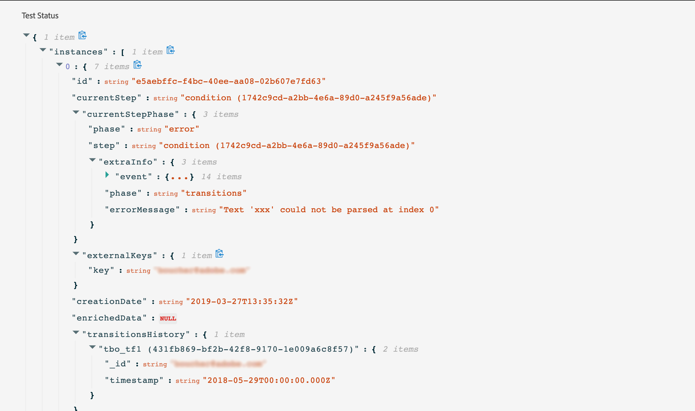

# Testing the journey{#testing_the_journey}

Before being able to test your journey, you must resolve all errors if any. See .

You have the possibility to test your journey before its publication, using test profiles. This allows you to analyze how individuals flow in the journey and troubleshoot before publication.

To use the test mode, follow these steps:

1. Before testing your journey, verify that it is valid and that there is no error. You won’t be able to launch a test of a journey with errors. See . A warning symbol is displayed when there are errors.

1. To activate the test mode, click on the **[!UICONTROL Test]** toggle, located in the top right corner.

    

1. Click **[!UICONTROL Trigger an event]** to configure and send events to the journey. Make sure to send events related to test profiles. See [Firing your events](#firing_events).

    

1. After the events are received, click the **[!UICONTROL Show log]** button to view the test result and verify them. See [Viewing the logs](#viewing_logs).

    

1. If there is any error, deactivate the test mode, modify your journey and test it again. When the test is conclusive, you can publish your journey. See .

## Important notes {#important_notes}

* An interface is provided to fire events to the tested journey but events can also be sent by third-party systems such as Postman.
* Only individuals flagged as "test profiles" in the Real-time Customer Profile Service will be allowed to enter the tested journey. The process to create a test profile is the same as the process to create a Profile in the Data Platform. You just have to make sure the test profile flag is true. You can use the Segments section in the Data Platform interface to create a segment of test profiles in your Data Platform and see a non-exhaustive list. The exhaustive list cannot be displayed for now.
* The test mode is only available in draft journeys that use a namespace. Indeed, the test mode needs to check if a person entering the journey is a test profile or not and thus must be able to reach the Data Platform.
* The maximum number of test profiles than can enter a journey during a test session is 100.
* When you disable the test mode, it empties the journeys from all people who entered it in the past or who are currently in it.
* You can enable/disable the test mode as many times as needed.
* You cannot modify your journey when the test mode is activated. When in test mode, you can directly publish the journey, no need to deactivate the test mode before.

## Firing your events {#firing_events}

The **[!UICONTROL Trigger an event]** button allows you to configure an event that will make a person enter the journey.

As a prerequisite, you must know which profiles are flagged as test profiles in the Data Platform. Indeed, the test mode only allows these profiles in the journey and the event must contain an ID. The expected ID depends on the event configuration. It can be an ECID for example.

This screen allows you to configure the fields passed in the event and the execution of the event sending. The interface helps you pass the right information in the event payload and make sure the information type is correct. The test mode saves the last parameters used in a test session for later use. 

The interface allows you to pass simple event parameters. If you want to pass collections or other advanced objects in the event, you can click on **[!UICONTROL Code View]** to see the entire code of the payload and modify it. For example, you can copy and paste event information prepared by a technical user.

A technical user can also use this interface to compose event payloads and trigger events without having to use a third-party tool.

## Viewing the logs {#viewing_logs}

The **[!UICONTROL Show log]** button allows you to view the test results. This page displays the journey’s current information in JSON format. A button allows you to copy entire nodes. You need to manually refresh the page to update the journey’s test results.

The number of individuals (technically they are called instances) currently inside the journey are displayed. Here is useful information that is displayed for each individual:

* _Id_: the individual’s internal ID in the journey. This can be used for debugging purposes.
* _currentstep_: the step where the individual is at in the journey. We recommend adding labels to your activities to identify them more easily.
* _currentstep_ > phase: the status of the individual’s journey (running, finished, error or timed out). See below for more information.
* _currentstep_ > _extraInfo_: description of the error and other contextual information.
* _externalKeys_: the value for the key formula defined in the event.
* _enrichedData_: the data that the journey has retrieved if the journey uses data sources.
* _transitionHistory_: the list of steps that the individual followed. For events, the payload is displayed.

