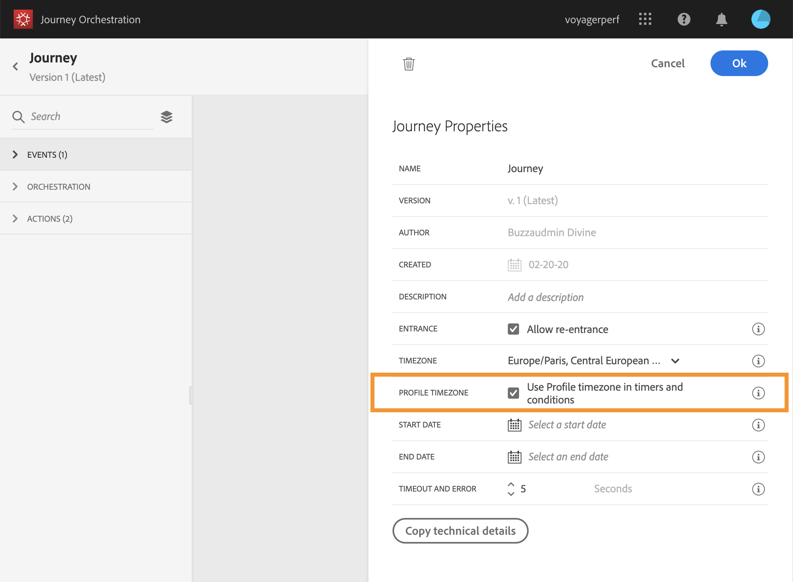
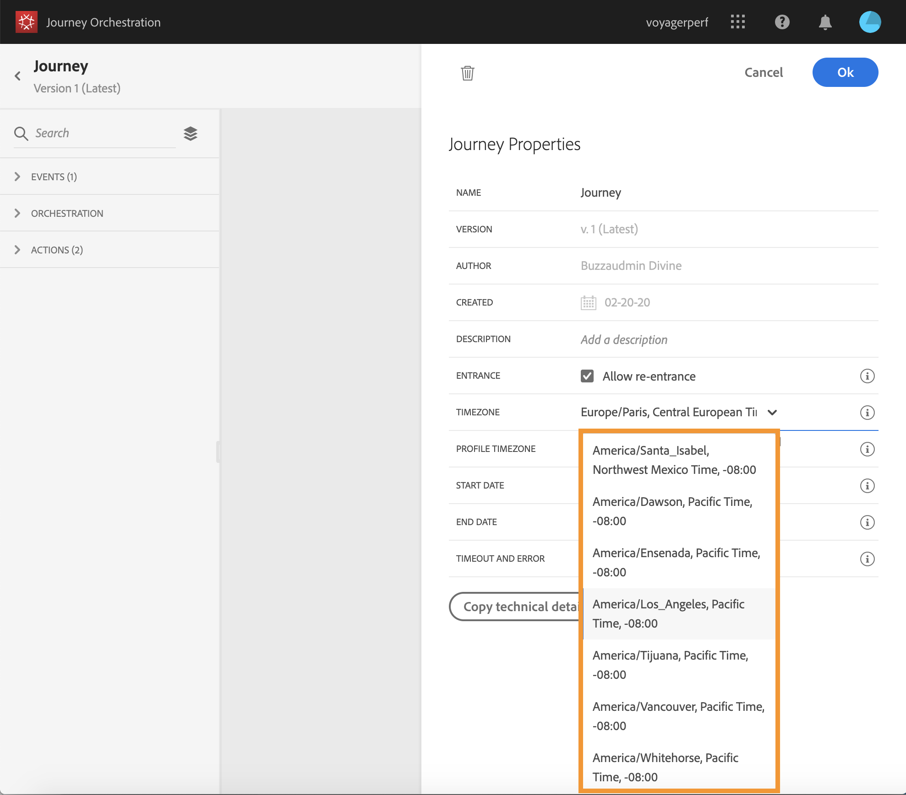

# Time zone management {#timezone_management}

You can define a time zone in the [properties](../building-journeys/changing-properties.md) of your journey.

To access Properties,click on the pencil icon in the top-right of the screen.

This time zone will be used for every activity of the journey containing a time element such as: 

* 
* 
* 
* 

You can select a time zone or choose to use the time zone defined in the user profile.

## Defining a fixed time zone

The time zone can also be fixed. Clear the pre-defined time zone and pick one from the drop-down list. If you use a fixed time zone, it will be the same for all individuals entering the journey.

To do so, in Properties, select a time-zone.

## Using profiles to define the journey time zone

If the entry event of the journey has a namespace, meaning that the journey can reach the Real-time Customer Profile service of the Data Platform, the time zone is pre-defined with the one specified in the profile of the individual flowing in the journey. 

If a time zone is defined in the Experience Platform profile, it can be retrieved in the journey.

If the individual's profile does not contain a time zone, the timezone retrieved will be the one defined in the timezone field.

To do so, in Properties, check **[!UI CONTROL Use Profile timezone in timers and conditions]**.

## Using time zones in expressions

Time zones are used to build expression with the advanced expression editor. In this case, you will use the expression editor to select where you want the system to get this information. See .

The start and end dates of a journey cannot be linked to a specific time zone. They are automatically associated to the instance's time zone.
