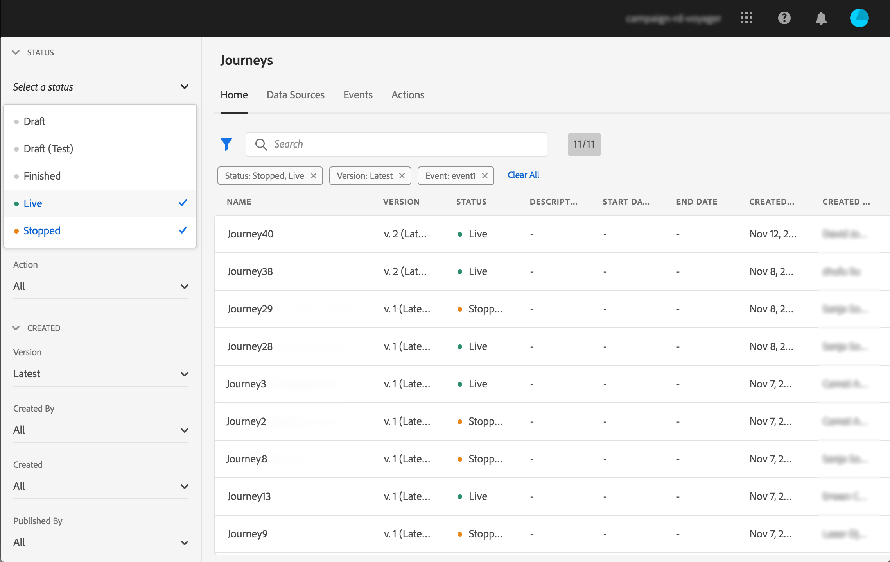
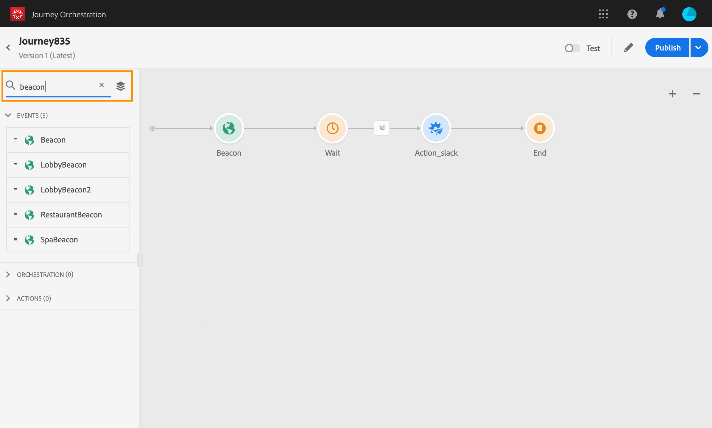
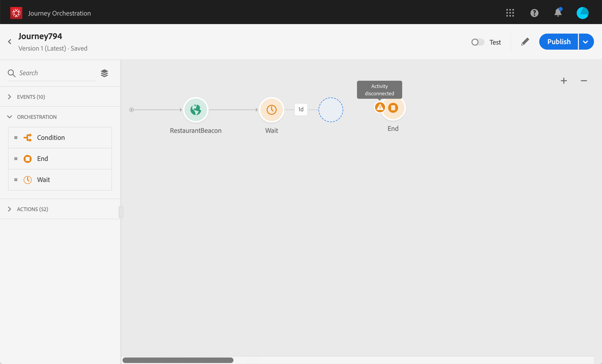
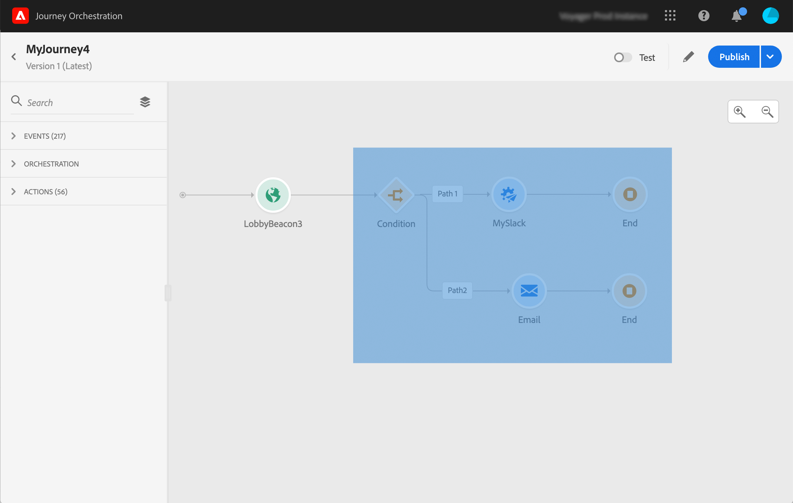
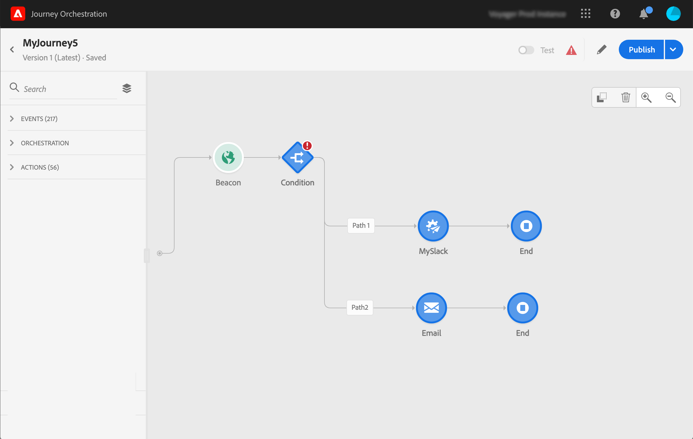

# Using the journey designer {#concept_m1g_5qt_52b}

The journey Home menu allows you to view the **list of journeys**. Create a new journey or click on a existing one to open the **journey designer's interface**. The designer is made up of the following zones: the palette, the canvas and the activity configuration pane.

## The journey list {#journey_list}

The **journey list** allows you to view all your journeys at once, see their status and perform basic actions. You can duplicate, stop or delete your journeys. Depending on the journey, certain actions might not be available. For example, you can't delete or restart a journey that is closed. You can create a new version from it, duplicate it or stop it. You can also use the search bar to search for a journey.

The **[!UICONTROL Filters]** can be accessed by clicking on the filter icon on the top left of the list. The filters menu allows you to filter the displayed journeys according to different criteria (status, the ones you created, the ones modified in the last 30 days, latest versions only etc.). You can also choose to only display the journeys that use a particular event, field group or action. Columns displayed on the list can be configured. All filters and columns are saved per user.

All the versions of your journeys appear in the list with the version number. See .

>[!NOTE]
>
>To open a journey's canvas in a different browser tab, hold the **Control** or **Command key** and click on the journey.

## The palette {#palette}

The **palette** is on the left-hand side of the screen. All available activities are sorted into several categories: **[!UICONTROL Events]**, **[!UICONTROL Orchestration]** and **[!UICONTROL Actions]**. You can expand/collapse the different categories by clicking on their name. To use an activity in your journey, drag and drop it from the palette into your canvas. You can also double-click on an activity in the palette to add it to the canvas, at the next step available. You have to configure each activity added from the palette before publishing the journey. If you drop an activity in the canvas and do not finish its configuration, it will stay in the canvas but a red warning will indicate that the configuration is not finished for this activity.

>[!NOTE]
>
>Note that there are rules when setting up a journey. Unallowed configuration will be discarded. For example, you cannot place actions in parallel, link an activity to a previous step to create a loop, start a journey with something else than an event, etc.

 

The **Show disabled items** icon in the top left corner allows you to hide or display unavailable elements in the palette, for example the events that use a different namespace than the ones used in your journey. By default, unavailable items are hidden. If you choose to display them, they will appear greyed out. 

When using the **Search** field, the number of results is displayed for each canvas activity category.

 

## The canvas {#canvas}

The **canvas** is the central zone in the journey designer. It is in this zone that you can drop your activities and configure them. Click on an activity in the canvas to configure it. This opens the activity configuration pane on the right-hand side. You can zoom in and out by using the "+" and "-" buttons on the top right. In the canvas, all activities allow you to add a next step after them, except **[!UICONTROL End]** activities (see ). 

 

## The activity configuration pane {#configuration_pane}

The **activity configuration pane** appears when you click on an activity in the palette. Fill in the required fields. Click on the **[!UICONTROL Delete]** icon to delete the activity. Click on **[!UICONTROL Cancel]** to cancel the modifications or **[!UICONTROL Ok]** to confirm. To delete activities, you can also select one activity (or several) and press the backspace key. Pressing the escape key will close the activity configuration pane.

In the canvas, your action and event activities are represented by an icon with the name of the event or action displayed underneath. In the activity configuration pane, you can use the **[!UICONTROL Label]** field to add a suffix to the activity name. These labels will help you contextualize the use of events and actions, especially when you use the same event or action several times in your journey. You will also be able to see the labels you added in the Journey Orchestration reporting.

 

## The top bar actions {#top_actions}

Depending on the journey's status, you can perform different actions on your journey using the buttons available in the top right corner: **[!UICONTROL Publish]**, **[!UICONTROL Duplicate]**, **[!UICONTROL Delete]**, **[!UICONTROL Journey properties]**, **[!UICONTROL Test]**. These buttons appear when no activity is selected. Some buttons will appear contextually. The test mode log button appears when test mode is activated (see ). The reporting button appears when the journey is live, stopped or closed.

 

## The use of paths in the canvas {#paths}

Several activities (**[!UICONTROL Condition]**, **[!UICONTROL Action]** activities) allow you to define a fallback action in case of an error or timeout. In the activity configuration pane, check the box: **[!UICONTROL Add an alternative path in case of a timeout or an error]**. Another path is added after the activity. The timeout duration is defined in the journey's properties (see  by an admin user. For example, if an email takes too long to be sent or is in error, you can decide to send an SMS.

 

Various activities (event, action, wait) allow you to add several paths after them. To do this, place your cursor on the activity and click on the "+" symbol. Only event and wait activities can be set in parallel. If several events are set in parallel, the chosen path will be the one of the first event happening. 

When listening to an event, we recommend that you do not wait for the event indefinitely. It is not mandatory, just a best practice. If you want to listen to one or several events only during a certain time, you will place one or several events and a wait activity in parallel. See .

To delete the path, place your cursor on it and click the **[!UICONTROL Delete arrow]** icon.

 

In the canvas, when two activities are disconnected, a warning is displayed. Place your cursor on the warning icon to display the error message. To fix the issue, simply move the disconnected activity and connect it to the previous activity.

 

 ## Copying and pasting activities {#copy-paste}

 You can copy one or several activities of a journey and paste them either in the same journey or a different one. This allows you to save time if you want to reuse numerous activities that have been already configured in a previous journey. 

 **Important notes**

 * You can copy/paste across different tabs and browsers. You can only copy/paste activities within the same instance. 
 * You can not copy/paste an event if the destination journey has an event that uses a different namespace.
 * Pasted activities may reference data that do not exist in the destination journey, for example if you copy/paste across different sandboxes. Always check for errors and make the required adjustments. 
 * Be aware that you cannot undo an action. To delete pasted activities, you will need to select and delete them. Therefore, make sure you only select the activities you need before copying them.
 * You can copy activities from any journey, even ones that are in read-only.
 * You can select any activity, even ones that are not linked. Linked activities will stay linked after being pasted.

 Here are the steps to copy/paste activities:

 1. Open a journey.
 1. Select the activities you want to copy by moving your mouse while clicking. You can also click on each activity while pressing the **Ctrl/Command** key. Use **Ctrl/Command + A** if you want to select all activities.
    
 1. Press **Ctrl/Command + C**. 
 1. In any journey, press **Ctrl/Command + V** to paste the activities without linking them to an existing node. Pasted activities are placed in the same order. After being pasted, activities stay selected so you can easily move them. You can also place the cursor on an empty place holder and hit **Ctrl/Command + V**. Pasted activities will be linked to the node. 
    

