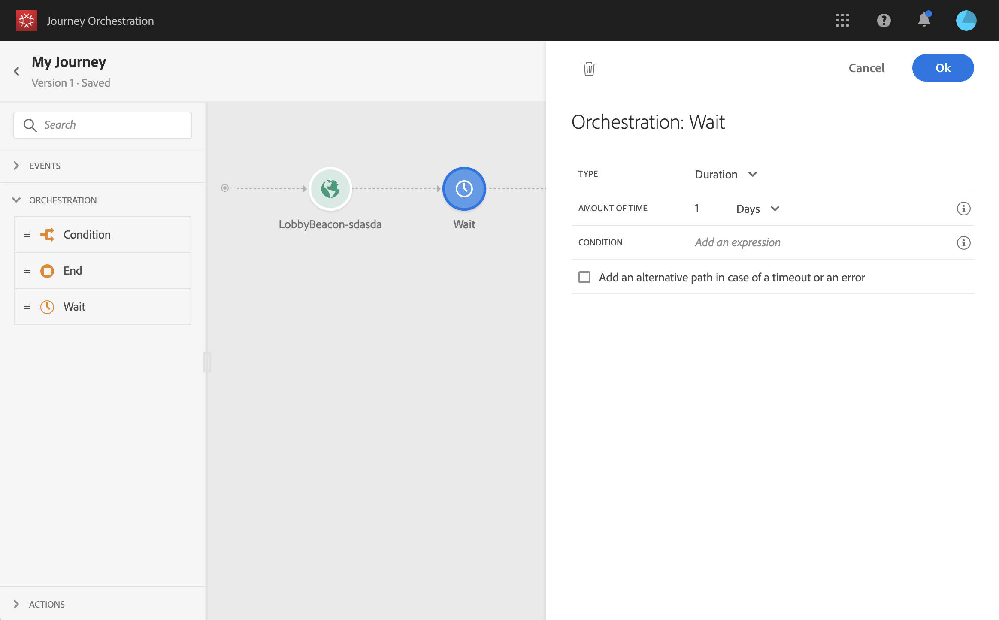
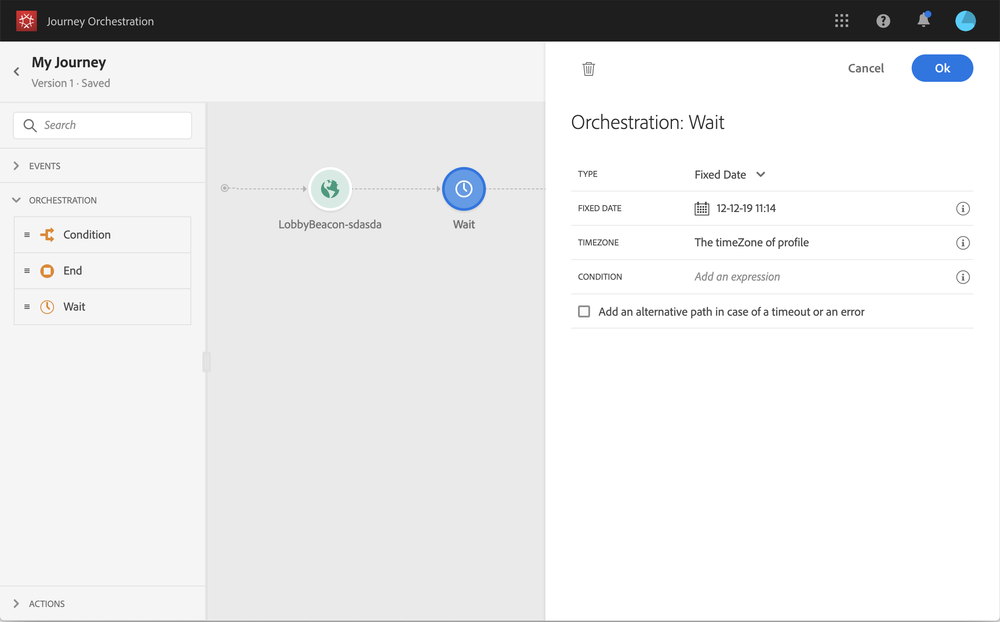

# Wait {#section_rlm_nft_dgb}

If you want to wait before executing the next activity in the path, you can use a **Wait** activity. It allows you to define the moment when the next activity will be executed. Four options are available:

* [Duration](#duration) 
* [Fixed date](#fixed_date) 
* [Custom](#custom) 
* [Email send time optimization](#email_send_time_optimization) 

## Duration{#duration}

Select the duration of the wait before the execution of the next activity.

## Fixed date{#fixed_date}

Select the date for the execution of the next activity. When you define a fixed date, you must specify a timezone. See [Time zone management](../building-journeys/journey.md#timezone_management).

## Custom{#custom}

This option lets you define a custom date, for example 12 July 2020 at 5pm, using an advanced expression based on a field coming from an event or a data source. It does not let you define a custom duration, for example, 7 days. The expression in the expression editor should provide a dateTimeOnly format. See [The advanced editor](../expression/expressionadvanced.md#concept_uyj_trt_52b).

>[!NOTE]
>
>You can leverage a dateTimeOnly field or use a function to convert to dateTimeOnly. For example: toDateTimeOnly(@{myEvent.xxx.yyy}), the
>field in the event being of the form 2016-08-12T09:46:06.
>
>The **timezone** is expected in another place in the custom wait configuration pane. As a result, it is not possible today from the interface to directly point at a full ISO-8601 timestamp mixing time and timezone like 2016-08-12T09:46:06.982-05. See [Time zone management](../building-journeys/journey.md#timezone_management).

## Email send time optimization{#email_send_time_optimization}

This type of wait uses a score calculated in the Platform. The score calculates the propensity to click or open an email in the future based on past behavior. Note that the algorithm calculating the score needs a certain amount of data to work. As a result, when it does not have enough data, the default wait time will apply. At publication time, you’ll be notified that the default time applies.

## Wait usage{#wait_usage}

You can also define a timezone and a condition if you want to restrict the wait to a certain population.

