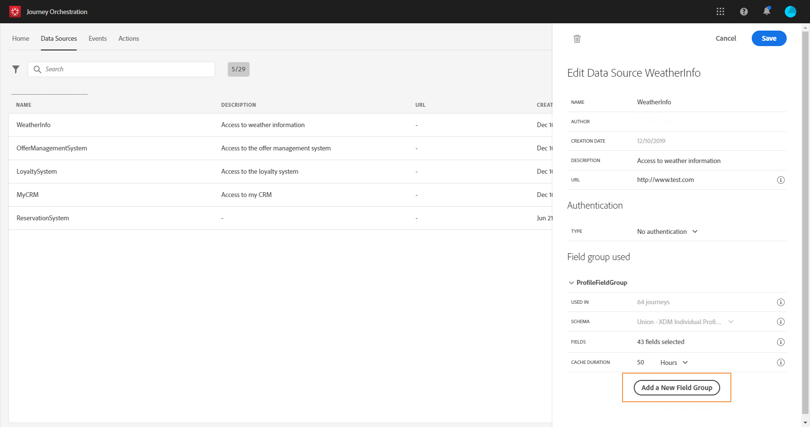

# Adobe Experience Platform data source {#concept_zrb_nqt_52b}

The Adobe Experience Platform data source defines the connection to the Real-time Customer Profile Service. This data source is built-in and pre-configured. It cannot be deleted. This data source is designed to retrieve and use data from the Real-time Customer Profile Service (for example, check if the person who entered a journey is a female). It allows you to use Profile data and Experience Events data. For more information on the Real-time Customer Profile Service, refer to this [page](https://docs.adobe.com/content/help/en/experience-platform/profile/home.html).

>[!NOTE]
>
>You can retrieve the 1000 latest experience events created less than a year ago.

To allow the connection to the Real-time Customer Profile Service, we must use a key to identify a person, and a namespace that contextualizes the key. As a result, you can only use this data source if your journeys start with an event containing a key and a namespace. See .

You can edit the pre-configured field group named “ProfileFieldGroup”, add new ones and remove the ones that are not used in any draft or live journeys. See .

Here are the main steps to add field groups to the build-in data source.

1. From the list of data sources, select the build-in Adobe Experience Platform data source.

    This opens the data source configuration pane on the right-hand side of the screen.

    

1. Click **[!UICONTROL Add a New Field Group]** to define a new series of fields to retrieve. See .

    

1. Select a schema from the **[!UICONTROL Schema]** drop-down. This field lists Profile and Experience Events schemas available in the Adobe Experience Platform. Schema creation is not performed in [!DNL Journey Orchestration]. It’s performed in the Adobe Experience Platform.
1. Select the fields you want to use.
1. Define the cache duration.
1. Click on **[!UICONTROL Save]**.

When you place the cursor on the name of a field group, you’ll see two icons on the right. They allow you to delete and duplicate the field group. Note that the **[!UICONTROL Delete]** icon is only available if the field group is not used in any live or draft journey (information displayed in the **[!UICONTROL Used in]** field).
