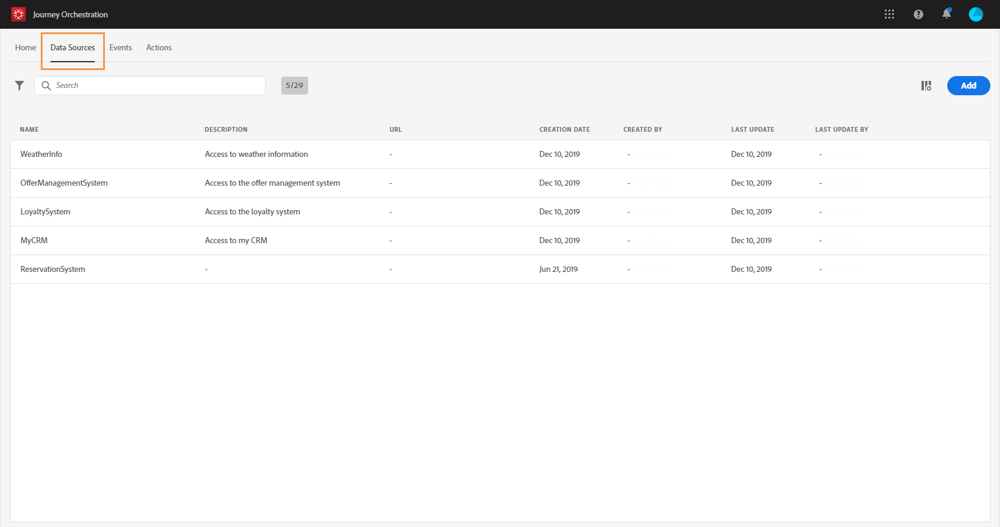

# About data sources {#concept_s1s_dqt_52b}

The data source configuration is always performed by a **technical user**.

The data source configuration allows you to define a connection to a system to retrieve additional information that will be used in your journeys, for:

* condition definition
* parameter and personalization data in actions
* custom wait definition
* custom time zone definition

This configuration is not required if your journeys only leverage local data coming from an event payload. For example, if your journey is composed of an event followed by an email activity that only uses data from the event, there is no need to configure a data source.

There are two types of data sources:

* The pre-configured Experience Platform data source that defines the connection to the Real-time Customer Profile Service. This is a built-in data source. See .
* The external data sources that allow you to define a connection to external systems. These are the ones you can create. See .

For each data source, you define the information to retrieve using field groups. See .

Here are the main data source configuration steps:

1. In the top menu, click the **Data Sources** tab.

    The list of data sources is displayed. See  for more information on the interface.

    

1. Then you can either add field groups to the built-in data source (see ).

    

1. Click **Save**. 

    The data source is now configured and ready to be used in your journeys.
