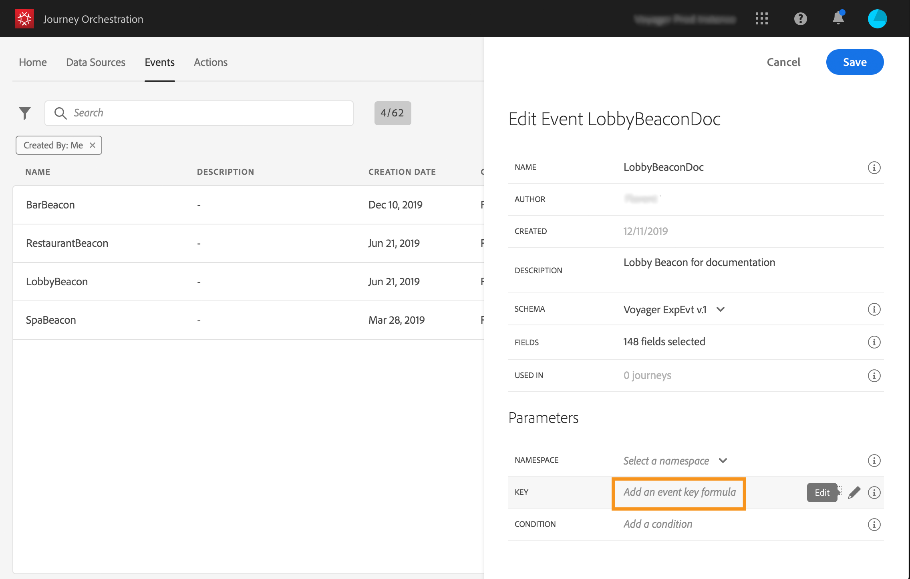
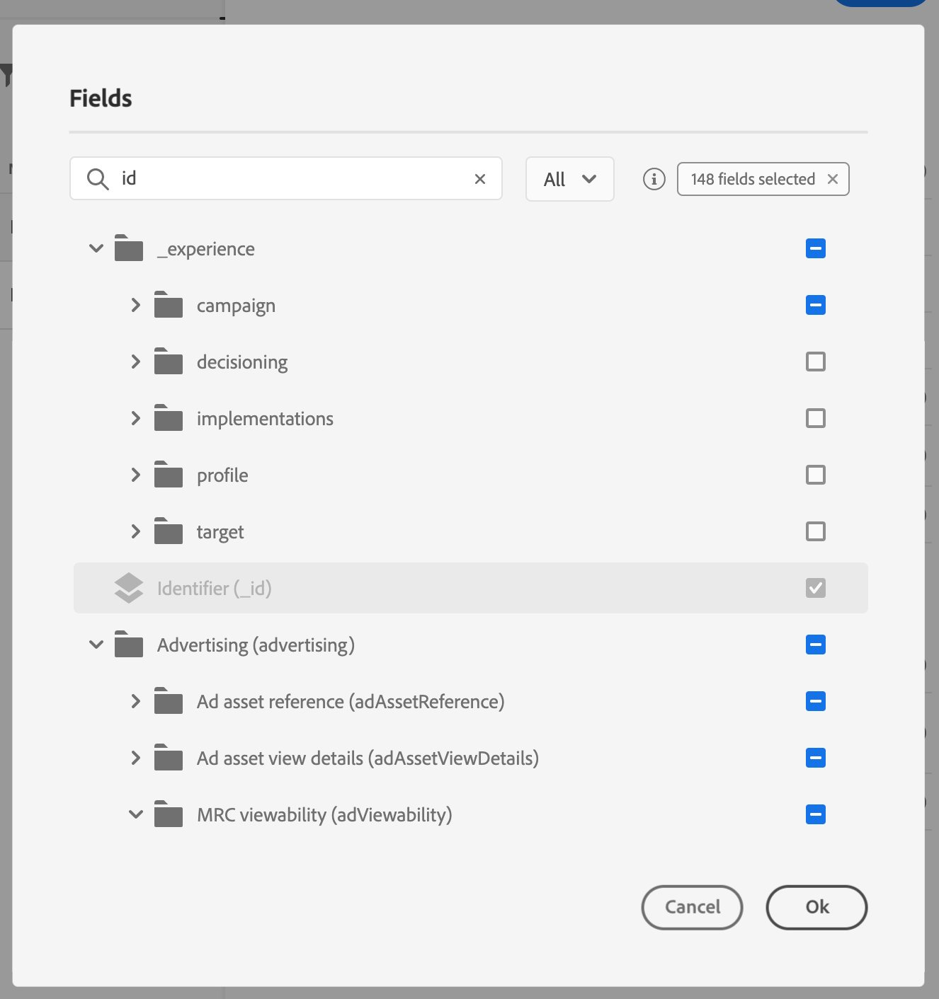

# Defining the event key {#concept_ond_hqt_52b}

The key is the field or combination of fields is part of the event payload data and that will allow the system to identify the person associated to the event. The key can be, for example, the Experience Cloud ID, a CRM ID or an email address.

If you plan to leverage data stored in the Real-time Customer Profile database, you must select, as the event key, information you defined as a profile's identity in the [Real-time Customer Profile Service](https://www.adobe.io/apis/cloudplatform/dataservices/profile-identity-segmentation/profile-identity-segmentation-services.html#!api-specification/markdown/narrative/technical_overview/unified_profile_architectural_overview/unified_profile_architectural_overview.md).

It will allow the system to perform the reconciliation between the event and the individual's profile. If you select a schema that has a primary identity, then the **[!UICONTROL Key]** and **[!UICONTROL Namespace]** fields are pre-filled. If there is no identity defined, we select _identityMap > id_ as the primary key. Then you have to select a namespace and the key will be pre-filled (below the **[!UICONTROL Namespace]** field) using _identityMap > id_.

If you need to use a different key, such as a CRM ID or an email address, you need to add it manually:

1. Click inside the **[!UICONTROL Key]** field or on the pencil icon.

    

1. Select the field chosen as the key in the list of payload fields. You can also switch to the advanced expression editor to create more complex keys (for example, a concatenation of two field of the events). See below, in this section.

    

When the event is received, the value of the key will allow the system to identify the person associated to the event. Associated to a namespace (see ), the key can be used to perform queries on the Adobe Experience Platform. See .
The key is also used to check that a person is in a journey. Indeed, a person cannot be at two different places in the same journey. As a result, the system does not allow the same key, for example the key CRMID=3224, to be at different places in the same journey.

You also have access to the advanced expression functions (**[!UICONTROL Advanced mode]**) if you want to perform additional manipulations. These functions let you manipulate the values used to carry out specific queries such changing formats, performing field concatenations, taking into account only a part of a field (for example the 10 first characters). See .  
