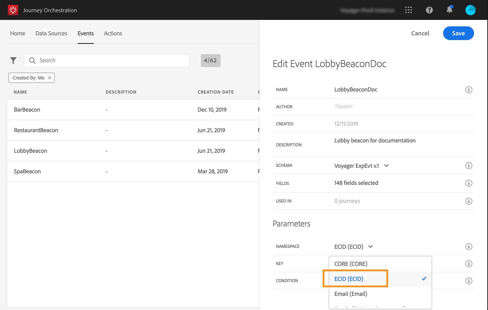

# Selecting the namespace {#concept_ckb_3qt_52b}

The namespace allows you to define the type of key used to identify the person associated to the event. Its configuration is optional. It is required if you want to retrieve, in your journeys, additional information coming from the [Unified Profile Service](https://www.adobe.io/apis/cloudplatform/dataservices/profile-identity-segmentation/profile-identity-segmentation-services.html#!api-specification/markdown/narrative/technical_overview/unified_profile_architectural_overview/unified_profile_architectural_overview.md). The namespace definition is not needed if you're only using data coming from a third-party system through a custom data source.

You can either use one of the predefined ones or create a new one using the Identity Namespace service. Refer to this [page](https://www.adobe.io/apis/cloudplatform/dataservices/profile-identity-segmentation/profile-identity-segmentation-services.html#!api-specification/markdown/narrative/technical_overview/identity_namespace_overview/identity_namespace_overview.md).

If you select a schema that has a primary identity, then the **Key** and **Namespace** fields are pre-filled. If there is no identity defined, we select __identityMap > id__ as the primary key. Then you have to select a namespace and the key will be pre-filled (below the **Namespace** field) using _identityMap > id_.

Select a namespace from the drop-down list.

Only one namespace is allowed per journey. If you use several events in the same journey, they need to use the same namespace. See [Building a journey](../building-journeys/journey.md).
