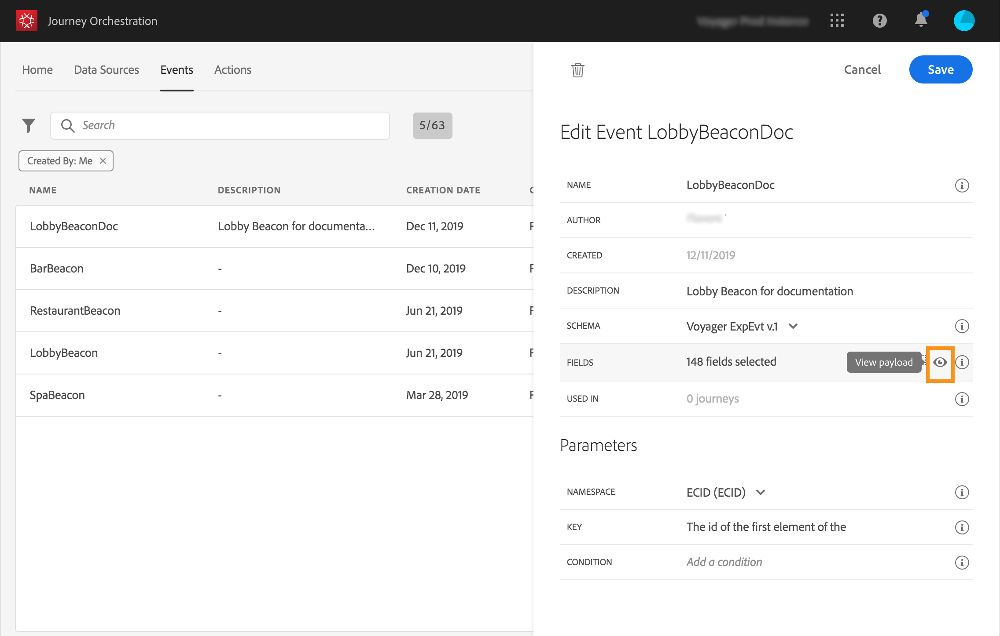

# Previewing the payload {#concept_jgf_4yk_4fb}

The payload preview allows you to validate the payload definition.

>[!NOTE]
>
>When you create an event, before viewing the payload preview, save your event and re-open it. This step is needed to generate an event ID in the payload.

1. Click the **View payload** icon to preview the payload expected by the system.

    

    You can notice that the fields selected are displayed.

    

1. Check the preview to validate the payload definition.

1. Then, you can share the payload preview with to the person responsible for the event sending. This payload can help him design the setup of an event pushing to Triggered Journeys. See [Additional steps to send events to Journeys](../event/eventsteps.md#concept_xrz_n1q_y2b).
