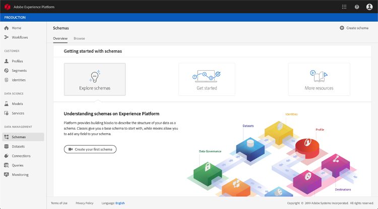
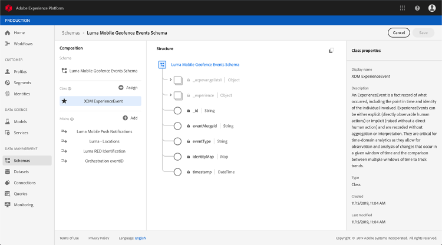
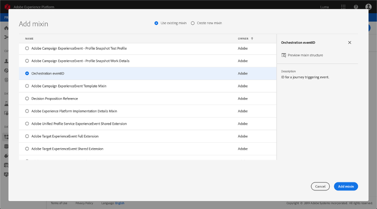
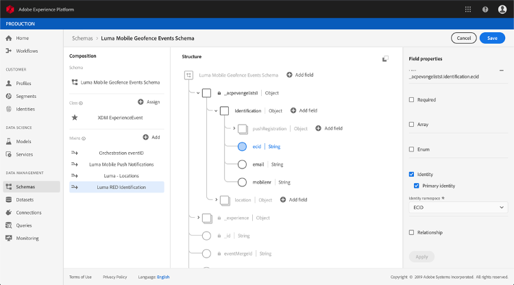
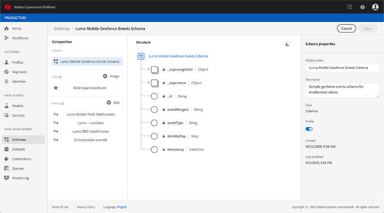
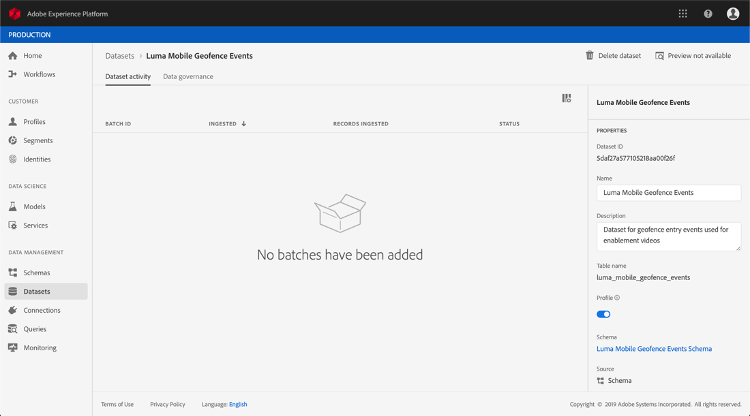
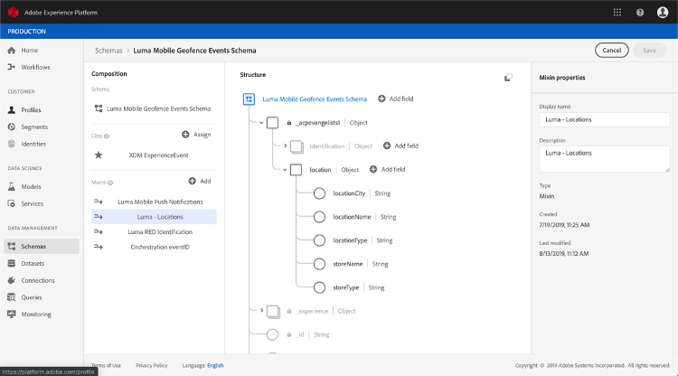

# About ExperienceEvent Schemas for Journey Orchestration Events 

Journey Orchestration events are XDM Experience Events that are sent to the Adobe Experience Platform via Streaming Ingestion.

As such, an important prerequisite for setting up events for Journey Orchestration is that you are familiar with the Platform’s Experience Data Model (or XDM) and how to compose XDM Experience Event schemas, as well as how to stream XDM-formatted data to the Platform.

## Schema requirements for Journey Orchestration Events 

The first step in setting up an event for Journey Orchestration is to ensure that you have an XDM schema defined to represent the event, and a dataset created to record instances of the event on the Platform. Having a dataset for your events is not strictly necessary, but sending the events to a specific dataset will allow you to maintain users’ event history for future reference and analysis, so it is always a good idea. If you do not already have a suitable schema and dataset for your event, both of those tasks can be done in the Platform web interface. 

Any XDM schema that will be used for Journey Orchestration events should meet the following requirements:  

* The schema must be of the XDM ExperienceEvent class. 

* The schema must include the Orchestration eventID mixin. Journey Orchestration uses this field to identify events used in journeys.

* Declare an identity field for identifying the subject of the event. If no identity is specified, an identity map can be used. This is not recommended.

* If you would like this data to be available for lookup later in a Journey, mark the schema and dataset for profile. 

* Feel free to include data fields to capture any other context data you want to include with the event, such as information about the user, the device from which the event was generated, location, or any other meaningful circumstances related to the event. 

