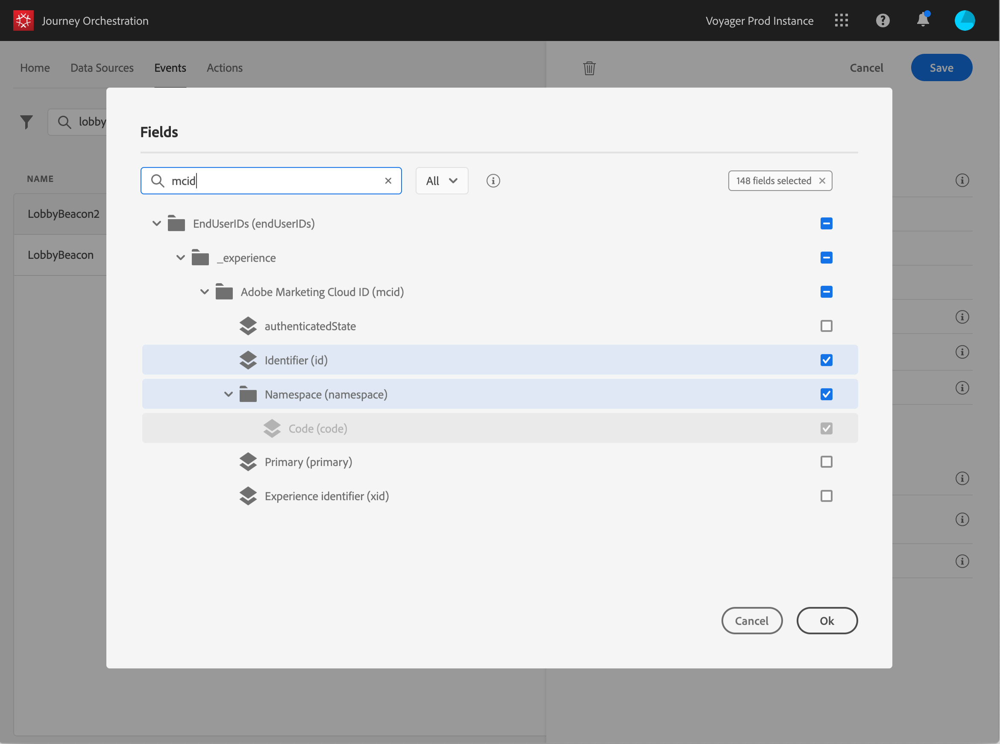
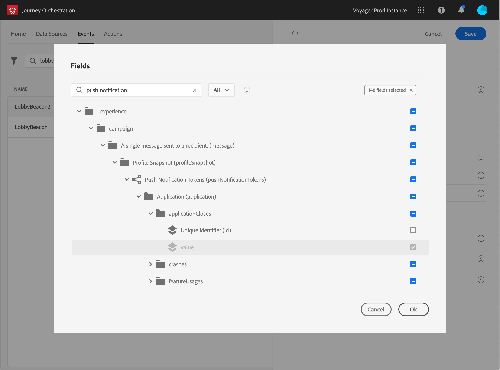

# Defining the payload fields {#concept_yrw_3qt_52b}

The payload definition allows you to choose the information the system expects to receive from the event in your journey and the key to identify which person is associated to the event. The payload is based on the Experience Cloud XDM field definition. For more information on XDM, refer to this [page](https://www.adobe.io/apis/cloudplatform/dataservices/xdm.html).

1. Select an XDM schema from the list and click on the **Payload** field or on the **Edit** icon.

    

    All the fields defined in the schema are displayed. The list of fields varies from one schema to another. You can search for a specific field or use the filters to display all nodes and fields or only the selected fields. According to the schema definition, some fields may be mandatory and pre-selected. You cannot unselect them. 

    

1. Select the fields you expect to receive from the event. These are the fields which the business user will leverage in the journey. They must also include the key that will be used to identify the person associated to the event (see [Defining the event key](eventkey.md#concept_ond_hqt_52b)). An example of field that can be used in the journey is the phone model (__device > model__).

    

    >[!NOTE]
    >
    >The **eventID** field is automatically added in the list of fields selected so that Triggered Journeys can identify the event. The system pushing the event should not generate an ID, it should use the one available in the payload preview. See [Previewing the payload](eventpayloadpreview.md#concept_jgf_4yk_4fb).

1. When you're done selecting the needed fields, click **Save** or press **Enter**.

    .

The number of selected fields appears in the **Payload** field.

    
