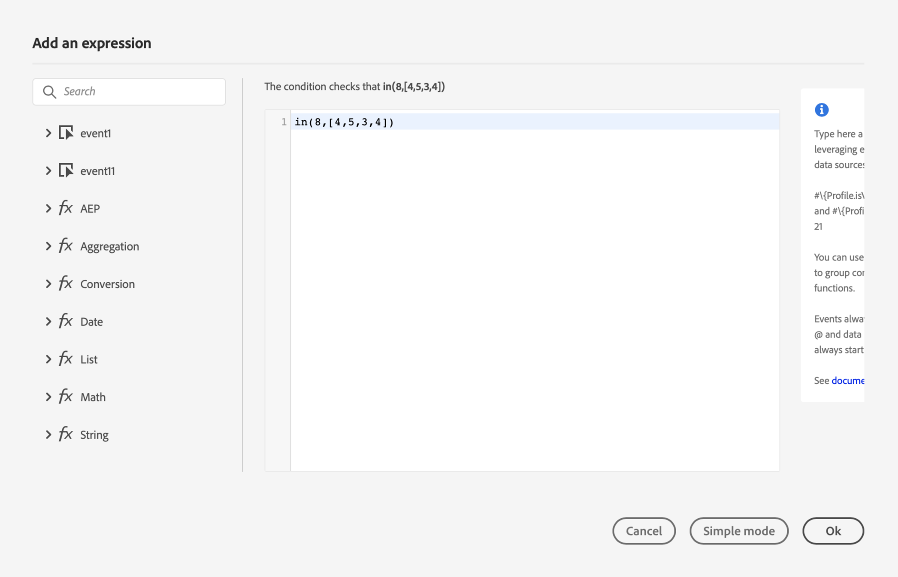
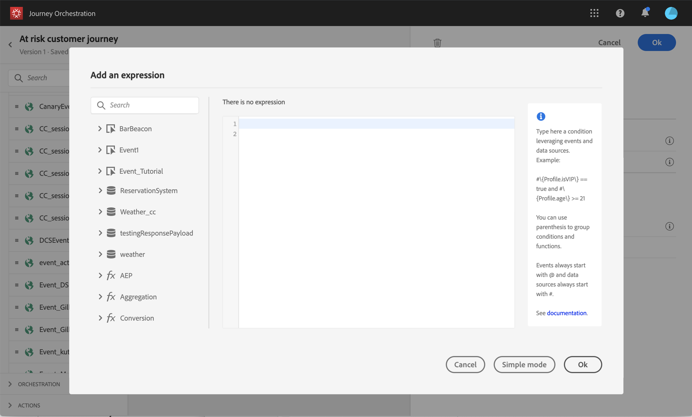
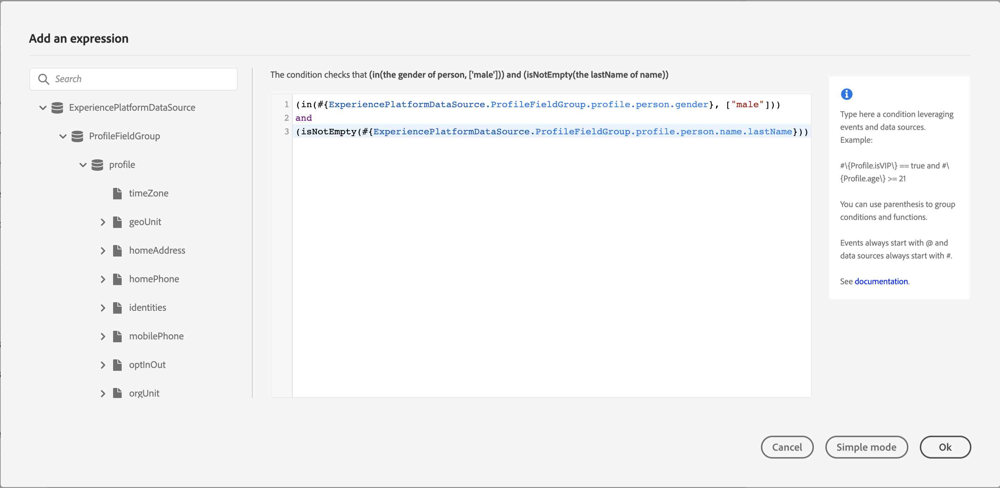
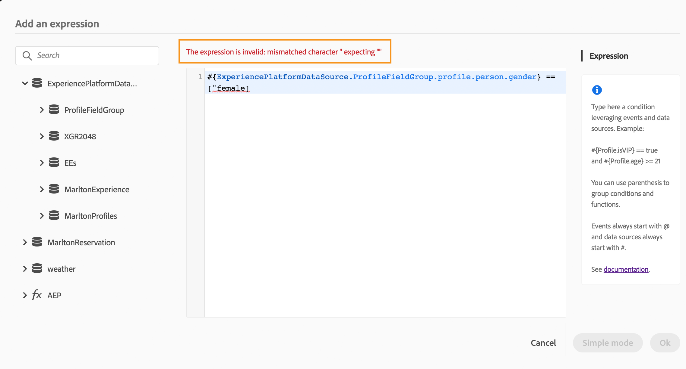

# Building advanced conditions {#concept_uyj_trt_52b}

## About advanced conditions {#section_llg_vnj_cjb}

The advanced expression editor allows you to build conditions in various screens of the interface, for example, when defining a data source condition. You can leverage data coming from the events or additional information retrieved from the data source. In a journey, the displayed list of event fields is contextual and varies according to the event(s) added in the journey.

The advanced expression editor offers a set of built-in functions and operators to let you manipulate values and define an expression that corresponds specifically to your needs with. It is available every time you need define a condition. The advanced expression editor also allows you to define the values of external data source parameters.

 

The advanced expression editor can be used to:

* create advanced data source conditions
* define custom timezones in date conditions, fixed date timers, custom timers
* define custom timers
* define custom action parameter mapping
* perform email, SMS and push personalization data mapping

When possible, you can switch between the two modes using the **Advanced mode** / **Simple mode** button. The simple mode is described [here](../journey/journeyorchestration.md#section_e2n_pft_dgb).

## Accessing the advanced expression editor {#section_fdz_4nj_cjb}

You can access the query editor in different ways:

* When you create a data source condition, you can access the advanced editor by clicking on **Advanced mode**.

* When you create a custom timezone or a custom timer, the advanced editor will be directly displayed.
* When you map custom action parameters and email, SMS, push personalization you can access it by clicking on **Advanced mode**.

## Discovering the interface{#section_otq_tnj_cjb}

This screen allows you to manually write your expressions.

On the left part of the screen are displayed available fields and functions:

* **Data Sources**: choose from the list of fields available from your data sources' field groups.
* **Events**: choose one of the fields received from the inbound event. The displayed list of event fields is contextual and varies according to the event(s) added in the journey.
* **Functions**: a list of advanced functions are available to carry out complex filtering. Functions are organized by categories.

An autocompletion mechanism displays contextual suggestions.

A syntax validation mechanism checks the integrity of your code. Errors are displayed on top of the editor.

**Need for parameters when building conditions with the advanced expression editor**

If you select a field from an external data source requiring a parameter to be called (see [External data sources](../datasource/dsexternal.md#concept_t2s_kqt_52b)), a new tab appears on the right to let you specify this parameter. The parameter value can come from the events positioned in the journey or the Experience Platform data source (and not from other external data sources). For example, in a weather-related data source, a frequently used parameter will be "city". As a result, you must select where you want to get this city parameter. Functions can also be applied to parameters to perform format changes or concatenations.

For more complex use cases, if you want to include the parameters of the data source in the main expression, you can define their values using the "params" keyword. See this [page](expressionfields.md#concept_fkj_ll5_dgb).
