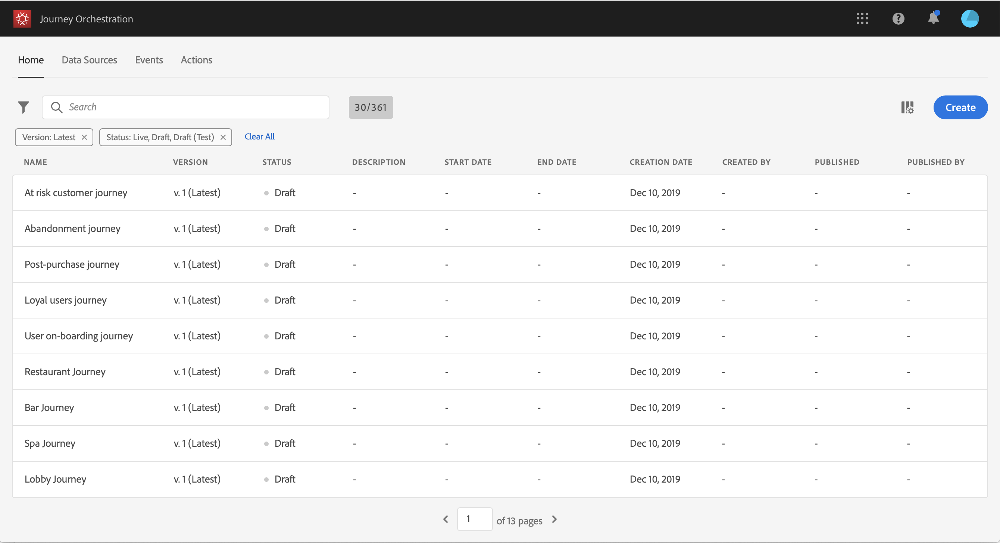

# Building a journey {#concept_gq5_sqt_52b}

This step is performed by the **business user**. This is where you create your journeys. Combine the different event, orchestration and action activities to build your multi-step cross-channel scenarios.

The journey interface allows you to easily drag and drop activities from the palette into the canvas. Each activity has a specific role and place in the process. The activities are sequenced. When an activity is finished, the flow continues and processes the next activity, and so on.

Only one namespace is allowed per journey. If you use several events in the same journey, they need to use the same namespace. When you drop the first event, events with different namespaces will be grayed out. If the first event doesn't have a namespace, then all events with a namespace will be grayed out. See [Selecting the namespace](eventnamespace.md#concept_ckb_3qt_52b). Also, Experience Platform field groups are grayed out if the journey has events without a namespace.

Here are the main steps to create and publish a journey.

1. In the top bar, click **Journeys**. The list of journeys is displayed. See [The journey designer's interface](journeyinterface.md#concept_m1g_5qt_52b) for more information on the interface.

 

1. Click **Create** to create a new journey.

 

1. Edit the journey's properties by clicking on the pencil icon. See [The journey's properties](journeyproperty.md#concept_prq_wqt_52b).

 

1. Start by drag and dropping an event activity from the palette into the canvas.

 

1. Drag and drop your other activities and configure them. See [Events activities](journeyevent.md#concept_rws_1rt_52b), [Orchestration activities](journeyorchestration.md#concept_ksq_2rt_52b) and [Action activities](journeyaction.md#concept_hbj_hrt_52b).

 

1. Your journey is automatically saved. Test your journey and publish it. See [Testing and publishing the journey](journeypublication.md#concept_mtc_lrt_52b).

 
