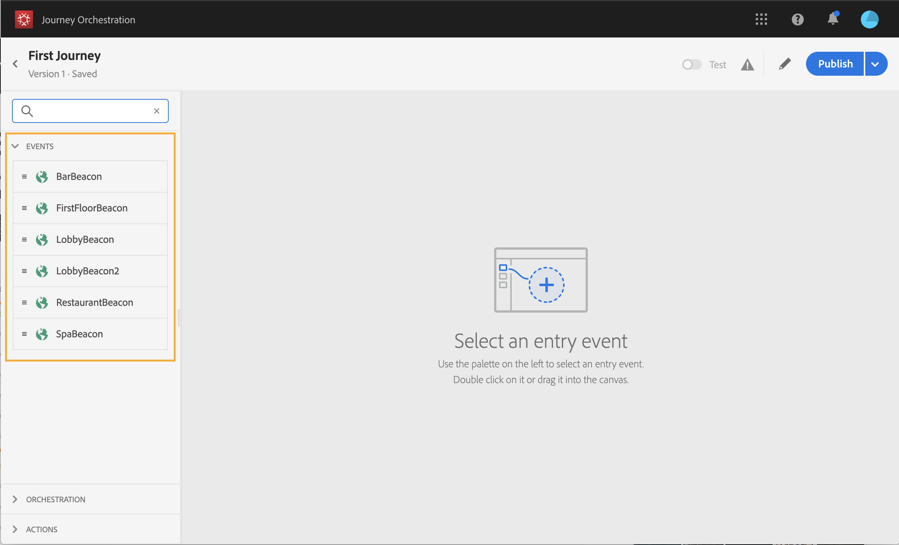
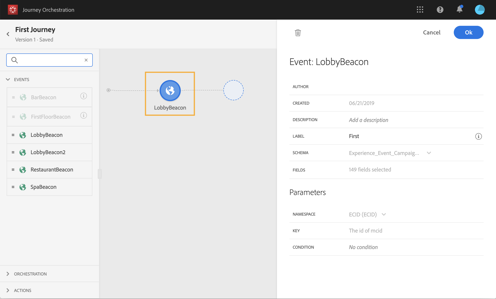

# Events activities {#concept_rws_1rt_52b}

The events configured by the technical user (see ) are all displayed in the first category of the palette, on the left side of the screen.

        

Always start your journey by drag and dropping an event activity.

        

When you click on the event activity in the canvas, the activity configurator is displayed. You can use the **Label** field to add a suffix to the event name that will appear under your activity in the canvas. This is useful if you use the same event several times in your journey. 

        

## General events {#section_ofg_jss_dgb}

For this type of event, you can only add a label and a description. The rest of the configuration cannot be edited. It was performed by the technical user. See . 

## Reaction events {#section_dhx_gss_dgb}

Among the different event activities available in the palette, you will find the built-in **Reactions** event. This activity allows you to react to specific tracking data related to a message sent within the same journey. The event can be triggered, for example, if the person clicked on the email, or if the push message failed to be delivered. This allows you to perform additional actions in reaction to the message's success. See .

            

Here are the different steps to configure the reaction events:

1. Add a **label** to the reaction. This step is optional.
1. From the drop-down list, select the action activity you want to react to. You can select any action activity positioned in the previous steps of the path.
1. Depending on the action you selected (an email, an SMS or a push notification), choose what you want to react to. 
    * For email, the following options are available: **Clicked** (a person clicked on all links), **Opened**, **Sent**, **Failed**. 
    * For a push: **Clicked**, **Sent**, **Failed**.
    * For an SMS: **Sent**, **Failed**.

1. You can define a condition as an optional step. For example, after an email action, you can decide to create two paths, one with a reaction event to track clicks only for VIP customers and one with a reaction event to track clicks performed by women.

    >[!NOTE]
    >
    >Reaction events cannot track actions that take place in a different journey. 
    >Reaction events track clicks on links of the type "tracked" (see this [page](https://docs.adobe.com/content/help/en/campaign-standard/using/designing-content/links.html#about-tracked-urls)). Unsubscription and mirror page links are not taken into account.

    >[!CAUTION]
    >
    >**Warning**: email clients such as Gmail allow image blocking. Emails opens are tracked using a 0-pixel image included in the email. If images are blocked, email opens will not be taken into account.

## Advanced usage {#section_vxv_h25_pgb}

How can you listen to an event only during a certain time?

An event activity positioned in the journey listens to events indefinitely. To listen to an event only during a certain time, you must add a timer activity in a second path, parallel to the event path. The journey will listen to the event during the time specified. If an event is received during that period, the event path will be chosen. If not, the customer will flow into the timer path.

For example, you sent a welcome first push to a customer and you want to send a meal discount push only if the customer enters the restaurant within the next 6 hours. To do this, you will create a second path (parallel to the restaurant event one) with a 6-hour timer activity followed by and End activity. The first eligible activity will be chosen. If the restaurant event is received less than 6 hours after the welcome push, the meal discount push activity is sent. If no restaurant event is received within the next 6 hours, the timer path is chosen and the flow ends.

            
