# Orchestration activities {#concept_ksq_2rt_52b}

From the palette, on the left-hand side of the screen, the following orchestration activities are available: **Condition**, **End**, **Timer**.

    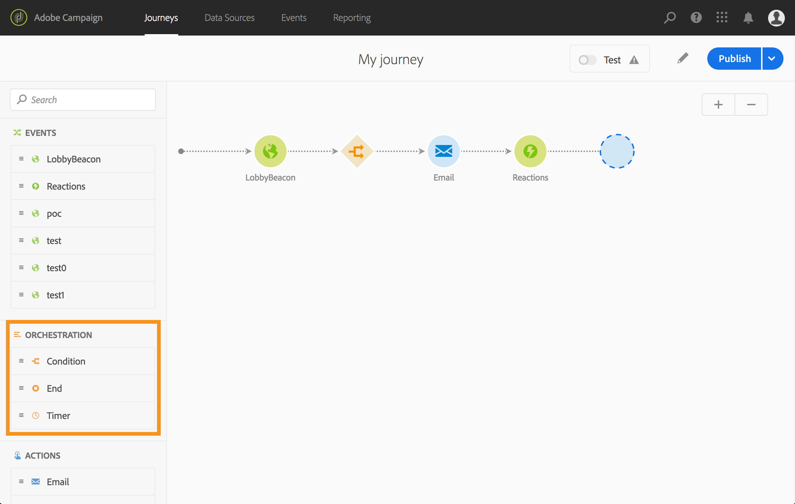

# Condition {#section_e2n_pft_dgb}

The **Condition** activity allows you to define a simple or advanced behavioral condition.

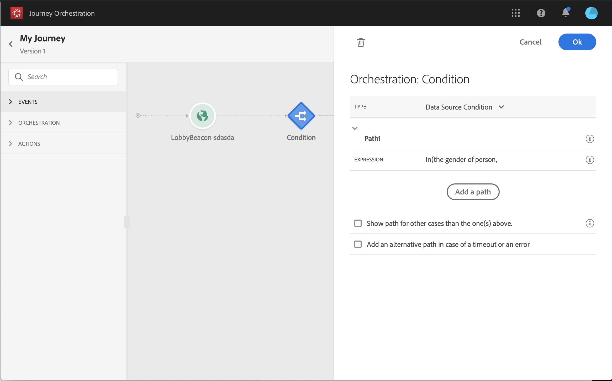

The simple mode allows you to perform simple queries based on a combination of fields. All the available fields are displayed on the left side of the screen. Drag and drop fields into the main zone. To combine the different elements, interlock them into one another to create different groups and/or group levels. You can then select a logical operator to combine elements on the same level:

* AND: an intersection of two criteria. Only the elements matching all criteria are taken into account. 
* OR: a union of two criteria. Elements matching at least one of the two criteria are taken into account.

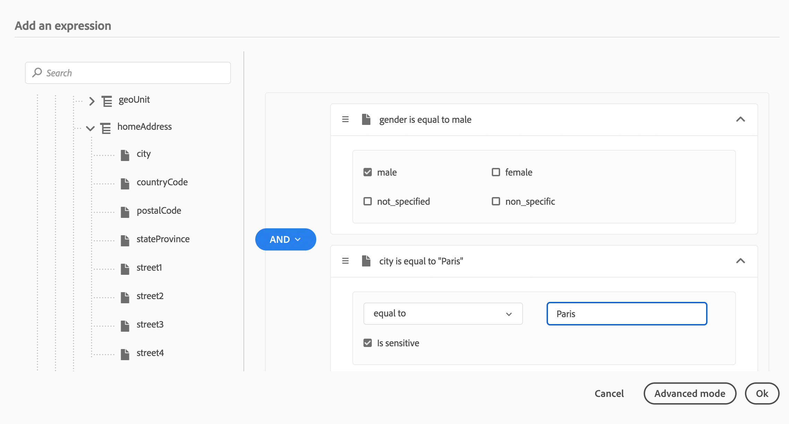

>[!NOTE]
>
>You cannot perform queries on time series (for example a list of purchases, past clicks on messages) with the simple editor. For this you’ll need to use the advanced editor. See [Building advanced conditions](expressionadvanced.md#concept_uyj_trt_52b).

Four types of conditions are available:

* **Data Source condition**: this allows you to define a condition based on fields from the data sources or the events. To learn how to use the expression editor, see [Building advanced conditions](expressionadvanced.md#concept_uyj_trt_52b). Using the advanced expression editor, you can define the values of external data source parameters. See [External data sources](dsexternal.md#concept_t2s_kqt_52b) and [Building advanced conditions](expressionadvanced.md#concept_uyj_trt_52b).

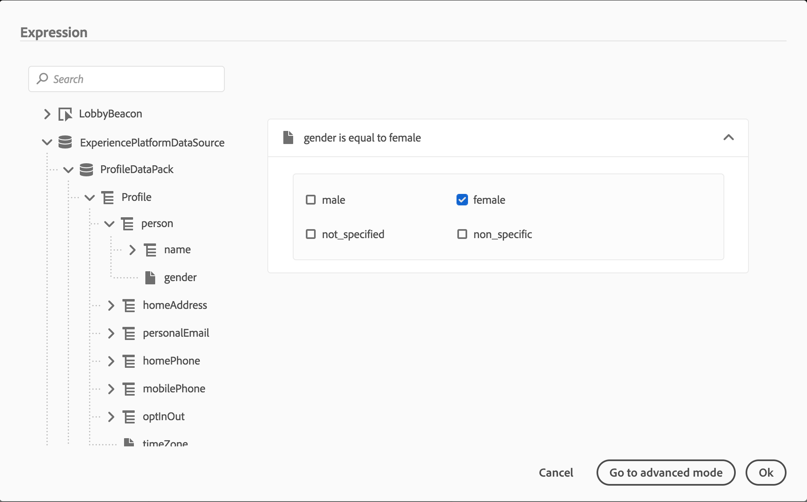

* **Time condition**: this allows you to perform different actions according to the hour of the day and/or the day of the week. For example, you can decide to send SMS messages during daytime and emails at night during weekdays. And during the weekend, you'll send both. You can define a specific timezone for this condition. It can be fixed, picked from a drop-down list or dynamic for each person entering this step. In that case, you'll use the expression editor to select where you want the system to get this information (it can be from an event or a data source). If no timezone is selected, the timezone of the instance's server will apply.

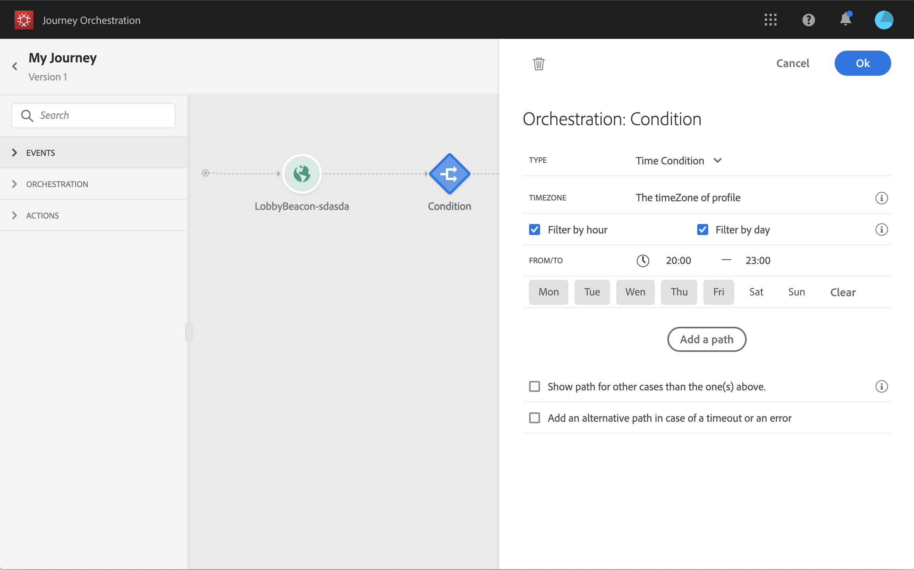

* **Percentage split**: this option allows you to randomly split the audience to define a different action for each group. Define the number of splits and the repartition for each group. The split calculation is statistical as the system cannot anticipate how many people will flow in this activity of the journey. The split has a very low error margin. This function is based on a Java random mechanism (see this [page](https://docs.oracle.com/javase/7/docs/api/java/util/Random.html)page).

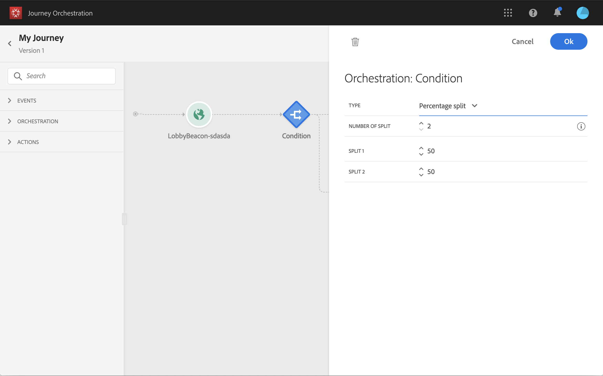

* **Date condition**: this allows you to define a different flow based on the date. For example, if the person enters the step during the "sales" period, you'll send him a push notification. The rest of the year, you'll send an email.
When you define a date condition, you must specify a timezone. The timezone can be set in different ways. It can be:

        * individualized and taken from the timezone of the profile in the Platform.
        * the same for all individuals in the journey passing through this step and picked from a dropdown list.
        * custom and retrieved from an event or a data source. The custom timezone must follow this [format](https://docs.oracle.com/javase/8/docs/api/java/time/ZoneId.html#of-java.lang.String-). If the timezone you want to leverage is a string, you can use the function ‘toTimeZone’ to convert it to the right format.

        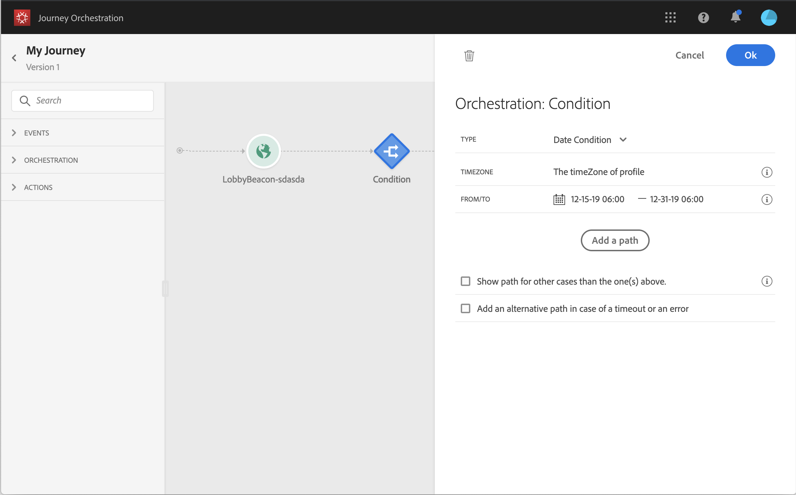

Click **Add a path** if you want to define several conditions. For each condition, a new path is added in the canvas after the activity.

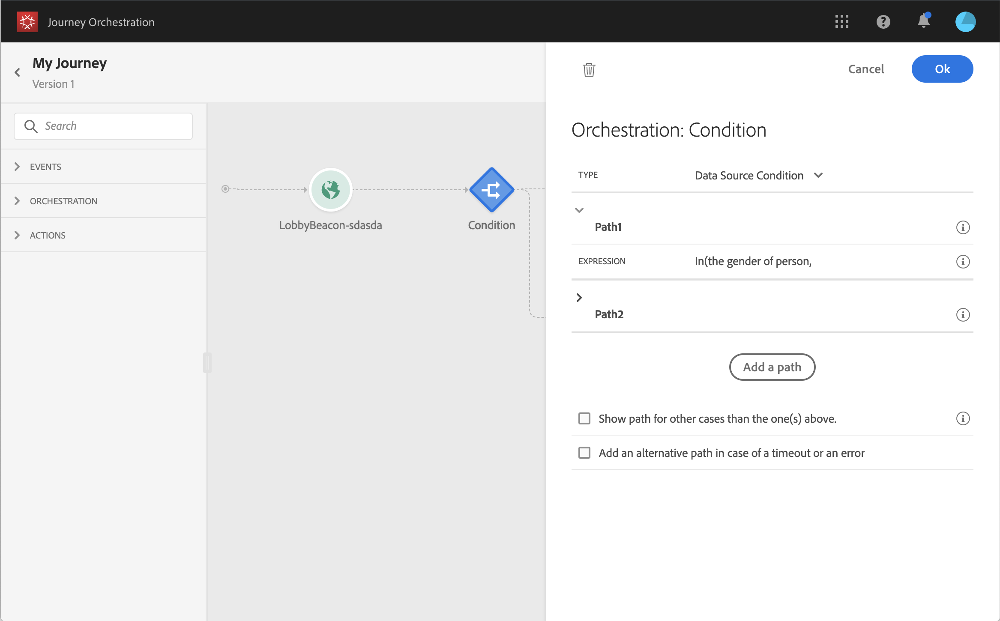

When several paths are defined after a condition, only the first eligible path will be executed. It means that you can vary the prioritization of paths by placing them above or below one another. For example, if the first path is "The person is a VIP" and the second path is "The person is a male". If a person meeting both conditions (a male who is a VIP) enters this step, the first path will be chosen even if he's also eligible to the second one, because the first path is "above".

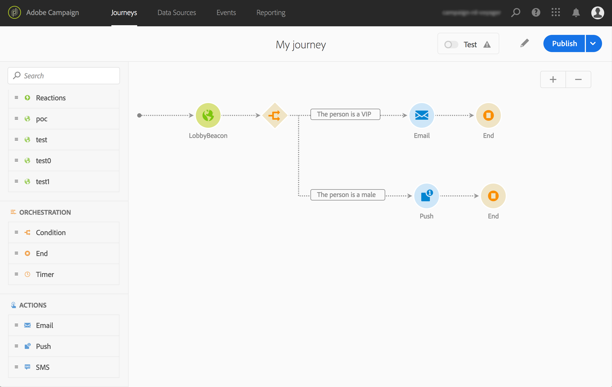

You can create another path for audiences that are not eligible to the defined conditions by checking **Show path for other cases than the one(s) above**.

## End {section_vqp_4ft_dgb}

The **End** activity allows you to mark the end of each path of the journey. It is not mandatory but recommended for visual clarity and reporting accuracy. Indeed, in the **Reporting** tab (see [Building your Journeys reports](reporting.md#concept_rfj_wpt_52b)), you will have a ratio of the number of people who entered the journey according to the number of people who exited the journey.

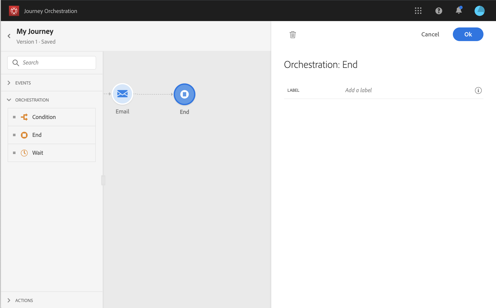

## Timer {#section_rlm_nft_dgb}
If you want to wait before executing the next activity in the path, you can use a **Timer** activity. It allows you to define the moment when the next activity will be executed. Three options are available:

* **Duration**: select the duration of the wait before the execution of the next activity.

* **Fixed date**: select the date for the execution of the next activity. When you define a fixed date timer, you must specify a timezone. The timezone can be set in different ways. It can be:

        * individualized and taken from the timezone of the profile in the Platform.
        * the same for all individuals in the journey passing through this step and picked from a dropdown list.
        * custom and retrieved from an event or a data source. The custom timezone must follow this [format](https://docs.oracle.com/javase/8/docs/api/java/time/ZoneId.html#of-java.lang.String-). If the timezone you want to leverage is a string, you can use the function ‘toTimeZone’ to convert it to the right format.

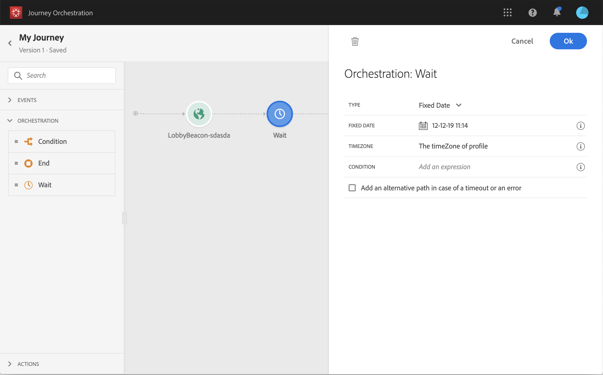

*  **Custom**: this option lets you define a custom date, for example 12 July 2020 at 5pm, using an advanced expression based on a field coming from an event or a data source. It does not let you define a custom duration, for example: 7 days, 2 months. The expression in the expression editor should provide a dateTimeOnly format. See [The advanced editor](expressionadvanced.md#concept_uyj_trt_52b).

>[!NOTE]
>
>You can leverage a dateTimeOnly field or use a function to convert to dateTimeOnly. For example: toDateTimeOnly(@{myEvent.xxx.yyy}), the
>field in the event being of the form 2016-08-12T09:46:06.
>The timezone is expected in another place in the custom timer configuration pane. As a result, it is not possible today from the interface to directly point at a full ISO-8601 timestamp mixing time and timezone like 2016-08-12T09:46:06.982-05.

The timezone can be set in different ways. It can be:

* individualized and be taken from the timezone of the profile in the Platform.
* the same for all individuals in the journey passing through this step and picked from a dropdown list.
* custom and retrieved from an event or a data source. The custom timezone must follow this [format](https://docs.oracle.com/javase/8/docs/api/java/time/ZoneId.html#of-java.lang.String-). If the timezone you want to leverage is a string, you can use the function ‘toTimeZone’ to convert it to the right format.

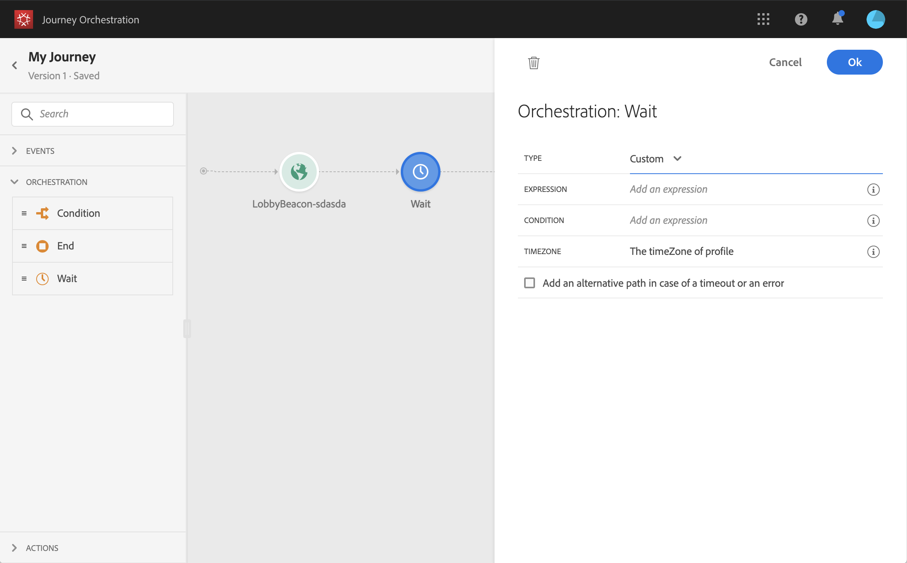

You can also define a timezone and a condition if you want to restrict the timer to a certain population.
