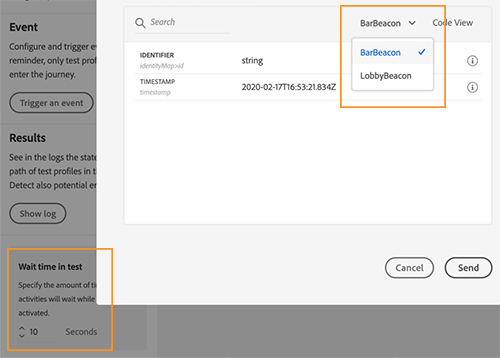
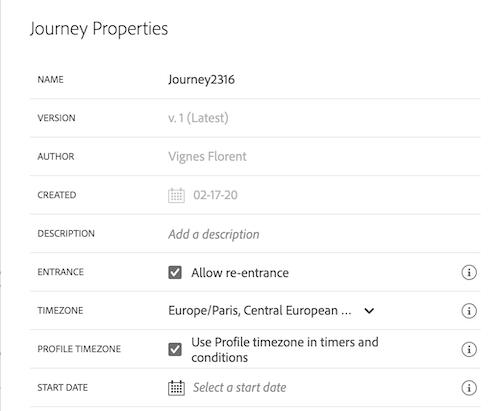
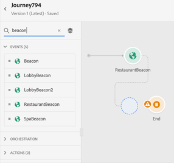
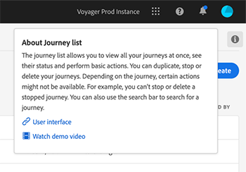

# Release Notes {#release-notes}

This page lists all the new features and improvements for Journey Orchestration.
You can also consult the [Documentation Updates](../release-notes/documentation-updates.md).

## Q2 Release - June 2020 {#q2-release---june-2020}

**Platform integration enhancements**

A new activity allows the listening of Platform segment entrances/exits to make people enter or move forward in a journey. [Read more](../building-journeys/event-activities.md#segment-qualification).

Platform segments can now be created and edited without leaving the Journey Orchestration interface, thanks to a new **Segments** tab. [Read more](../segment/about-segments.md). 

In the simple expression editor, Platform segments are now directly listed in the navigation tree to allow easy setup of conditions such as "does this person belong to segment A?". [Read more](../segment/using-a-segment.md).
 
Journey Orchestration is now automatically passing, to the Adobe Data Platform, the steps followed by individuals in journeys. This includes potential errors encountered. This information can be used for analysis or segmentation purposes.

Journey Orchestration can now be connected to non-production Platform Sandbox. Effective availability: June, 15 2020.

**Journey designer and test mode enhancements** 

You can now copy paste activities from one journey to another, selecting 1 or N journey activities. [Read more](../building-journeys/using-the-journey-designer.md#copy-paste).

The **Finished** journey state has been nenamed **Closed (no entrance)** to better reflect what this state means.  

After firing an event to make a test profile enter a journey, you can now see its progress along the journey thanks to a colored visual flow. In case of error in the journey, details of errors are also displayed. [Read more](../building-journeys/testing-the-journey.md#firing_events).

**Other improvements**

To avoid sending too many API calls to third-party systems, we introduce a new public API to setup "capping" rules. Capping rules allow the definition of a maximum number of calls to an API endpoint per milliseconds. 

Journey Orchestration is now available in APAC (Australian data centers). Effective availability: June, 15 2020

Journey Orchestration interface is available in Japanese.

## Q1 Release - March 2020 {#q1-release---march-2020}

**What's new?**

<table>
<thead>
<tr>
<th><strong>Test mode enhancements</strong> </th>
</tr>
</thead>
<tbody>
<tr>
<td>

The following enhancements have been made to the test mode:

<ul>
<li>When a journey uses several events, you can now trigger each of them individually from a drop-down list, in the <strong>Event configuration</strong> screen of the test mode. <a href="../building-journeys/testing-the-journey.md#firing_events">Read more</a>
</li>
<li>
When one or more <strong>Wait</strong> activities are used in a journey, you can now define the time that each of these activities will last in test mode. The default time is 10 seconds. You can change this using the <strong>Wait time in test</strong> parameter, in the bottom left corner. <a href="../building-journeys/testing-the-journey.md">Read more</a>

</li>
<li>In the <strong>test logs</strong>, in case of an error when calling a third-party system (data source or action), the error code and error response are now displayed. <a href="../building-journeys/testing-the-journey.md#viewing_logs">Read more</a>
</li>
</ul>
</td>
</tr>
</tbody>
</table>

<table>
<thead>
<tr>
<th><strong>Centralized timezone management</strong> </th>
</tr>
</thead>
<tbody>
<tr> 
<td>

Timezone management is now centralized in the journey properties panel. Two parameters have been added in the journey properties:

<ul>
<li>The <strong>Timezone</strong> drop-down list allows you to select a specific timezone. By default, the browser's timezone is used. </li>
<li>The <strong>Profile Timezone</strong> checkbox allows you to use the Experience Platform Profile timezone of the person entering the journey, if available. If not, the timezone defined in the drop-down list is used. This feature is not compatible with journeys using events that do not have a namespace.</li>
</ul>

For more information, refer to the <a href="../building-journeys/changing-properties.md#timezone">Changing properties</a> and <a href="../building-journeys/timezone-management.md">Timezone management</a> sections.

</td>
</tr>
</tbody>
</table>

<table>
<thead>
<tr>
<th><strong>Journey designer enhancements</strong> </th>
</tr>
</thead>
<tbody>
<tr> 
<td>

The journey <strong>palette</strong>, on the left side of the journey designer has been enhanced:

<ul>
<li>A new icon, next to the <strong>Search</strong>  bar, allows you to hide or display unavailable elements in the palette, for example the events that use a different namespace than the ones used in your journey. By default, unavailable items are hidden.</li>
<li>When using the <strong>Search</strong> field, the number of results for each canvas activity category is now displayed.</li>
<li>The navigation between the different activity categories has been improved.</li>
</ul>

In the journey designer, you can now check you are accessing the latest version of the journey. This information is displayed next to the version number.

In the journey <strong>canvas</strong>, when two activities are disconnected, a warning message is now displayed.

For more information, refer to the <a href="../building-journeys/using-the-journey-designer.md">detailed documentation</a>.

</td>
</tr>
</tbody>
</table>

<table>
<thead>
<tr>
<th><strong>Contextual Help</strong> </th>
</tr>
</thead>
<tbody>
<tr>
<td>

A contextual help is now available across the different Journey Orchestration list screens (journeys, events, actions and data sources). This allows you to view a quick description of the current functionality and access related articles and videos.

To display the contextual help, click the  icon in the upper-right corner of the screen. 

</td>
</tr>
</tbody>
</table>

**Other improvements**

* In addition to US, Journeys Orchestration is now available in **EMEA**. The application and documentation are available in French and German.

* Experience League is now integrated into the product. This simplifies the access to related content and helps you get the most out of Experience Cloud. Direct access to Journey Orchestration documentation is available at the bottom of the Help tab. Additionally, click Help > Feedback to report issues or share your ideas with Adobe.

* The **C** keyboard shortcut, which allows you to create a new item, is now available in all list screens: journeys, data sources, actions and events. [Read more](../about/user-interface.md#section_ksq_zr1_ffb)

* You can now **delete** stopped journeys. Reports associated to these deleted journeys will not be available.

* When browsing through **Data Platform fields** (XDM format), you will now see the display name in addition to the field name. This information is retrieved from the schema definition in the Experience Data Model. When available, the alternate display name appears. This user-friendly description, especially useful in the case of eVar fields, allows you identify your fields more easily. [Read more](../about/user-interface.md#friendly-names-display)

## GA Release - December 2019 {#ga-release---december-2019}

Journey Orchestration is now GA. 

Build real-time orchestration use cases leveraging contextual data stored in events or data sources.

Journey Orchestration allows real-time orchestration powered by contextual data from events, information from the Adobe Experience Platform, or data from third-party API services. The application determines in multistep flows called journeys the next best actions specific to the consumer, based on their profile and behaviors. This comprises both the optimal timing, as well as the type of action, such as sending the consumer a push notification via Adobe Campaign Standard transactional messaging capabilities (requires Adobe Campaign Standard) or the notification of a third-party system. These decisions are made based on rules and Sensei scores.

[Learn more](../action/working-with-adobe-campaign.md) on Journey Orchestration.

Additional resources:

* [Tutorials](https://docs.adobe.com/content/help/en/platform-learn/tutorials/journey-orchestration/introduction.html)
* [Community](https://www.adobe.com/go/journeyorchestrationcommunity)
