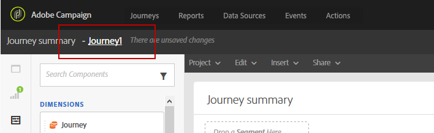
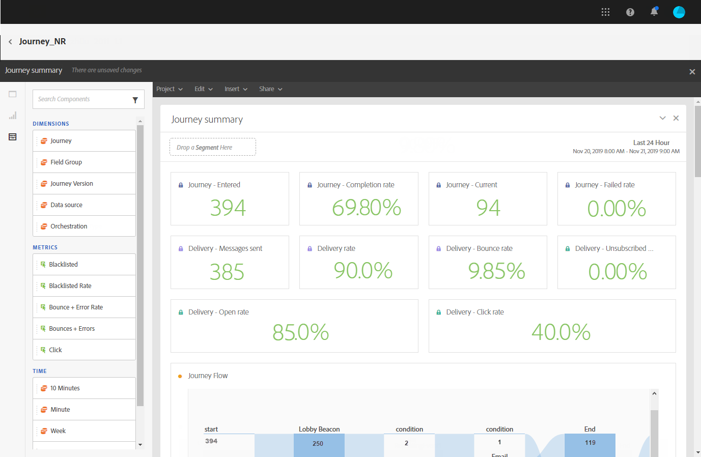
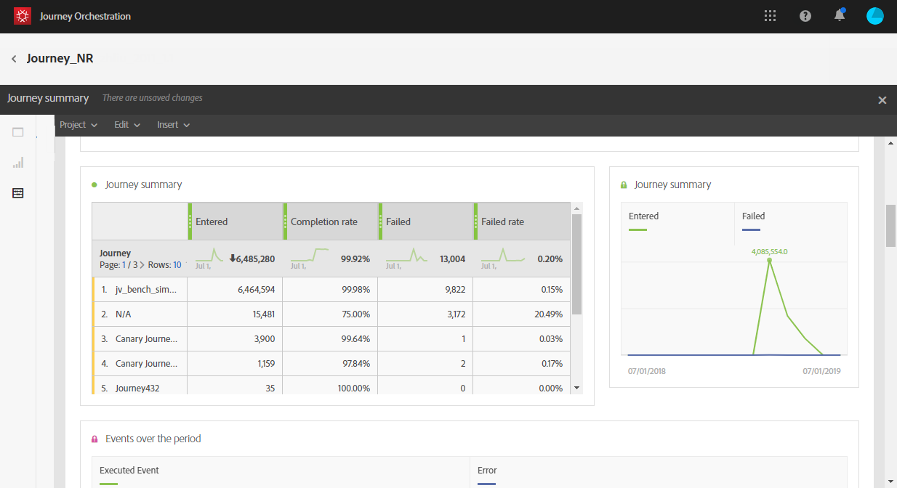
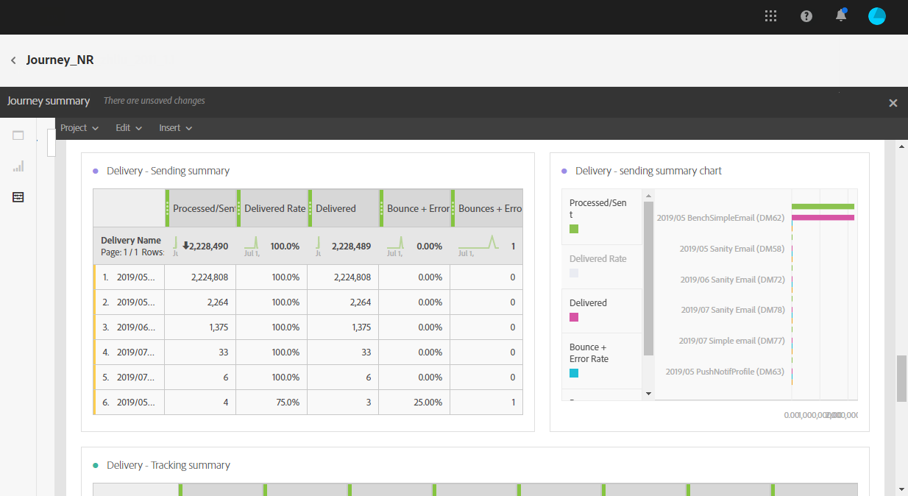

# Building your Journeys reports{#concept_rfj_wpt_52b}

This section will present you how to access and use reports to measure your journeys' effectiveness.

**Accessing your reports**

Reports can be accessed two different ways depending on the data you want to filter in your dynamic reports:

* From the **Reports** tab, you can access your journey reports for every journey created. 

    

* From your journey dashboard by clicking the  icon, you can access the report for this specific journey. 

    

To go back to your deliveries from your report, click your delivery's name in the report title.

    

For more information on the reporting interface, refer to the [Adobe Campaign Standard documentation.](https://helpx.adobe.com/campaign/standard/reporting/using/reporting-interface.html)

**Out-of-the-box template**
Reports are divided into two categories: an out-of-the-box template and custom reports.
The out-of-the-box template, **Journey summary**, gives you a clear view of the most important tracking data.

        

Each table is represented by summary numbers and charts. You can change how the details are shown in their respective visualization settings.

 The following KPIs are available at the top of your report:
* **Journey - Entered**: Total number of individuals who reached the entry event of the journey.
* **Journey - Completion rate**: Total number of individuals who reached the end of the journey (or in case of an individual not matching any condition) compared to the total number of individuals who entered the journey.
* **Journey - Current**: Total number of individuals currently in the journey.
* **Journey - Failed rate**: Total number of journeys that were not successfully executed compared to the number of run journeys.
* **Delivery - Messages sent**: Total number of sends for the delivery.
* **Delivery rate**: Total number of messages successfully delivered compared to messages sent.
* **Delivery - Bounce rate**: Total number of messages that bounced compared to messages sent.
* **Delivery - Unsubscribed rate**: Total number of unsubscriptions by recipient compared to the delivered messages.
* **Delivery - Open rate**: Total number of opened messages compared to the number of delivered messages.
* **Delivery - Click rate**: Total number of clicks in a delivery compared to the number of delivered messages.

The Journey flow visualization allows you to see the path of your targeted profiles step-by-step through your journey. This is only available when targeting one journey.

        

The **Journey summary** table contains the data available for journeys, such as:

* **Entered**: Total number of individuals who reached the entry event of the journey.
* **Completion rate**: Total number of individuals who reached the end flow control of the journey compared to the total number of individuals who entered the journey.
* **Current**: Total number of individuals currently in the journey.
* **Failed**: Total number of journeys that were not successfully executed.
* **Failed rate**: Total number of journeys that were not successfully executed compared to the number of run journeys.

The **Top events** table displays the most successful events and the **Top action** the most successful actions in your journeys.

        

The **Delivery - Sending summary** table contains the data available for your journey's deliveries, such as:

* **Processed/sent**: Total number of sends for the delivery.
* **Delivered rate**: Total number of messages successfully delivered compared to messages sent.
* **Delivered**: Number of messages successfully sent, in relation to the total number of sent messages.
* **Bounce + error rate**: Total number of messages that bounced compared to messages sent.
* **Bounces + errors**: Total of errors cumulated during delivery and automatic return processing in relation to the total number of sent messages.

The **Delivery - Tracking summary** table contains the data available to track the success of your journeys' deliveries, such as:

* **Open Rate**: Percentage of opened messages.
* **Open**: Number of times a message was opened in a delivery.
* **Click trough rate**: Total number of clicks in a delivery compared to the number of delivered messages.
* **Click**: Number of times a content was clicked in a delivery.
* **Unsubscribe rate**: Percentage of unsubscriptions by recipient compared to the delivered messages.
* **Unsubscribed**: Total number of unsubscriptions by recipient compared to the delivered messages.
 
**Custom reports**
You can also create custom reports, which are directly created via the **Create a new project** button on the Reporting page. You, then, only need to add panels and drag and drop components or visualizations to your freeform environment. For more information on the reporting interface, refer to the [Adobe Campaign Standard](https://helpx.adobe.com/campaign/standard/reporting/using/reporting-interface.html) documentation.
