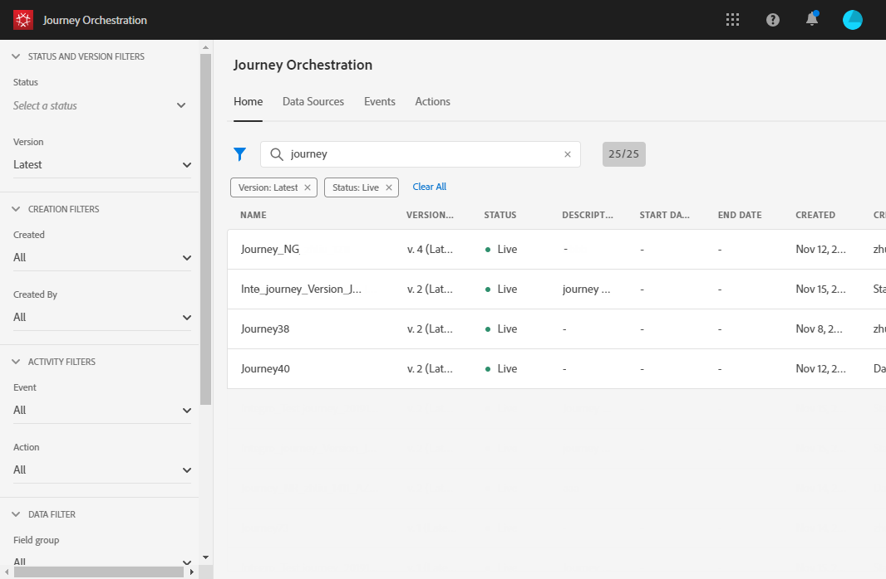
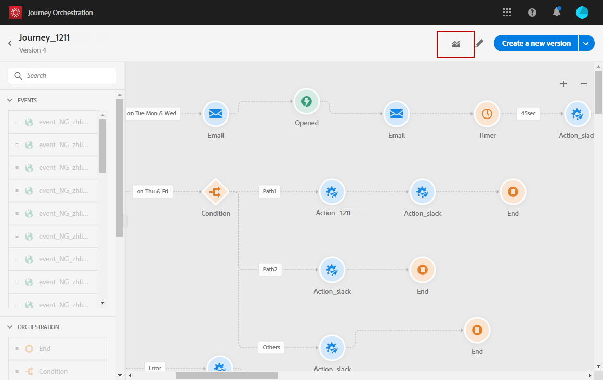
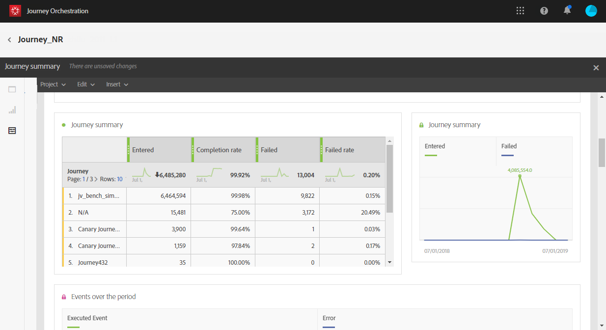

# Building your Journey Orchestration reports{#concept_rfj_wpt_52b}

This section will present you how to access and use reports to measure your journeys' effectiveness.

## Reporting interface {#reporting-interface}

The top toolbar allows you, for example, to modify, save or print your report.

Use the **[!UICONTROL Project]** tab to:

* **[!UICONTROL Open]**: Opens a previously created report or a template.
* **[!UICONTROL Save As]**: Duplicates templates to be able to modify them.
* **[!UICONTROL Refresh project]**: Updates your report based upon new data and changes to filters.
* **[!UICONTROL Download CSV]**: Exports your reports to a CSV file.

The **[!UICONTROL Edit]** tab allows you to:

* **[!UICONTROL Undo]**: Cancels your last action on your dashboard.
* **[!UICONTROL Clear all]**: Deletes every panel on your dashboard.

The **[!UICONTROL Insert]** table lets you customize your reports by adding graphs and tables to your dashboard:

* **[!UICONTROL New Blank Panel]**: Adds a new blank panel to your dashboard.
* **[!UICONTROL New Freeform]**: Adds a new freeform table to your dashboard.
* **[!UICONTROL New Line]**: Adds a new line graph to your dashboard.
* **[!UICONTROL New Bar]**: Adds a new bar graph to your dashboard.

## Accessing your reports {#accessing-reports}

To access your journeys' reports and start tracking the success of your deliveries:

1. From the homepage, select the journey you want to report on.

    

1. Click the **[!UICONTROL Report]** icon on the top right of your screen.

    

1. The **[!UICONTROL Journey summary]** out-of-the box report appears on screen. To access custom report, click the Close button.

1. Click **[!UICONTROL Create new project]** to start your report from scratch.  You, then, only need to add panels and drag and drop components or visualizations to your freeform environment.

## Journey summary template {#ootb-template}

Reports are divided into two categories: an out-of-the-box template and custom reports.
The out-of-the-box template, **[!UICONTROL Journey summary]**, gives you a clear view of the most important tracking data.

 

Each table is represented by summary numbers and charts. You can change how the details are shown in their respective visualization settings.

 The following KPIs are available at the top of your report:

* **[!UICONTROL Journey - Entered]**: Total number of individuals who reached the entry event of the journey.
* **[!UICONTROL Journey - Completion rate]**: Total number of individuals who reached the end of the journey (or in case of an individual not matching any condition) compared to the total number of individuals who entered the journey.
* **[!UICONTROL Journey - Current]**: Total number of individuals currently in the journey.
* **[!UICONTROL Journey - Failed rate]**: Total number of journeys that were not successfully executed compared to the number of run journeys.
* **[!UICONTROL Delivery - Messages sent]**: Total number of sends for the delivery.
* **[!UICONTROL Delivery rate]**: Total number of messages successfully delivered compared to messages sent.
* **[!UICONTROL Delivery - Bounce rate]**: Total number of messages that bounced compared to messages sent.
* **[!UICONTROL Delivery - Unsubscribed rate]**: Total number of unsubscriptions by recipient compared to the delivered messages.
* **[!UICONTROL Delivery - Open rate]**: Total number of opened messages compared to the number of delivered messages.
* **[!UICONTROL Delivery - Click rate]**: Total number of clicks in a delivery compared to the number of delivered messages.

The Journey flow visualization allows you to see the path of your targeted profiles step-by-step through your journey. This is only available when targeting one journey.

 

The **[!UICONTROL Journey summary]** table contains the data available for journeys, such as:

* **[!UICONTROL Entered]**: Total number of individuals who reached the entry event of the journey.
* **[!UICONTROL Completion rate]**: Total number of individuals who reached the end flow control of the journey compared to the total number of individuals who entered the journey.
* **[!UICONTROL Current]**: Total number of individuals currently in the journey.
* **[!UICONTROL Failed]**: Total number of journeys that were not successfully executed.
* **[!UICONTROL Failed rate]**: Total number of journeys that were not successfully executed compared to the number of run journeys.

The **[!UICONTROL Top events]** table displays the most successful events and the **[!UICONTROL Top action]** the most successful actions in your journeys.

 

The **[!UICONTROL Delivery - Sending summary]** table contains the data available for your journey's deliveries, such as:

* **[!UICONTROL Processed/sent]**: Total number of sends for the delivery.
* **[!UICONTROL Delivered rate]**: Total number of messages successfully delivered compared to messages sent.
* **[!UICONTROL Delivered]**: Number of messages successfully sent, in relation to the total number of sent messages.
* **[!UICONTROL Bounce + error rate]**: Total number of messages that bounced compared to messages sent.
* **[!UICONTROL Bounces + errors]**: Total of errors cumulated during delivery and automatic return processing in relation to the total number of sent messages.

The **[!UICONTROL Delivery - Tracking summary]** table contains the data available to track the success of your journeys' deliveries, such as:

* **[!UICONTROL Open Rate]**: Percentage of opened messages.
* **[!UICONTROL Open]**: Number of times a message was opened in a delivery.
* **[!UICONTROL Click trough rate]**: Total number of clicks in a delivery compared to the number of delivered messages.
* **[!UICONTROL Click]**: Number of times a content was clicked in a delivery.
* **[!UICONTROL Unsubscribe rate]**: Percentage of unsubscriptions by recipient compared to the delivered messages.
* **[!UICONTROL Unsubscribed]**: Total number of unsubscriptions by recipient compared to the delivered messages.

## Creating your custom reports {#custom-reports}

You can also create custom reports, which are directly created via the **Create a new project** button on the Reporting page. You, then, only need to add panels and drag and drop components or visualizations to your freeform environment. For more information on the reporting interface, refer to the [Adobe Campaign Standard](https://helpx.adobe.com/campaign/standard/reporting/using/reporting-interface.html) documentation.

