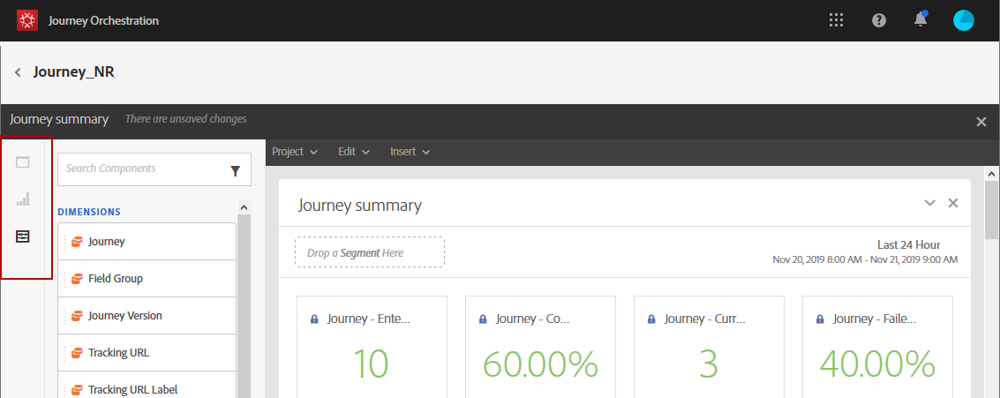
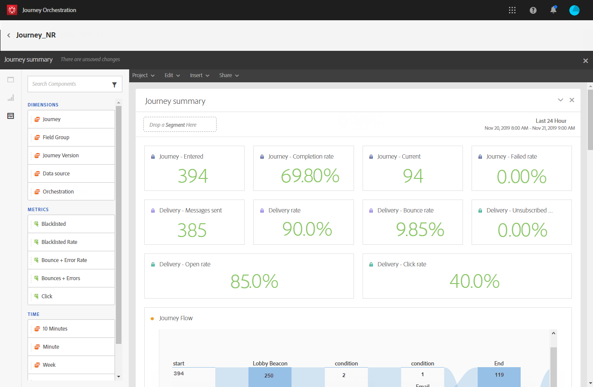
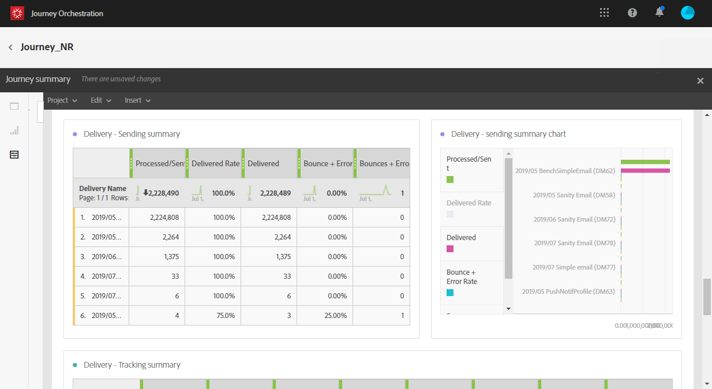

# About journey reports {#concept_rfj_wpt_52b}

>[!NOTE]
>
>Delivery data will only be populated if you have Adobe Campaign Standard.

This section will present you how to access and use reports to measure your journeys' effectiveness.

## Reporting interface {#reporting-interface}

The top toolbar allows you, for example, to modify, save or print your report.

Use the **[!UICONTROL Project]** tab to:

* **[!UICONTROL Open]**: opens a previously created report or template.
* **[!UICONTROL Save As]**: duplicates templates to be able to modify them.
* **[!UICONTROL Refresh project]**: updates your report based upon new data and changes to filters.
* **[!UICONTROL Download CSV]**: exports your reports to a CSV file.
* **[!UICONTROL Print]**: prints your report.

The **[!UICONTROL Edit]** tab allows you to:

* **[!UICONTROL Undo]**: cancels your last action on your dashboard.
* **[!UICONTROL Redo]**: cancels your last **[!UICONTROL Undo]** action on your dashboard.
* **[!UICONTROL Clear all]**: deletes every panel on your dashboard.

The **[!UICONTROL Insert]** table lets you customize your reports by adding graphs and tables to your dashboard:

* **[!UICONTROL New Blank Panel]**: adds a new blank panel to your dashboard.
* **[!UICONTROL New Freeform]**: adds a new freeform table to your dashboard.
* **[!UICONTROL New Line]**: adds a new line graph to your dashboard.
* **[!UICONTROL New Bar]**: adds a new bar graph to your dashboard.

The left tabs let you build your report and filter your data as needed.

These tabs give you access to the following items:

* **[!UICONTROL Panels]**: add a blank panel or freeform to your report to start filtering your data. For more on this, refer to the [Adding panels](../reporting/reportingcreating.md#adding-panels) section
* **[!UICONTROL Visualizations]**: drag and drop a selection of visualization items to give your report a graphical dimension. For more on this, refer to the [Adding visualizations](../reporting/reportingcreating.md#adding-visualizations) section.
* **[!UICONTROL Components]**: customize your reports with different dimensions, metrics, segments and time periods. For more on this, refer to the [Adding components](../reporting/reportingcreating.md#adding-components) section.

## Journey summary template {#ootb-template}

Reports are divided into two categories: an out-of-the-box template and custom reports.
The out-of-the-box template, **[!UICONTROL Journey summary]**, gives you a clear view of the most important tracking data.

 

Each table is represented by summary numbers and charts. You can change how the details are shown in their respective visualization settings.

 The following KPIs are available at the top of your report:

* **[!UICONTROL Journey - Entered]**: total number of individuals who reached the entry event of the journey.
* **[!UICONTROL Journey - Completion rate]**: total number of individuals who reached the end of the journey (or in case of an individual not matching any condition) compared to the total number of individuals who entered the journey.
* **[!UICONTROL Journey - Current]**: total number of individuals currently in the journey.
* **[!UICONTROL Journey - Failed rate]**: total number of journeys that were not successfully executed compared to the number of run journeys.
* **[!UICONTROL Delivery - Messages sent]**: total number of messages sent.
* **[!UICONTROL Delivery rate]**: total number of messages successfully delivered compared to messages sent.
* **[!UICONTROL Delivery - Bounce rate]**: total number of messages that bounced compared to messages sent.
* **[!UICONTROL Delivery - Unsubscribed rate]**: total number of unsubscriptions by recipient compared to the delivered messages.
* **[!UICONTROL Delivery - Open rate]**: total number of opened messages compared to the number of delivered messages.
* **[!UICONTROL Delivery - Click rate]**: total number of clicks in a delivery compared to the number of delivered messages.

The Journey flow visualization allows you to see the path of your targeted profiles step-by-step through your journey. This is only available when targeting one journey. It is automatically generated and cannot be modified.

 

The **[!UICONTROL Journey summary]** table contains the data available for your journey, such as:

* **[!UICONTROL Entered]**: total number of individuals who reached the entry event of the journey.
* **[!UICONTROL Completion rate]**: total number of individuals who reached the end flow control of the journey compared to the total number of individuals who entered the journey.
* **[!UICONTROL Current]**: total number of individuals currently in the journey.
* **[!UICONTROL Failed]**: total number of journeys that were not successfully executed.
* **[!UICONTROL Failed rate]**: total number of journeys that were not successfully executed compared to the number of run journeys.

The **[!UICONTROL Top events]** table displays the most successful events and the **[!UICONTROL Top action]**, the most successful actions in your journeys.

 

The **[!UICONTROL Delivery - Sending summary]** table contains the data available for your journey's deliveries, such as:

* **[!UICONTROL Processed/sent]**: total number of messages sent.
* **[!UICONTROL Delivered rate]**: total number of messages successfully delivered compared to messages sent.
* **[!UICONTROL Delivered]**: number of messages successfully sent, in relation to the total number of sent messages.
* **[!UICONTROL Bounce + error rate]**: total number of messages that bounced compared to messages sent.
* **[!UICONTROL Bounces + errors]**: total of errors cumulated during delivery and automatic return processing in relation to the total number of sent messages.

The **[!UICONTROL Delivery - Tracking summary]** table contains the data available to track the success of your journeys' deliveries, such as:

* **[!UICONTROL Open Rate]**: percentage of opened messages.
* **[!UICONTROL Open]**: number of times a message was opened in a delivery.
* **[!UICONTROL Click trough rate]**: total number of clicks in a delivery compared to the number of delivered messages.
* **[!UICONTROL Click]**: number of times a content was clicked in a delivery.
* **[!UICONTROL Unsubscribe rate]**: percentage of unsubscriptions by recipient compared to the delivered messages.
* **[!UICONTROL Unsubscribed]**: total number of unsubscriptions by recipient compared to the delivered messages.
