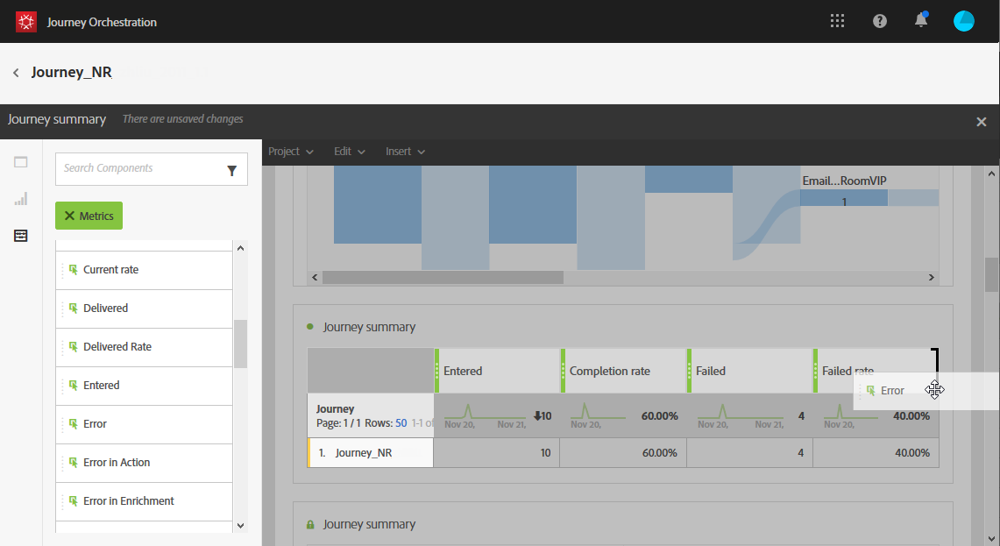

# Creating your Journey Orchestration reports{#concept_rfj_wpt_52b}

This section will present you how to create or use out-of-the-box reports. Combine panels, components and visualizations to better track the success of your journeys.

1. To create a custom report on your journeys, you first need to access the journeys you want to report on.

1. Click the **[!UICONTROL Report]** icon on the top right of your screen.

    

1. The **[!UICONTROL Journey summary]** out-of-the box report appears on screen. To access custom report, click the **[!UICONTROL Close]** button.

1. Click the **[!UICONTROL Create new project]** to create your report from scratch.

    

1. From the **[!UICONTROL Panels]** tab, drag and drop as many panels or freeform tables as needed. 

    

1. You can then start filtering your data by drag and dropping dimensions and metrics from the **[!UICONTROL Components]** tab to your freeform table. 

    

1. To have a clearer view of your data, you can add visualizations from the **[!UICONTROL Visualizations]** tab.

    
